# 六、深入Linux进程

## (一) 问题

>❓进程参数和环境变量对于进程意味着什么？

### 1.进程参数和环境变量的意义

>* 一般情况下 , 子进程的创建是为了解决某个子问题
>* 子进程解决问题需要父进程的 **$\color{red}{"数据输入"}$** $\color{red}{(进程参数 and 环境变量)}$
>* 设计原则 :
>   * 子进程启动时 **$\color{red}{必然}$** $\color{red}{用到的参数使用}$ **$\color{red}{进程参数}$** $\color{red}{传递}$
>   * 子进程解决问题 **$\color{red}{可能}$** $\color{red}{用到的参数使用}$ **$\color{red}{环境变量}$** $\color{red}{传递}$
>
>

### 2.思考

>❓子进程如何将结果 “返回” 父进程？
>
>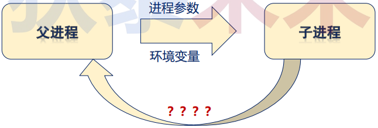

### 3.编程实验

>[test.cpp参考链接](https://github.com/WONGZEONJYU/Linux_System_Program/blob/main/5.deep_process/test.cpp)
>
>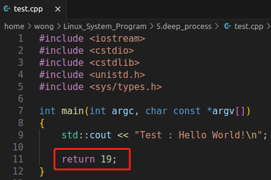
>
>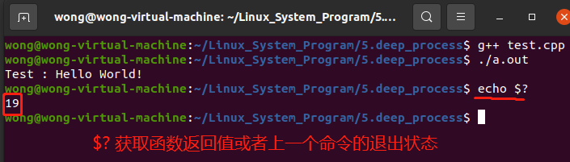

## (二)深入理解父子进程

>* 子进程的创建是为了 $\color{red}{并行的解决子问题}$ (问题分解 , 原问题分解为子问题 , 子问题之间没有依赖关系)
>* 父进程需要通过 $\color{red}{等待子进程的结果}$ 以最终解决问题 (并获取结果)
>
>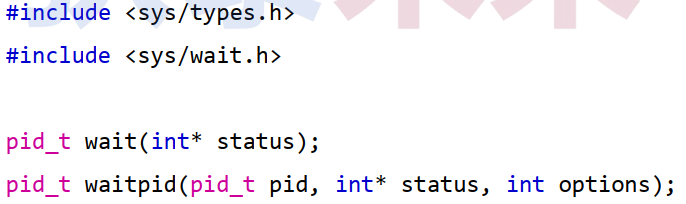

### 1. 进程等待系统接口

>* `pid_t wait(int* status);` $\color{SkyBlue}{(标准版)}$
>   * 等待一个子进程完成 , 并返回子进程标识和状态信息
>   * 当有多个子进程完成 , 只能逐一等待完成 **(随机挑选子进程返回)**
>* `pid_t waitpid(pid_t pid, int* status, int options);` $\color{SkyBlue}{(进阶版)}$
>   * 可等待特定的子进程或一组子进程
>   * 在子进程还未终止时 , 可通过options设置不必等待 $\color{SkyBlue}{(直接返回)}$
>

### 2. 进程退出系统接口

>* 头文件 : `#include <unistd.h>`
>   * `void _exit(int status);` 系统调用 , 终止当前进程
>
>* 头文件：`#include <stdlib.h>`
>   * `void exit(int status);` 库函数 , 先做资源清理 , 再通过系统调用终止进程
>   * `void abort(void);` 异常终止当前进程 (通过产生 `SIGABRT ` 信号终止)
>
>
>```tex
>‼️ 注：信号：操作系统发送给进程的通知。
>```

### 3. 问题

> ❓下面的程序运行后会发生什么?
>
> [代码参考链接](https://github.com/WONGZEONJYU/Linux_System_Program/blob/main/5.deep_process/main.cpp)
>
> 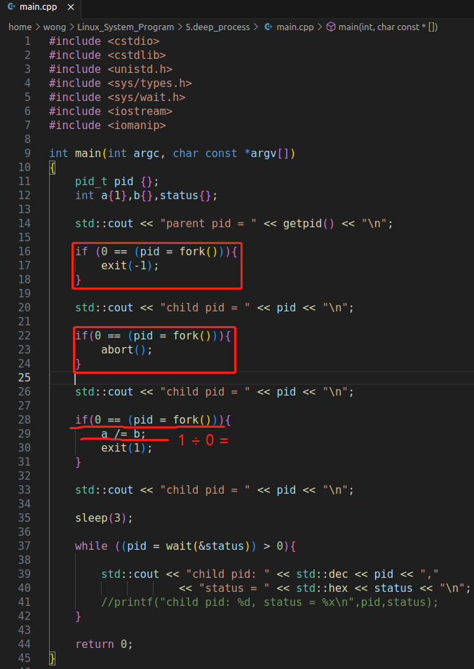
>
> 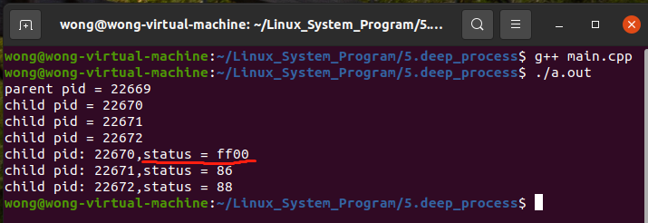

### 4. 进程退出状态详解

>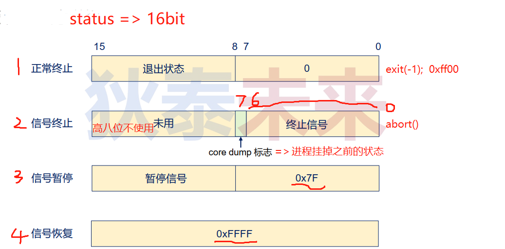
>
>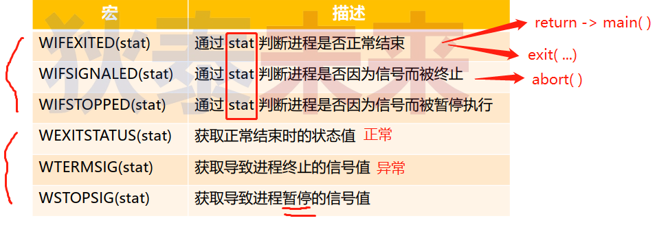
>
>[main2.cpp代码参考链接](https://github.com/WONGZEONJYU/Linux_System_Program/blob/main/5.deep_process/main2.cpp)
>
>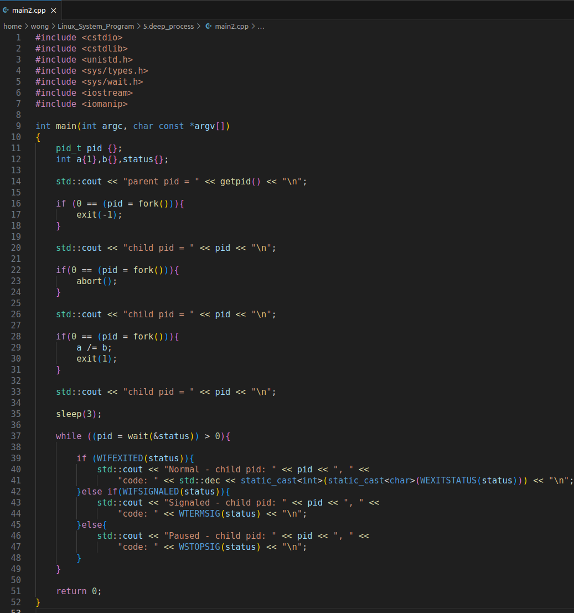
>
>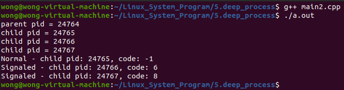

### 5. 僵尸进程（僵死状态）

>[main3.cpp参考代码](https://github.com/WONGZEONJYU/Linux_System_Program/blob/main/5.deep_process/main3.cpp)
>
>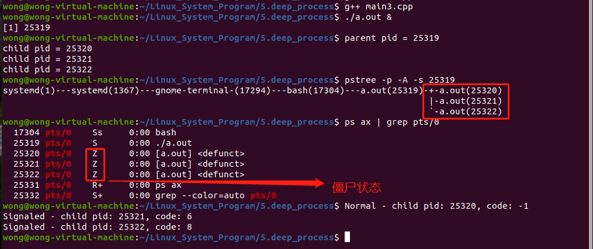
>
>* 理论上 , 进程 $\color{red}{退出 / 终止}$ 后应立即释放所有系统资源
>   * 然而, 为了给父进程提供一些 $\color{red}{重要信息}$ , 子进程 **退出 / 终止** 所占的部分资源 $\color{red}{会暂留}$
>   * 当父进程收集这部分信息后 ( `wait()` / `waitpid()` ) , 子进程所有资源被释放
>     * 父进程调用 `wait()`, $\color{red}{为子进程 “收尸” 处理并释放暂留资源}$
>     * 若父进程退出，`init` / `systemd` $\color{red}{为子进程 “收尸” 处理并释放暂留资源}$

### 6. 僵尸进程的危害

>* 僵尸进程保留进程的终止状态和资源的使用信息
>   * 进程为何退出 , 进程消耗多少CPU时间 , 进程最大内存驻留值 , 等
>* $\color{red}{如果僵尸进程得不到回收 , 那么可能影响正常进程的创建}$
>   * 进程创建最重要的资源是内存和进程标识
>   * 僵尸进程的存在可看作是一种类型的内存泄露
>   * 当系统僵尸进程过多 , 可能导致进程标识不足 , 无法创建新进程

### 7. wait()的局限

>* 不能等待 $\color{red}{指定子进程}$ , 如果存在多个子进程 , 只能 $\color{red}{逐一}$ 等待完成
>* 如果不存在终止的子进程 , 父进程只能 **阻塞等待** 
>* $\color{red}{只针对终止的进程，无法发现暂停的进程}$
>* `wait(…)`升级 ==> `pid_t waitpid(pid_t pid, int* status, int options)`
>   * 返回值相同 , 终止子进程标识符
>   * 状态值意义相同 , 记录子进程中止信息
>   * 特殊之处 : 
>
>
>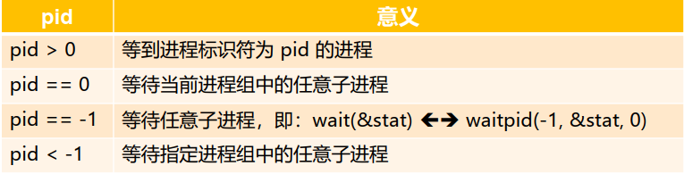

### 8. 编程实验: 子进程实验

>[参考代码](https://github.com/WONGZEONJYU/Linux_System_Program/blob/main/5.deep_process/skill.cpp)
>
>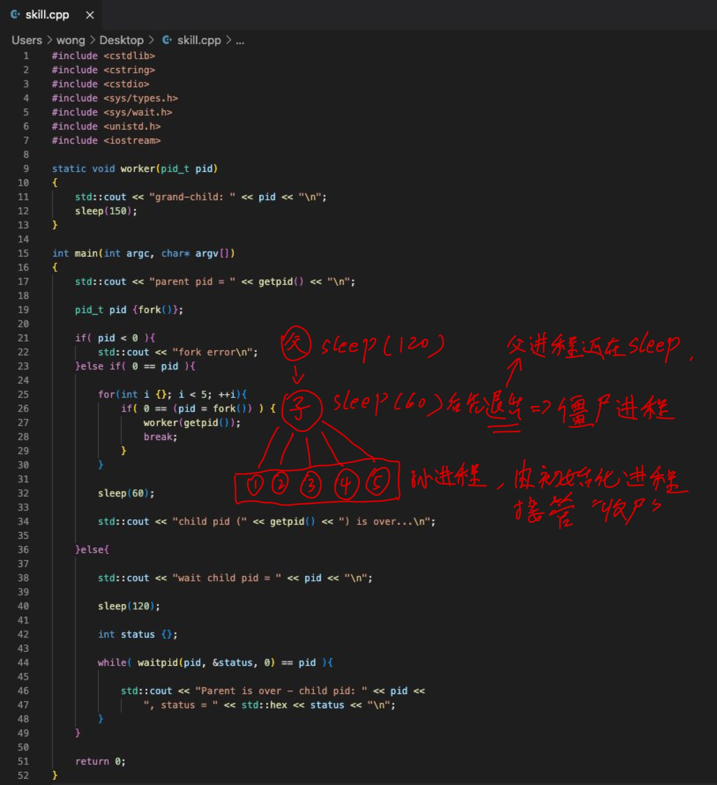
>
>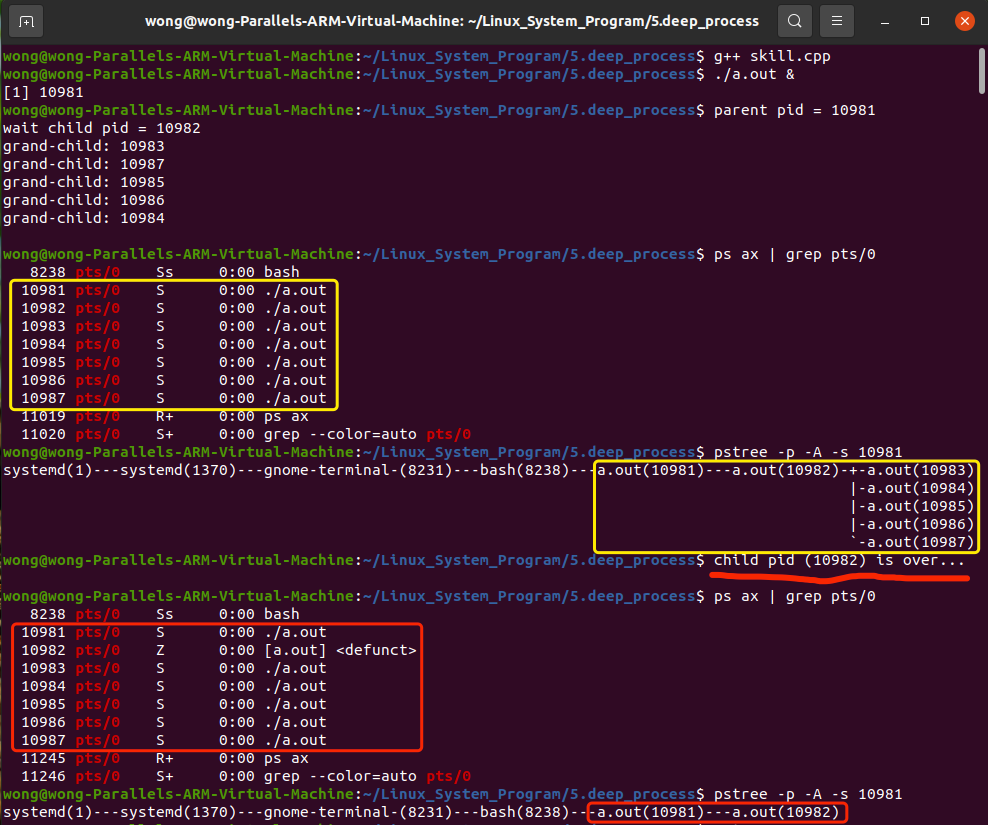
>
>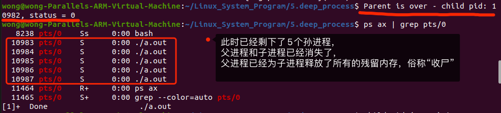
>
>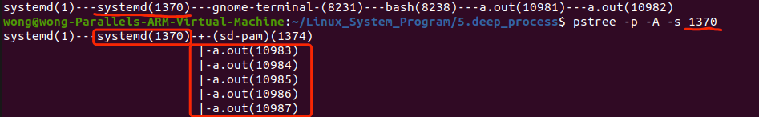
>
>```tex
>‼️ ‼️ ‼️上图显示，5个孙进程已经被初始化进程接管了，后续的“收尸”工作全部交由初始化进程处理
>```
>
>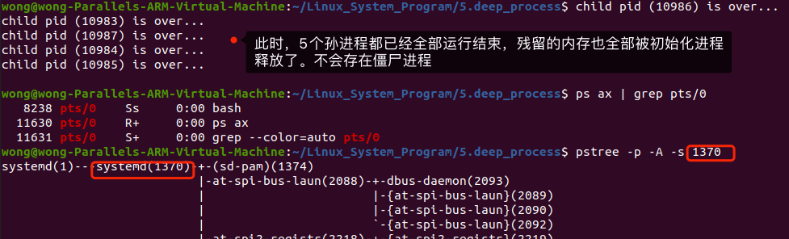

### 9.僵尸进程避坑指南

>* 利用`wait(…)` 返回值判断是否继续等待子进程 , 意味着 $\color{red}{父进程阻塞}$
>   * `while(( pid = wait(&status)) > 0 ) { … }`
>* 利用 `waitpid(…)` 及 ( `init` / `systemd` ) 回收子进程
>   * 通过两次`fork()`创建 $\color{red}{孙进程}$ 解决子问题


