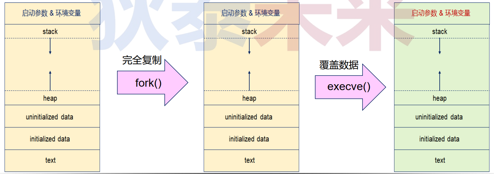
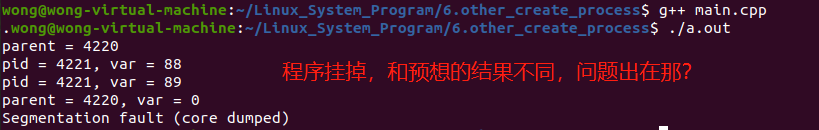
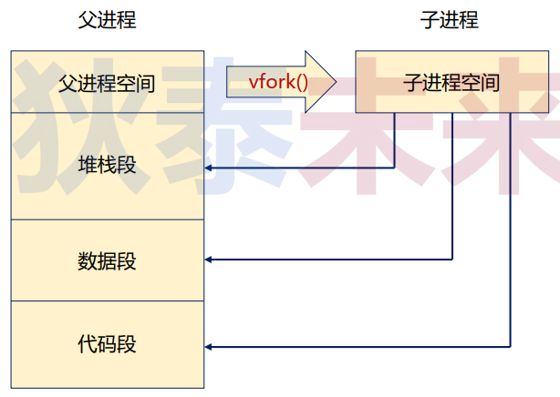
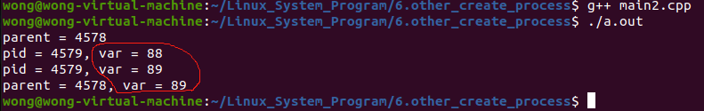
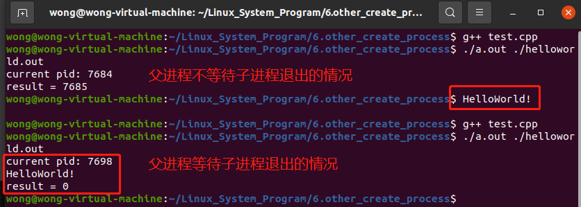
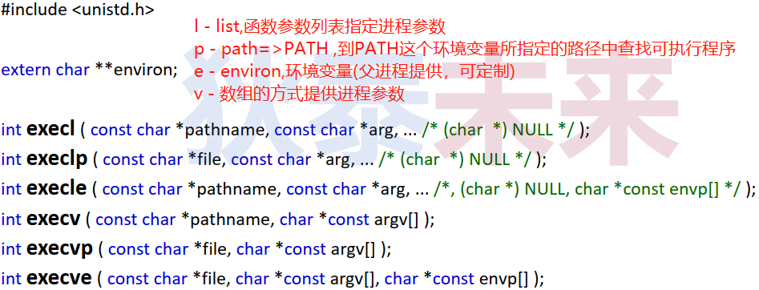
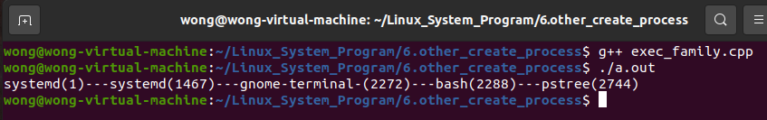
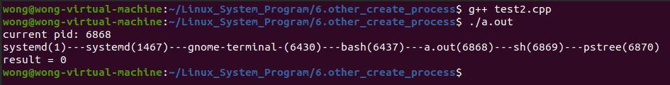
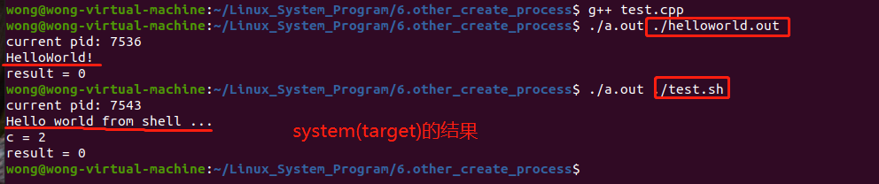
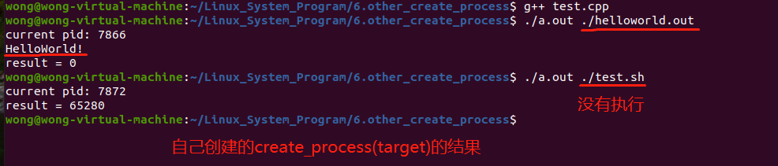

# 七、进程创建大盘点

## (一) 进程创建回顾

>```c++
>int create_process(char* path, char* args[], char* env[])
>{
>    int ret {fork()};
>    if( 0 == ret ){
>        execve(path, args, env);
>    }
>    return ret;
>}
>```
>
>问题 : 
>
>❓进程创建是否只能依赖于`fork()`和`execve() ` ?

## (二) 再论进程创建

>* `fork()` 通过 **$\color{red}{完整复制}$** 当前进程的方式创建新进程
>* `execve()` 根据参数覆盖进程数据 (一个不留) 
>
>```tex
>注释: 如果fork()后立马调用execve() ,那么没必要复制父进程的数据
>```
>
>
>
>* `pid_t vfork(void);`
>   * `vfork()` 用于创建子进程 , 然而 **$\color{red}{不会复制}$** 父进程空间中的数据
>   * `vfork()` 创建的子进程直接使用父进程空间 **$\color{red}{(没有完整独立的进程空间)}$**
>   * `vfork()` 创建的子进程对数据 (变量) 的修改会 **$\color{red}{直接反馈}$**  到父进程中
>   * `vfork()` 是为了 `execve()` 系统调用而设计的

### 1. 思考

>```c++
>int main(int argc, char* argv[])
>{   
>    std::cout << "parent = " << getpid() << "\n";    
>    pid_t pid {};
>    int var {88};
>
>    if( (pid = vfork()) < 0 ){
>
>        std::cout << "vfork error\n";
>    }
>    else if( 0 == pid ){
>        std::cout << "pid = " <<  getpid() << ", var = " << var << "\n";
>        var++;
>        std::cout << "pid = " <<  getpid() << ", var = " << var << "\n";
>        return 0; 
>
>    }
>    printf("parent = %d, var = %d\n", getpid(), var);
>    return 0;
>}
>```
>
>[main.cpp代码参考链接](https://github.com/WONGZEONJYU/Linux_System_Program/blob/main/6.other_create_process/main.cpp)
>
>

### 2. `vfork()`深度分析

>

### 3. `vfork()`要点分析

>- `vfork()`成功后 , 父进程将等待子进程结束
>- 子进程 $\color{red}{可以使用父进程的数据 (堆、栈、全局)}$
>- 子进程可以从创建点调用其它函数 , **$\color{red}{但不要从创建点返回}$**
>   - 当子进程执行流回到创建点或者需要结束时, 使用 `_exit(0)`  $\color{red}{系统调用}$
>   - 如果 **$\color{red}{使用}$** **`return 0`**  **$\color{red}{将破坏栈结构}$** , 导致后续父进程执行出错
>
>
>[main.cpp参考代码](https://github.com/WONGZEONJYU/Linux_System_Program/blob/main/6.other_create_process/main.cpp)
>
>

### 4. `fork()`的现代优化

>- **$\color{red}{Copy-on-Write技术}$**
>   - 多个任务访问同一资源时 , 在写入操作修改资源时 , 复制资源的原始副本
>- `fork()`引入Copy-on-Write之后 , 父子进程共享相同的进程空间
>   - 当父进程或子进程的其中之一修改内存数据 , 则实时复制进程空间
>   - `fork()` + `execve()` <==> `vfork()` + `execve()`
>

### 5. 编程实验: `fork()` & `vfork()`

>[`fork()` & `vfork()`实验参考代码](https://github.com/WONGZEONJYU/Linux_System_Program/blob/main/6.other_create_process/test.cpp)
>
>

## (三) `exec()`与`system()`简介

### 1. `exec()`函数家族

>
>
>
>
>[exec_family.cpp参考代码](https://github.com/WONGZEONJYU/Linux_System_Program/blob/main/6.other_create_process/exec_family.cpp)
>
>```c++
>#include <iostream>
>#include <unistd.h>
>#include <cstdio>
>#include <cstdlib>
>
>#define RC(s)   const_cast<char*>(#s)
>
>int main(int argc, char *argv[])
>{
>    char pids[32]{};
>    char* const ps_argv[] {RC(pstree),RC(-A),RC(-p),RC(-s),pids,nullptr};
>    char* const ps_envp[] {RC(PATH=/bin:/usr/bin),RC(TEST=WONG),nullptr};
>
>    sprintf(pids,"%d",getpid());
>
>    execl("/bin/pstree", "pstree", "-A", "-p", "-s",pids, nullptr);
>    execlp("pstree", "pstree", "-A", "-p", "-s", pids, nullptr);
>    execle("/bin/pstree", "pstree", "-A", "-p", "-s", pids, nullptr, ps_envp);
>    execv("/bin/pstree", ps_argv);
>    execvp("pstree", ps_argv);
>    execve("/bin/pstree", ps_argv, ps_envp);
>
>    return 0;
>}
>```
>
>

### 2. 进程创建库函数

>- `#include <stdlib.h>`
>- `int system(const char* command);`
>   - 参数 : 程序名及进程参数 ( 如 : `pstree -A -p -s $$` )
>   - 返回值 : 进程退出状态
>
>
>```tex
>注释: system()首先会创建shell进程，效率比我们自己创建的create_process(…) 低
>```
>
>```c++
>#include <cstdio>
>#include <cstdlib>
>#include <sys/types.h>
>#include <sys/wait.h>
>#include <unistd.h>
>#include <iostream>
>
>int main(int argc, char *argv[])
>{
>   std::cout << "current pid: " << getpid() << "\n";
>   int result {system("pstree -A -p -s $$")};
>   std::cout << "result = " << result << "\n";
>   return 0;
>}
>```
>
>[参考代码](https://github.com/WONGZEONJYU/Linux_System_Program/blob/main/6.other_create_process/test2.cpp)
>
>

### 3. 编程实验 : `system("./helloworld")`

>[参考代码](https://github.com/WONGZEONJYU/Linux_System_Program/tree/main/6.other_create_process)
>
>
>
>


