# 八、Linux终端与进程

## (一) 详解控制台与终端

### 1. 问题

>❓Linux中的终端，控制台，TTY，PTY究竟是什么？它们与进程是什么关系？

### 2. 历史回顾

#### (1) 控制台 (Console)

>- 控制台是一个直接控制设备的面板（属于设备的一部分）
>- 计算机设备的控制台：按键 & 指示灯（键盘 & 显示器）
>- 早期的电子计算机必然有一个控制台

#### (2) 终端 (Terminal)

>终端是一台独立于计算机的机器，是能够用来和计算机交互的设备
>
>
>
>
>
>$\color{red}{TTY}$ , 即 : $\color{red}{TeleType Writer}$电传打字机 , 一种终端设备

#### (3) 历史发展进程

>1. 电传打字机已经淘汰
>2.  计算机上的输入设备和显示设备从主机独立出来
>3.  控制台与终端的物理表现形式逐渐趋近
>4.  计算机开始支持多任务处理
>5.  ……
>
>- 控制台 VS 终端
>   - 控制台是计算机的基本组成部分
>   - 终端是 连接 / 使用 计算机的附加设备
>   - 计算机只有一个控制台，但可以有多个终端
>
>**注释 : **
>
>- ❓怎么区分控制台和终端？
>- ✅计算机系统启动的过程中，能够显示启动信息的是控制台，在启动过程中能够响应键盘输入的是控制台，终端需要等到计算机系统启动成功正常运行之后，才能够连接上计算机，才能够使用计算机。

#### (4) 终端与进程

>$\color{red}{TTY}$ 演变为Linux中的 $\color{red}{抽象概念}$ , 对于进程而言 , TTY是一种输入输出设备
>
>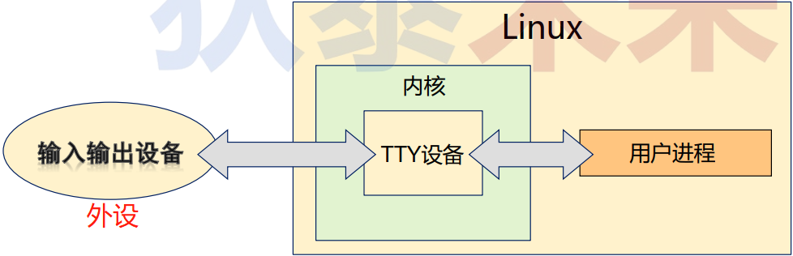
>
>```tex
>注释: TTY在内核中 , 运行于内核模式 , 可以与外设进行交互 , 外设为了成功地被进程所使用 , 就必须在驱动程序的层面上去满足TTY的抽象概念的要求(TTY规则)。
>```
>

### (二) 虚拟终端 与 伪终端

#### 1. 各种终端类型

>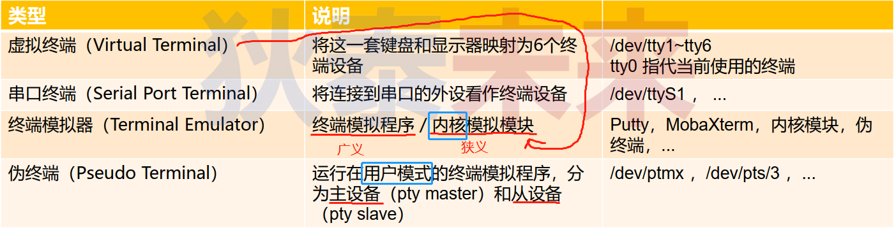

#### 2. 内核终端模拟器

>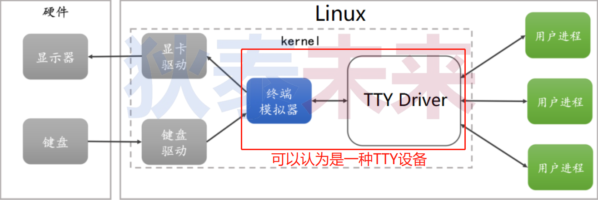

#### 3. 伪终端模型

>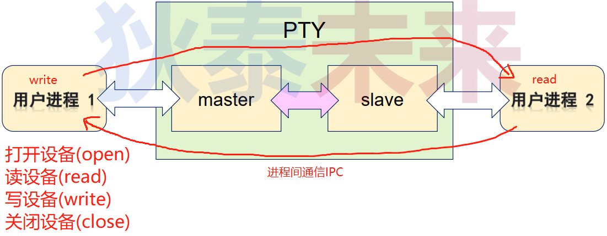

#### 4. 伪终端 (gnome-terminal)

>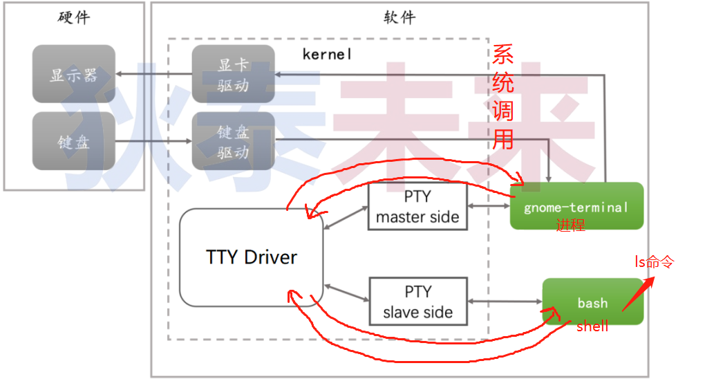
>
>**$\color{red}{注释：gnome-terminal是一个进程}$**
>
>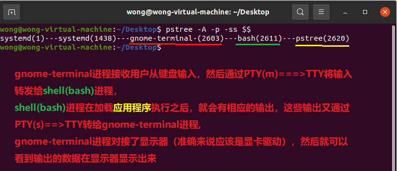
>
>```tex
>gnome-terminal进程接收用户从键盘输入,然后通过PTY(m)===>TTY将输入转发给shell进程，
>shell进程在加载应用程序执行之后,就会有相应的输出,这些输出又通过PTY(s)==>TTY转给gnome-terminal进程
>gnome-terminal进程对接了显示器(准确来说应该是显卡驱动),然后就可以看到输出的数据在显示器显示出来
>```
>
>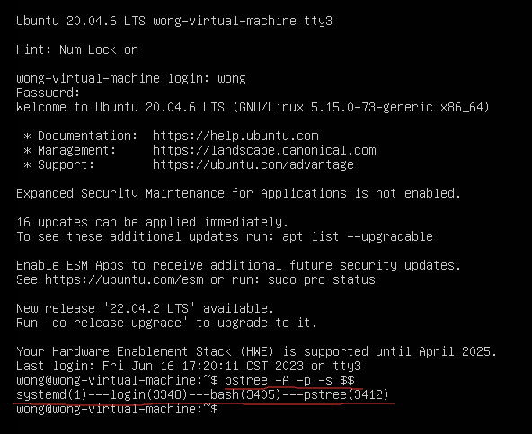

#### 5. 小结

>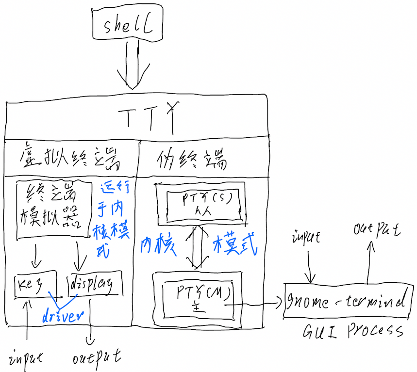

### (三) 伪终端程序设计原理

#### 1. 伪终端程序设计 (master)

>- 创建 PTY 主从设备 : `master = posix_openpt(O_RDWR);`
>   - master 主设备标识
>
>- 获取主设备权限 : 
>   - `grantpt(master); ` 获取设备使用权限
>   - `unlockpt(master); ` 解锁设备 , 为读写做准备
>
>- 读写主设备
>   - `c = read(master, &rx, 1);`
>   - `len = write(master, txbuf, strlen(txbuf));`
>   - `ptsname(…)` 获取伪终端从设备的名字
>
>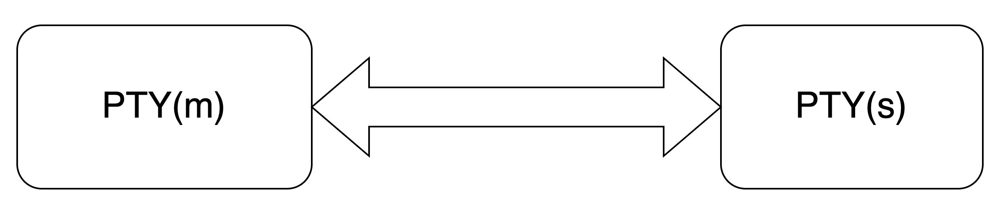
>
>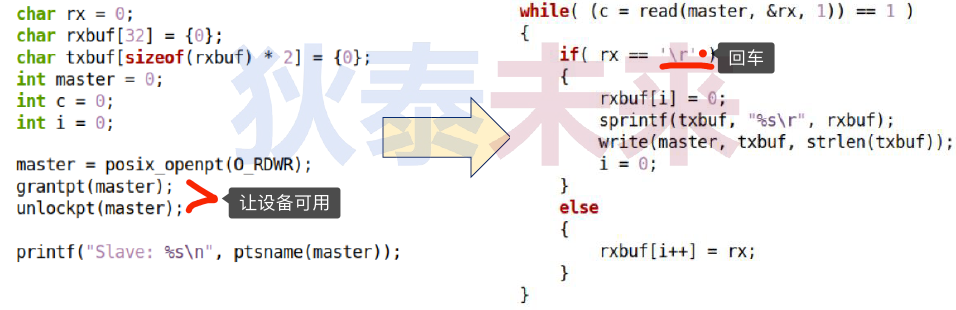

#### 2. 伪终端程序设计 ( slave )

>- 打开 PTY 从设备: `slave = open(path_to_slave, O_RDWR);`
>- 读写从设备 : 
>   - `write(slave, “Delphi\r”, 7);`
>   - `read(slave, buf, sizeof(buf)-1);`
>
>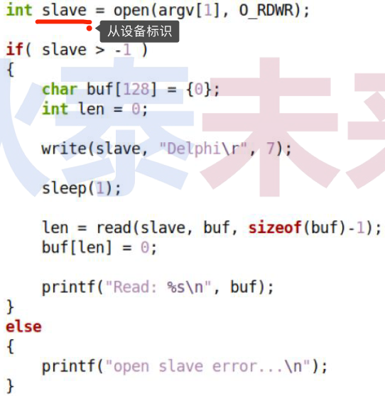

#### 3. 编程实验:实战伪终端程序设计

>[master,salve参考代码](https://github.com/WONGZEONJYU/Linux_System_Program/tree/main/7.terminal)
>
>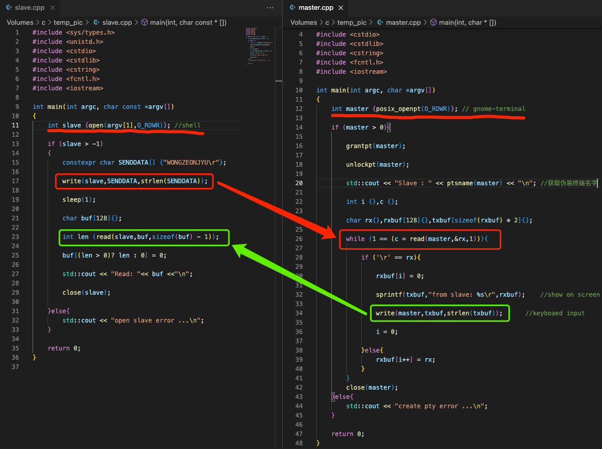
>
>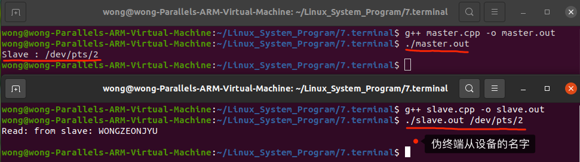

#### 4. 思考

>❓终端必然与进程关联才有意义！那么，进程之间除了父子关系，是否还有其它关系？
