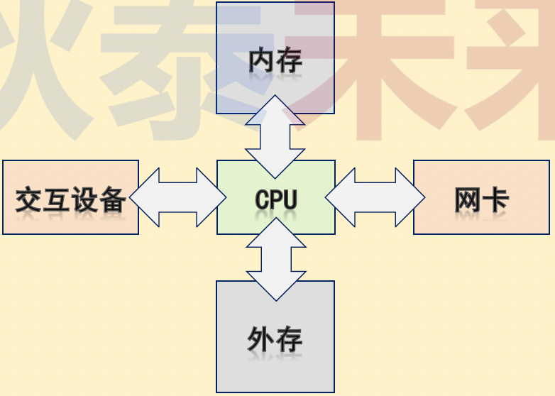
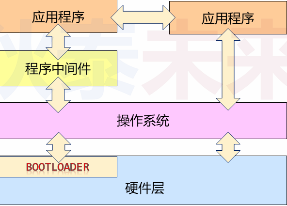
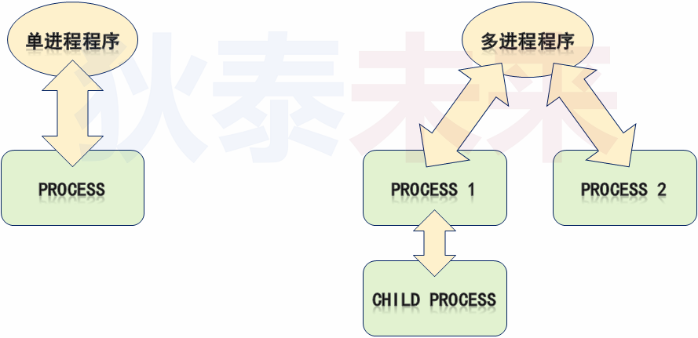
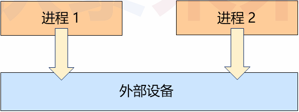
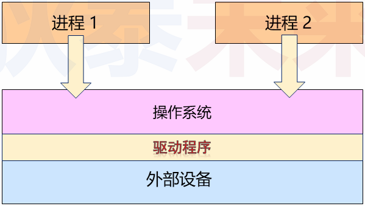
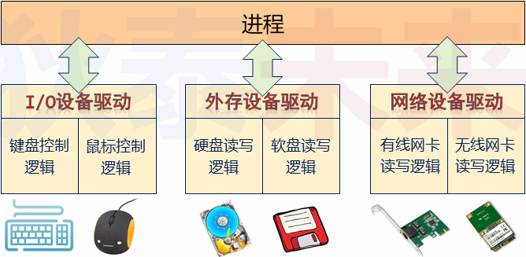
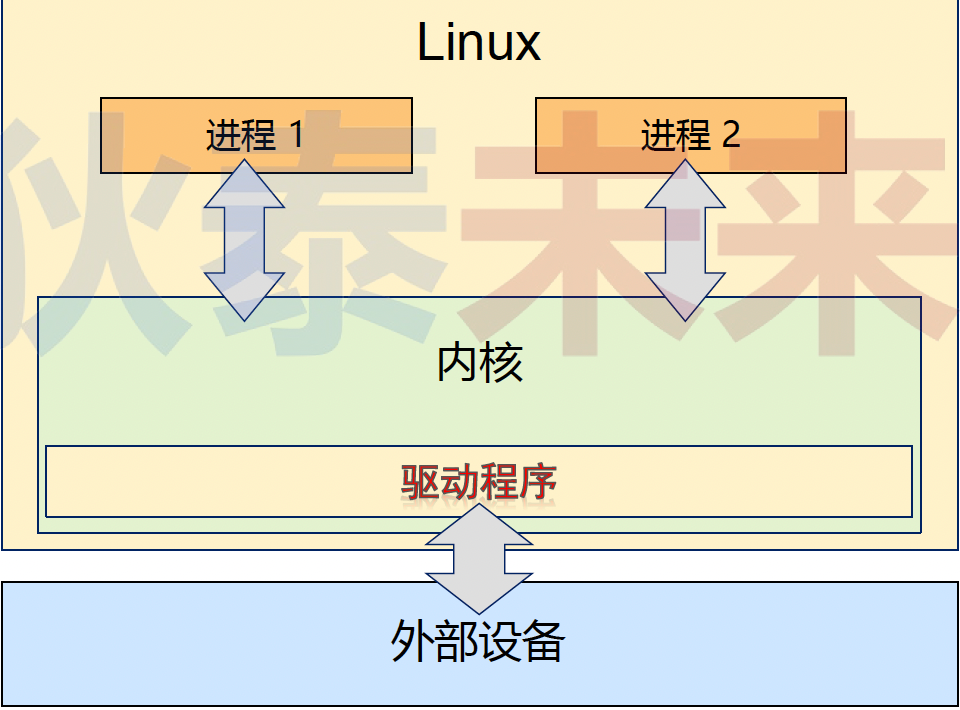
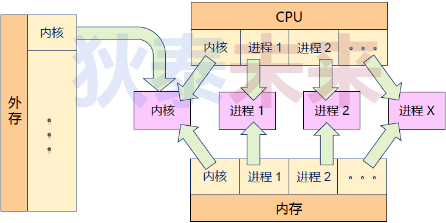
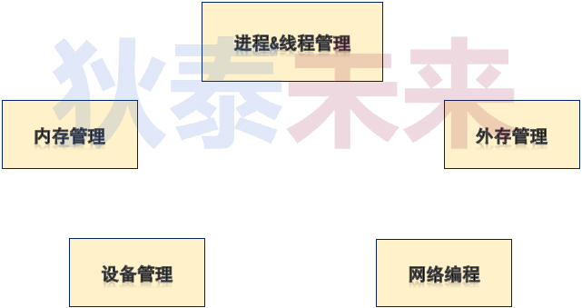

# 一、再论计算机系统

* 计算机系统由躯体和灵魂两部分组成
* 躯体：构成计算机系统的电子设备（硬件）
* 灵魂：指挥躯体完成动作的指令序列（软件）
* 躯体核心：中央处理器CPU
* 灵魂核心：操作系统OS

## 	（一）问题

$\color{red}{思考}$ : 计算机系统的诞生是为了执行数据处理 ( 计算 ) 任务。那么 , 如何获取计算任务 , 并反馈任务执行结果?

数据  **$\color{red}{输入}$** 与  **$\color{red}{输出}$** 是计算机系统不可或缺的部分

 

## （二）计算任务执行流程

* 通过交互设备或网络向计算机系统发起请求

* 根据请求将任务指令（程序/软件）加载进入内存

* CPU 从内存中取指令，并逐条执行

* 计算任务的最终结果暂存入内存

* 内存数据通过交互设备或网络进行反馈（也可以写入外存）

 

## （三）什么是程序

* 程序的本质是 **$\color{red}{指令}$** 和 **$\color{red}{数据}$** 的集合
   * 指令 : 指示CPU 执行动作的命令
   * 数据 : CPU 执行动作的操作目标

## （四）什么是程序

* 应用程序 : 用户可直接使用，为用户提供直接帮助的程序
* 程序中间件 : 多数应用程序的 **$\color{red}{通用功能}$**  , 用于辅助应用程序的运行
* 操作系统 : 直接操作硬件设备 , 并为应用程序与程序中间件提供运行环境

## （五）当代计算机系统架构

 

## （六）进程-程序的执行

* 通常情况下 , 程序在操作系统上以进程为单位运行
* 每个程序运行后由一个或者多个进程构成
* 进程是操作系统任务的基本单元 , 也是系统资源的基本分配单元
* 程序是“死”的 , 进程是“活”的
    * 程序的本质只是二进制数据 , 不加载执行就没有任何价值
    * 进程是计算机系统对程序的 **$\color{red}{一次}$** 加载执行 , 即 : 执行计算任务的过程

## （七）程序VS进程

 

## （八）应用程序与外部设备

 * 多数情况下 , 应用程序需要借助外部设备才能完成计算任务
 * 外部设备 : 除CPU 与内存之外的其它计算机硬件( 如 : 硬盘 , 网卡 , 显卡 )

 

 * 应用程序设备访问 : 

   * 直接访问
     * 开发成本高 : 应用开发者必须熟悉各类外设的硬件特性
     * 开发周期长 : 业务逻辑 + 设备逻辑
     * 应用场景难 : 其它应用程序可能同时访问外设

   * 间接访问
     * 应用程序通过 **$\color{red}{某软件层（驱动程序）接口}$** 以统一方式访问外设

## （九）设备驱动程序

**$\color{red}{设备驱动程序}$** 是外设访问接口 , **$\color{red}{对应用程序提供统一的外设访问方式}$** 

 

### 1、Linux设备驱动模型

* 抽象各种外设的共性 , 简化设备驱动开发方式
* 设备类型 : 字符设备 , 块设备 , 网络设备 , 等
* 对于同一类型的设备 , 可以通过统一接口进行访问
* OS定义的规范 : 驱动程序必须实现的函数

 

>
> | 驱动程式 |   对上 : write()、read()    |
> | :------: | :-------------------------: |
> | 驱动程式 | 对下 : 为操作系统准备的函数 |
>

### 2、存在的问题

* 设备驱动程序仍然可能同时被不同进程使用 , 设备驱动程序 **$\color{red}{并非唯一}$** 访问外设的方式。
	 * 问题 : 如何限制进程必须按照规则通过驱动程序访问外部设备 ?

### 3、Linux系统的工作模式

 

 * 用户模式(用户态)(User Mode)
    * 执行应用程序私有代码 , **$\color{red}{受限制的}$** 访问内存 , 无法直接访问外部设备

* 内核模式 (内核态) (Kernel Mode)
    * 执行内核代码 , 可访问 **$\color{red}{所有硬件资源}$** , 可立即暂停进程的执行 , ……
    * 绝大多数设备驱动程序执行于内核模式
    * **$\color{red}{内核职责}$** : 以 **$\color{red}{统一 }$** 的方式 **$\color{red}{有序}$** 的分配硬件资源 , 保证用户任务按照期望的方式执行。

### 4、工作模式的切换 : 系统调用（System Call）

* 应用程序与操作系统内核直接的接口 (表现形式为 **$\color{red}{函数}$** )
* 系统调用决定了应用程序如何与内核打交道 (应用程序如何向操作系统发送请求)
* ❓问题 : 为什么需要系统调用？
    * 系统资源有限,需要统一有序的调配
    * 多个进程可能同时访问同一资源 , 进而产生冲突
    * 一些特定的功能必须由操作系统内核完成 (如 : 精确延时)

* 系统调用的本质 : 
    * 进程系统调用后 , 由 **$\color{red}{用户模式切换到内核模式}$** (执行内核代码)
    * 工作模式的转变通常由 **$\color{red}{中断}$** 触发 (不同于普通函数调用)
    * **$\color{red}{(中断==>系统调用==>工作模式的切换==>系统规则的强制执行==>应用程序的规范运行==>进而得到了一个软硬件协同工作的计算机系统)}$**
    * 用户进程通过系统调用请求内核完成资源分配 , 硬件访问等操作
    * 所有进程请求集中到内核 , **$\color{red}{内核可统一调度处理}$** , 协调进程的执行

 
 
 
