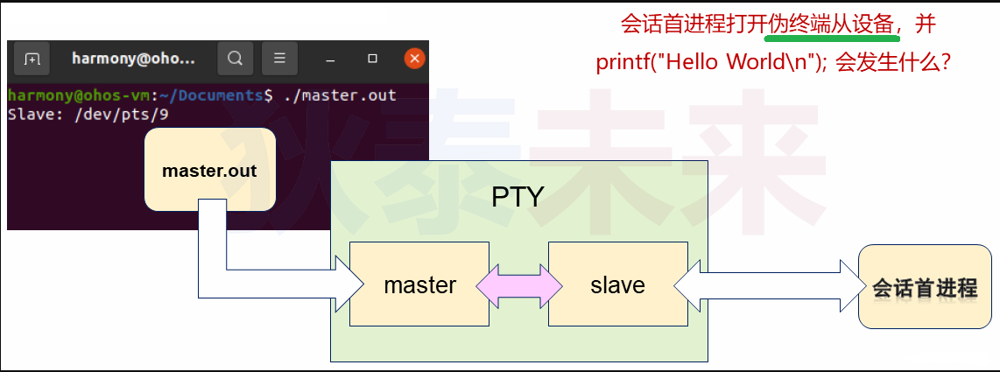
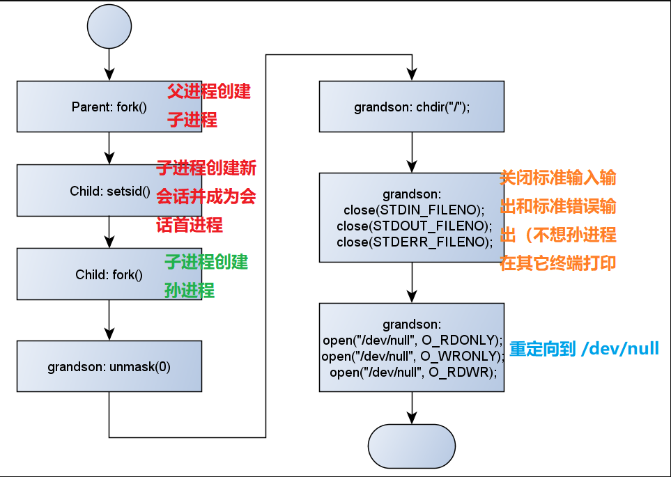
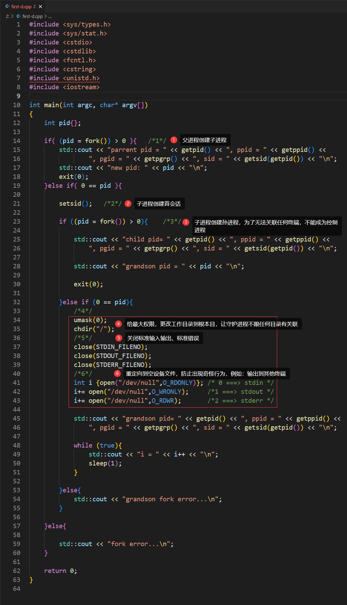
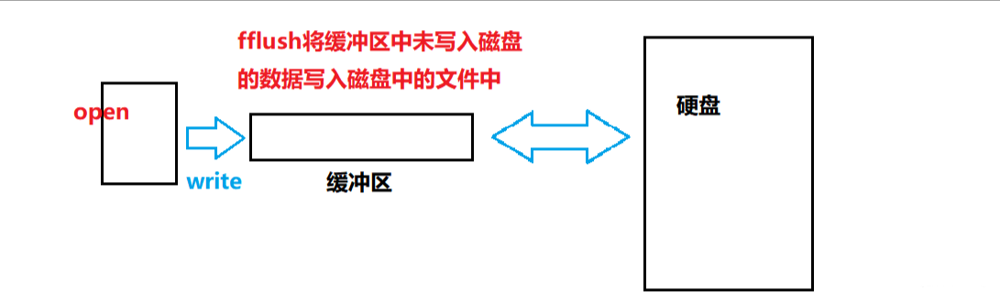

# 十、守护进程深度分析

## (一) 会话与终端的关联

### (1) 思考

>❓代码中创建的会话 , $\color{red}{如何关联}$ 控制终端?

### (2) 新会话关联控制终端的方法

会话首进程成功打开终端设备 **(设备打开前处于空闲状态)**

* 关闭**标准输入输出和标准错误输出** 
* 将`stdin`关联到终端设备 : `STDIN_FILENO` **==> 0**
* 将`stdout`关联到终端设备 : `STDOUT_FILENO` **==> 1**
* 将`stderr`关联到终端设备 : `STDERR_FILENO` **==> 2**

### (3) 一些相关推论

* $\color{red}{新会话 关联}$ **$\color{red}{控制终端}$**  $\color{red}{后,}$  $\color{red}{会话中的}$  **$\color{red}{所有进程 生命期}$** $\color{red}{与}$ **$\color{red}{控制终端}$** $\color{red}{相关}$
* $\color{red}{只有}$  **$\color{red}{会话首进程}$**  能够关联控制终端 **(会话中的其它进程不行)**
* 进程的标准输入输出与标准错误输出可以进行 重定向
	* 由描述符 **0,1,2** 决定重定向的目标位置 **$\color{red}{(按顺序打开设备)}$**
	* 控制终端与进程的标准输入输出以及标准错误输出 **无直接关系** 

### (4) 一些想法

 

 

### (5) 编程实验 : 会话与终端

[master.cpp参考链接](https://github.com/WONGZEONJYU/Linux_System_Program/blob/main/9.daemon_process/master.cpp)

[session.cpp参考链接](https://github.com/WONGZEONJYU/Linux_System_Program/blob/main/9.daemon_process/session.cpp)

 

 

 

## (二) 守护进程要点分析

### (1) 什么是守护进程 (Daemon) 

* 守护进程是系统中执行任务的 **$\color{red}{后台进程}$**
	* $\color{red}{不与任何终端相关联 (不接收终端相关的信号) }$
	* 生命周期长 , 一旦启动 , 正常情况下不会终止 (直到系统退出) 
	* Linux大多数 **$\color{red}{服务器}$** 使用守护进程实现 (守护进程名以 **$\color{red}{后缀d}$** 结尾) 

### (2) 守护进程的创建步骤

1. 通过 `fork()` 创建新进程 , 成功后 , 父进程退出
2. 子进程通过 `setsid()` 创建新会话
3. 子进程通过 `fork()` 创建孙进程 (肯定不是会话首进程) 
4. 孙进程修改模式 `umask()` , 改变工作目录为 `"/"`  **$\color{red}{(意义 : 不希望守护进程与哪一个目录相关联 )}$**
5. **$\color{red}{关闭}$** **标准输入输出** 和 **标准错误输出**（`STDIN` ,`STDOUT` ,`STDERR`）
6. **$\color{red}{重定向}$** **标准输入输出** 和 **标准错误输出** (`"/dev/null"`)

>```tex
>‼️	‼️	‼️	创建孙进程的目的是: 孙进程不是 会话首进程 , 无法与终端相关联 , 孙进程无法变成控制进程，
>我们不希望 守护进程 与哪个终端相关联 , 与哪个终端生命周期绑定在一起 , 所以才让孙进程变成守护进程
>```

### (3) 守护进程的创建步骤流程图

 

### (4) 守护进程关键点分析

* 父进程创建子进程是为了 **创建新会话**
* 子进程创建孙进程是为了 $\color{red}{避免产生}$ **$\color{red}{控制进程}$**
* 孙进程不是会话首进程，因此不能关联终端
* **重定向操作** 可以避开 **奇怪** 的进程输出行为

### (5) 编程实验 : 创建守护进程

[创建守护进程](https://github.com/WONGZEONJYU/Linux_System_Program/blob/main/9.daemon_process/first-d.cpp)

 

 

>```tex
>😅没有孙进程中的打印信息不太合理,因为在一些情况下,我们还是需要查看守护进程的一些打印数据。我们可以将原本重定向到"/dev/null"的输出,重新重定向到其它文件:
>```

 

 

 
