# 十三、信号可靠性剖析

## (一) 信号的可靠性

### 1.问题

❓基于信号发送的进程间通信方式可靠吗? ? ?

### 2. 信号查看 (`kill -l` )

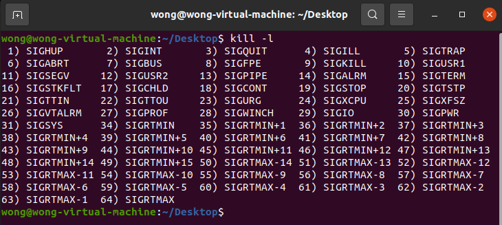 

### 3. 信号的分类

#### (1) 不可靠信号 (传统信号)

* 信号值在 [1, 31] 之间的所有信号

#### (2) 可靠信号 (实时信号)

* 信号值在 [ `SIGRTMIN` , `SIGRTMAX` ] , 即: [34, 64]
	* `SIGRTMIN` ==> 34
	* `SIGRTMAX` ==> 64

#### (3) 信号小知识补充

* 信号32与信号33 ( `SIGCANCEL` & `SIGSETXID` ) 被 **NPTL线程库** 征用 **(征用意指被明确赋予了含义)**
* NPTL ==> Native Posix Threading Library
	* 即 : POSIX线程标准库 , Linux可以使用这个库进行多线程编程
* $\color{red}{对于Linux内核 , 信号32是最小的}$ **$\color{red}{可靠信号}$**
* `SIGRTMIN` **$\color{SkyBlue}{在}$** `signal.h` **$\color{SkyBlue}{中定义}$** , **$\color{SkyBlue}{不同平台的linux可能不同}$** **(arm  linux)**

### 4. 不可靠信号 vs 可靠信号

* 不可靠信号
	* 内核 不保证 信号可以递送到目标进程 (内核对信号状态进行标记)
	* 如果信号处于未决状态 (从信号产生到信号被进程接收之间的状态) , 并且相同信号被发送 ,内核丢弃后续相同信号
	* 进程只知道一个不可靠信号是否递达 , 没有办法知道这个不可靠信号递达了几次

 

* 可靠信号
	* 内核维护信号队列 , 未决信号位于队列中 , 因此 信号不会被丢弃
	* 严格意义上 , 信号队列 有上限 , 因此不能无限制保存可靠信号

### 5. 一些注意事项

* 不可靠信号的默认处理行为可能不同 $\color{red}{(忽略 , 结束)}$
* 可靠信号的默认处理行为都是 **$\color{red}{结束进程}$**
* 信号的可靠性由 **$\color{red}{信号数值决定 ,与发送方式无关}$**
* 信号队列的上限可通过命令设置
	* 查询信号队列上限 : `ulimit -i`
	* 设置信号队列上限 : `ulimit -i 10000`

>```tex
>‼️ ‼️ ‼️ 如果ulimit -i 10000命令不成功,可以参考一下方法,在终端输入一下命令
>```
>
>```C++
>echo "* soft sigpending 655360" >>/etc/security/limits.conf
>echo "* hard sigpending 655360" >>/etc/security/limits.conf
>```
>
>```tex
>‼️ ‼️ ‼️ 特别需要注意的是，设置好之后，需要退出当前终端，重新登录才会生效
>```

### 6. 信号可靠性实验设计

* 目标 : 验证信号可靠性 (不可靠信号 or 可靠信号)
* 方案 : **$\color{red}{对目标进程“疯狂”发送N次信号,验证信号处理函数调用次数是怎么样的}$**
* 预备函数 : 

>
>```c++
>int sigaddset(sigset_t* set, int signum);
>int sigdelset(sigset_t* set, int signum);
>int sigfillset(sigset_t* set);
>int sigemptyset(sigset_t* set);
>int sigprocmask(int how, const sigset_t* set, sigset_t* oldset);
>```
>

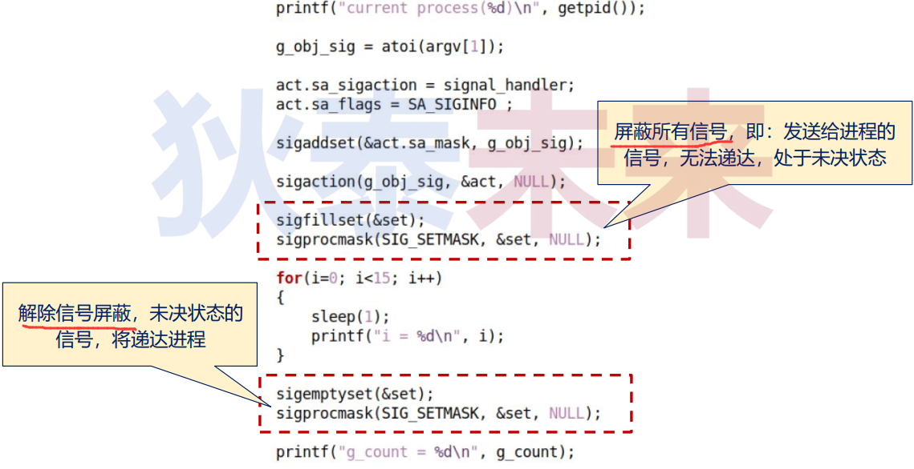 

### 7.编程实验 : 信号可靠性实验

[信号可靠性实验](https://github.com/WONGZEONJYU/Linux_System_Program/tree/main/10.Signal/13/reliability)

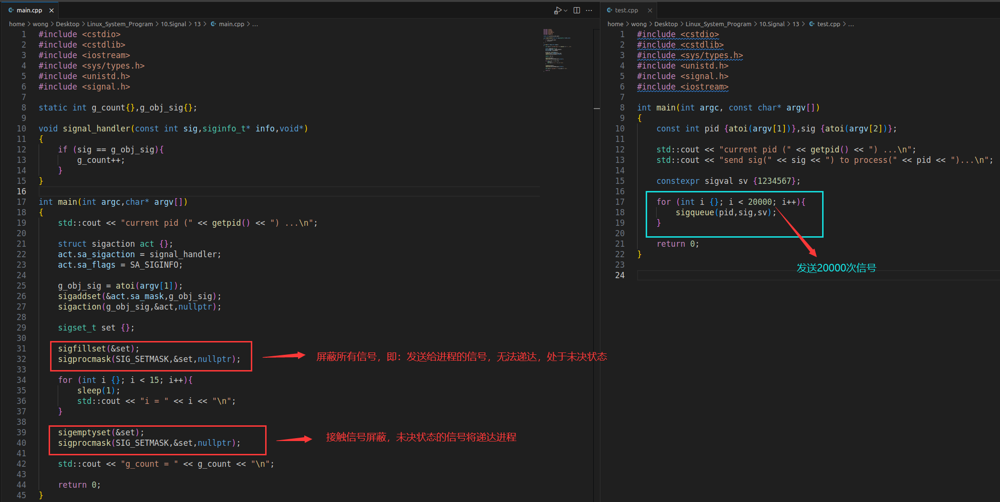 

#### (1) 不可靠信号

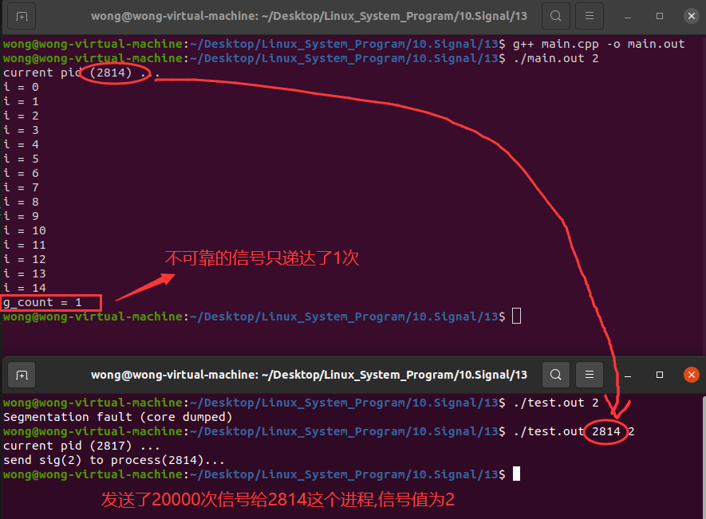 

#### (2) 可靠信号

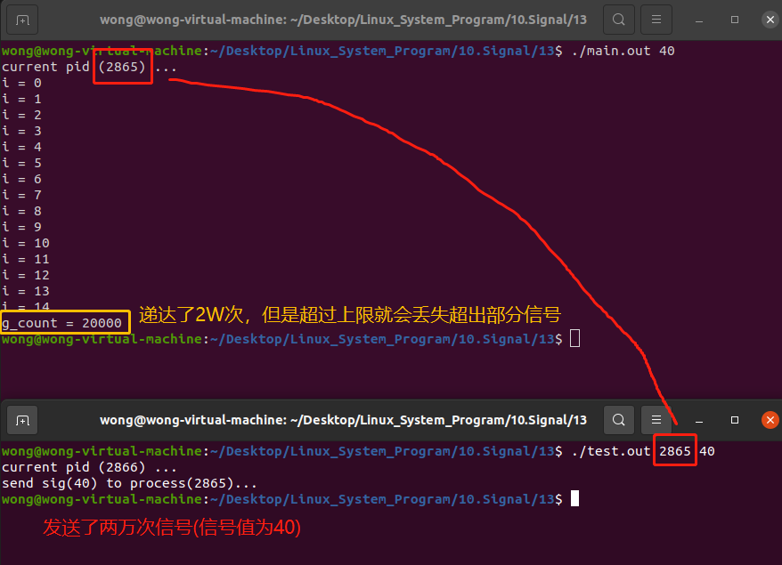 

#### (3) 超出范围的

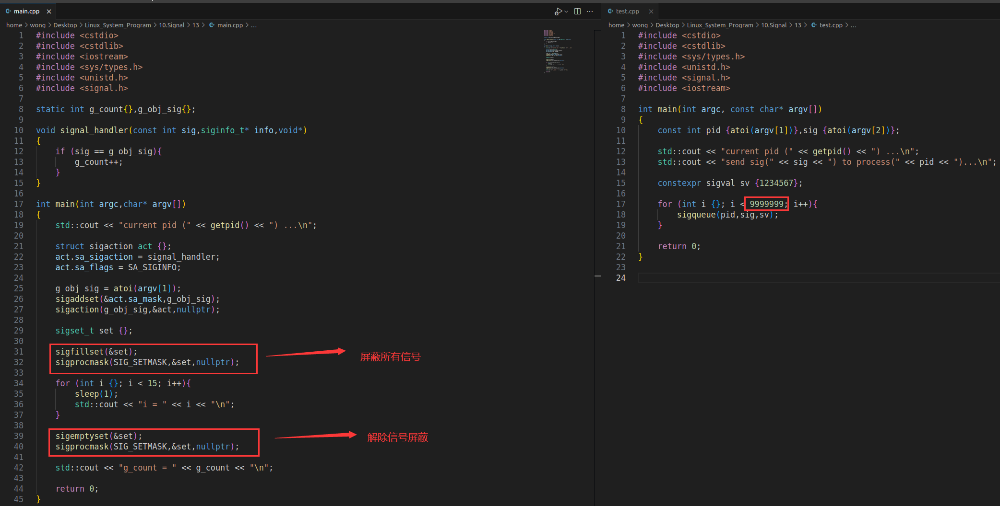 

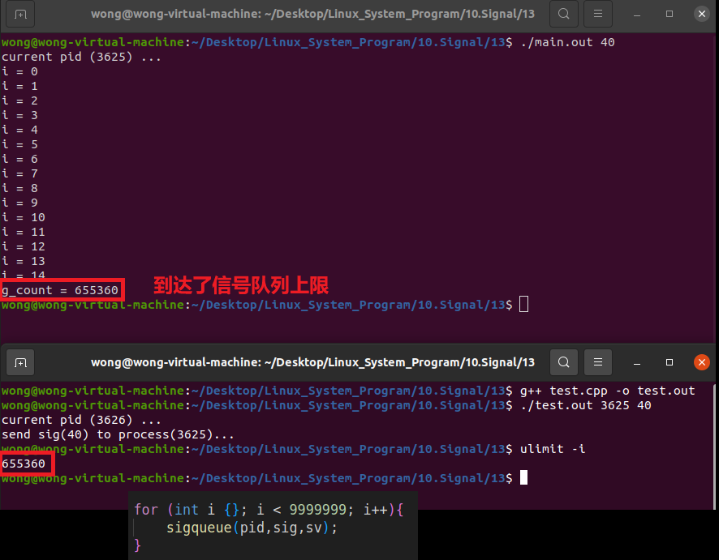 

## (二) 基于信号的进程间通信实验

* $\color{red}{发送端}$ : A 进程将 `TLV` 类型的数据 通过可靠信号传递给B进程
	* `TLV : (type, length, value)`
	* 由于可靠信号的限制 , 每次传输 **$\color{red}{4字节数据}$**
* $\color{red}{接收端}$ ：B进程首先接收4字节数据 ( `type` 或 `type` + `length` )
	* 根据接收到的length信息 , 多次接收后续的字节数据
	* 每次只能接收4字节数据 , 设计层面需要进行 **$\color{red}{状态处理}$**

### 1. 状态设计

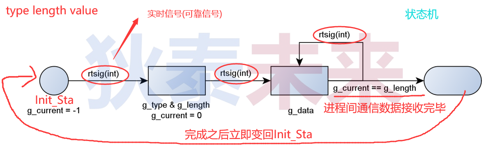 

### 2. 数据发送进程关键实现

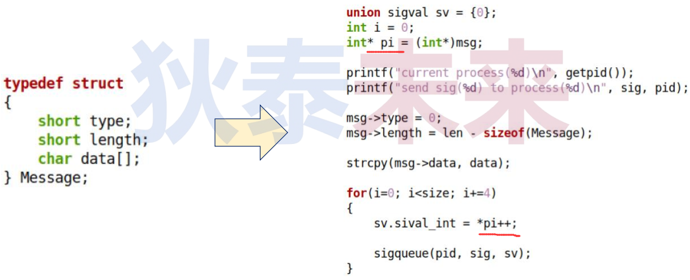 

### 3. 数据接收进程关键实现

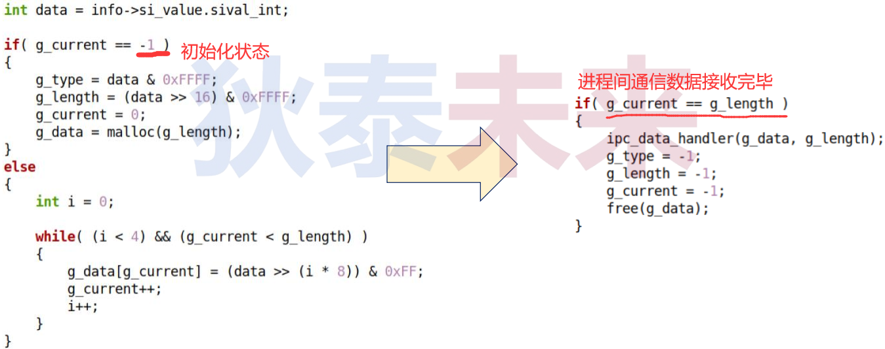 

### 4. 编程实验 : 进程间通信实验(IPC)

[Signal用于IPC参考代码](https://github.com/WONGZEONJYU/Linux_System_Program/tree/main/10.Signal/13/ipc)

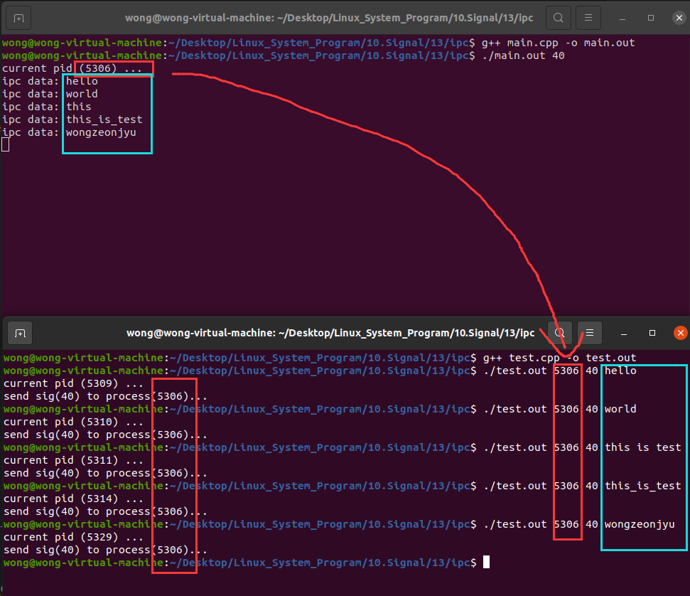 
