# 十五、信号处理设计模式

## (一) Linux应用程序安全性讨论

### 1. 问题

❓如何编写信号安全的应用程序? ? ?

### 2. 不同场景

#### (1) 场景一 : 不需要处理信号

* 应用程序实现单一功能 , 不需要关注信号
* 如 : 数据处理程序 , 文件加密程序、科学计算程序

#### (2) 场景二 : 需要处理信号

* 应用程序长时间运行 , 需要关注信号 , 并及时处理
* 如 : 服务端程序 , 上位机程序

## (二) 场景一 : 不需要信号处理 (单一功能应用程序)

>```
>📖 在代码层面,直接阻塞所有可能的信号(本质上就是信号始终处于未决状态,无法递达进程)
>```

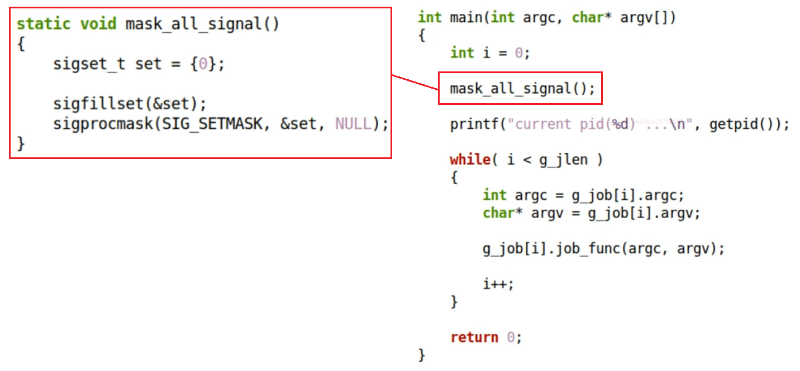 

* 编程实验 : 不需要处理信号

[编程实验：不需要处理信号](https://github.com/WONGZEONJYU/Linux_System_Program/blob/main/10.Signal/15/0_no_need_signal/main.cpp)

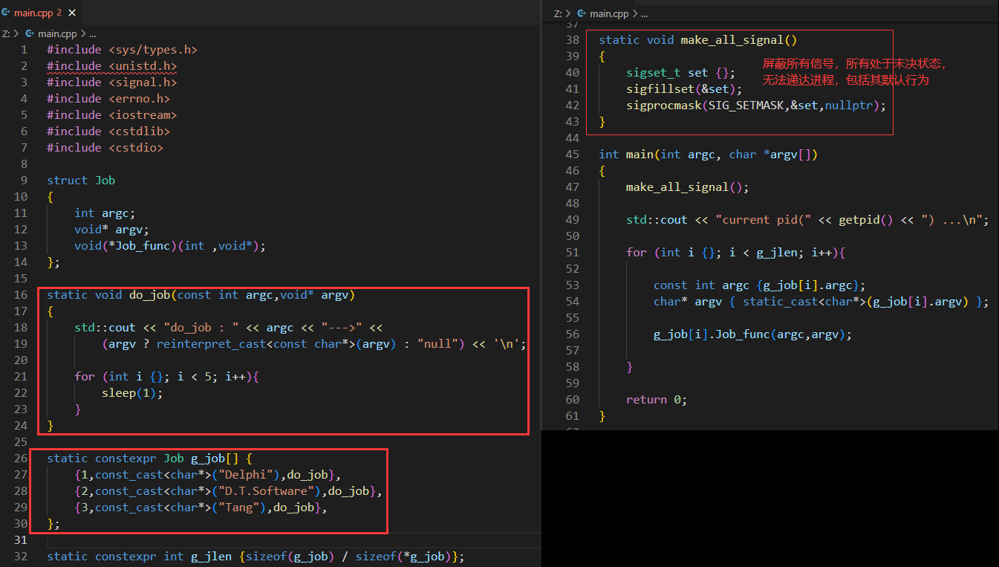 

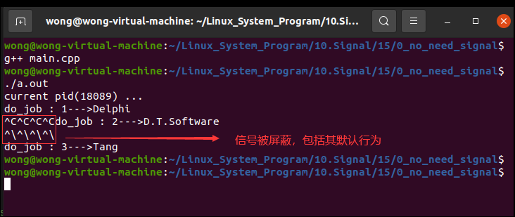 

## (三) 场景二 : 需要处理信号 (长时间运行的应用)

* **$\color{red}{同步方案}$**
	* 通过 **$\color{red}{标记}$** 同步处理信号 , 整个应用中 **$\color{red}{只有一个执行流( 交替执行 )}$**
* **$\color{red}{异步方案}$**
	* 专用任务处理 , 应用中存在 **$\color{red}{多个执行流 (多线程应用)}$**
	* 设置 **$\color{red}{专用于信号处理的任务}$** , 其它任务忽略信号 , 专注功能实现

### 1.同步解决方案 (单任务)

* 信号处理逻辑与程序逻辑位于同一个上下文
	* 即：信号处理函数与主函数不存在资源竞争关系

#### (1) 方案设计一

1. 将任务分解为 **$\color{red}{子任务}$** (每个任务可对应一个函数)
2. 信号递达时 , 信号处理函数中 $\color{red}{仅}$ **$\color{red}{标记}$** $\color{red}{递达状态}$
3. $\color{red}{子任务处理结束后 , 真正执行信号处理}$

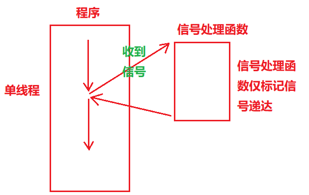 

##### ① 同步方案示例一

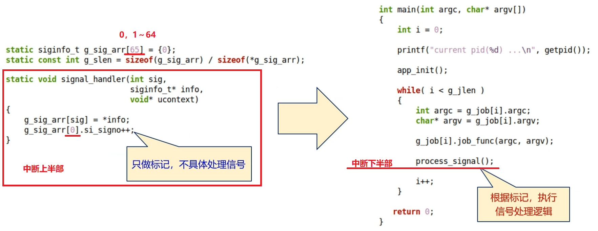 

##### ② 编程实验

[同步方案一参考代码](https://github.com/WONGZEONJYU/Linux_System_Program/tree/main/10.Signal/15/1_Synchronize)

###### a. 对于不可靠信号

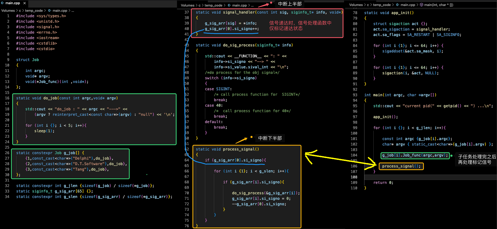 

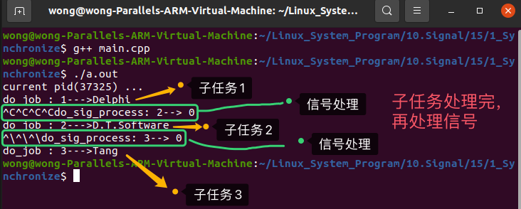 

###### b. 对于可靠信号存在问题

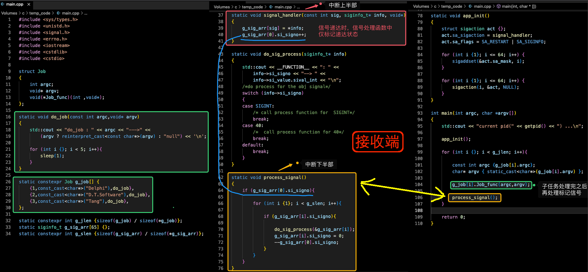 

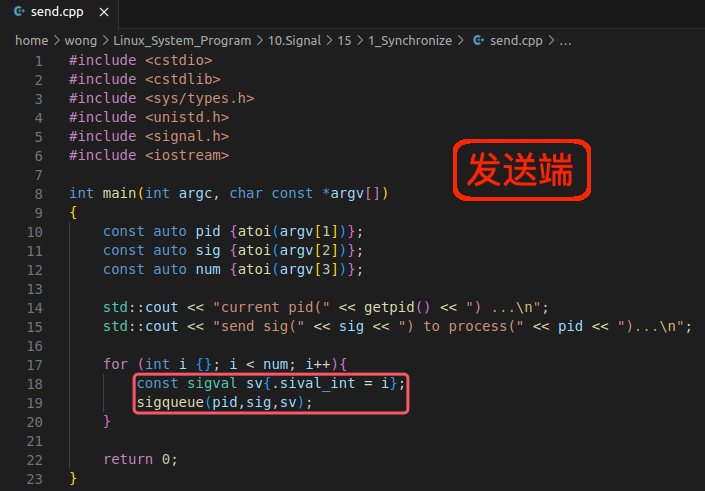 

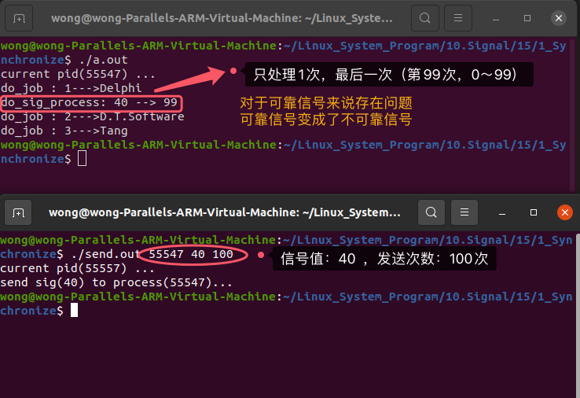 

##### ③ 存在的问题

* 由于给每个信号唯一的标记位置 , 因此 , **$\color{red}{所有信号转变为不可靠信号}$** , 并且仅保留最近递达的信号信息
* 可能改进方案 : 
	* 标记位置设计为链表 , 信号递达后在对应位置的链表处增加结点保留信号信息 ( 增加结点涉及到 `malloc()` , 不安全 )

#### (2) 方案设计二

* 将任务分解为子任务 (每个任务可对应一个函数)
	* 创建 **$\color{red}{信号文件描述符}$** , 并阻塞所有信号 (可靠信号递达前位于内核队列)
	* 意义 : 化被动为主动 , 原先任务的执行流在收到信号后被动中断。现在主动去检查是否有信号 , 如果有信号 , 将信号取出来处理 , 此时就需要文件描述符。
* 子任务处理结束后 , 通过 `select(...)` $\color{red}{机制}$ 判断是否有信号需要处理
	* `true` : 处理信号 , `false` : 等待超时

##### ① 系统关键函数

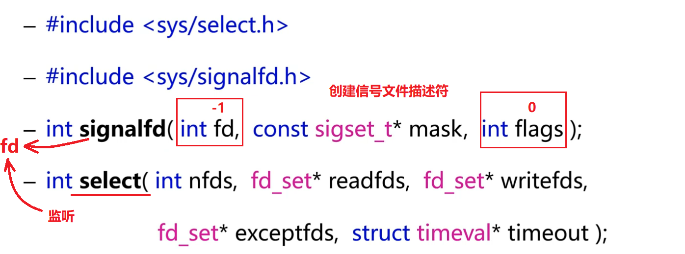 

* 使用 `signalfd()` 处理信号
	* 先屏蔽所有信号(无法递达进程) , 之后为屏蔽信号创建文件描述符 , 当时机成熟 , 通过 `read()` 系统调用读取未决信号 (主动接收信号)

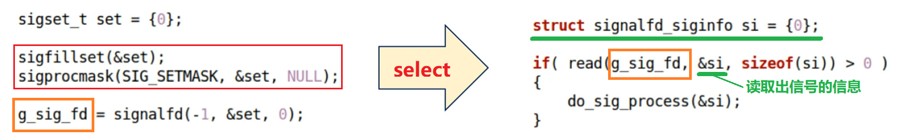 

* 使用 `select(...)` 监听文件描述符 (简单介绍 `selelct(...)` 函数怎么使用)

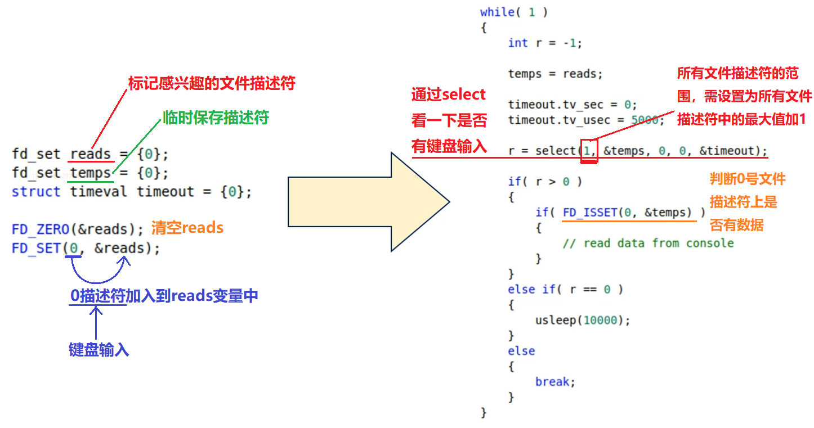 

* 使用  `select(...)` 处理信号

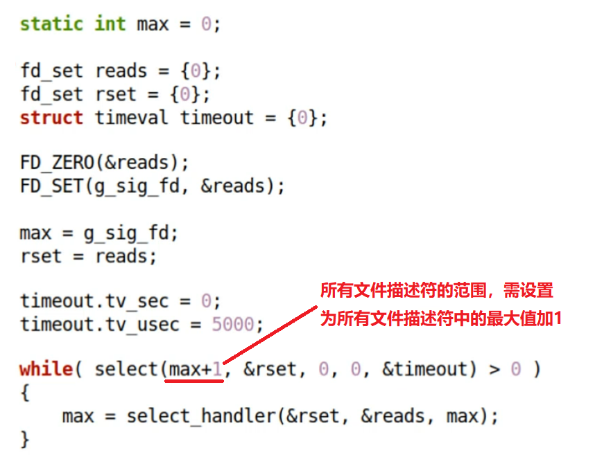 

##### ② 编程实验

[同步方案二参考代码](https://github.com/WONGZEONJYU/Linux_System_Program/tree/main/10.Signal/15/2_Synchronize_select)

###### a.可靠信号 (实时信号)

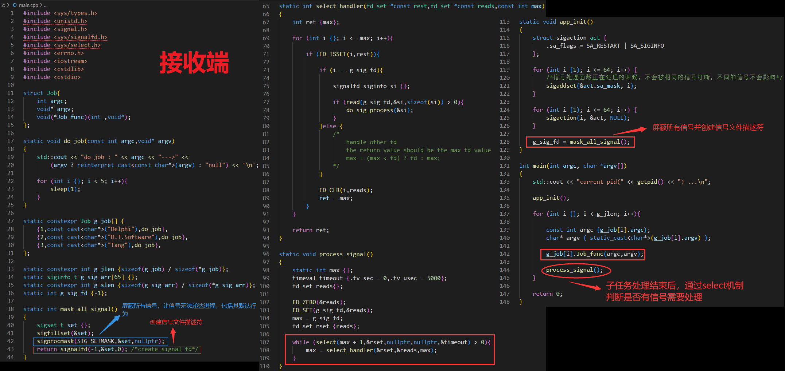 

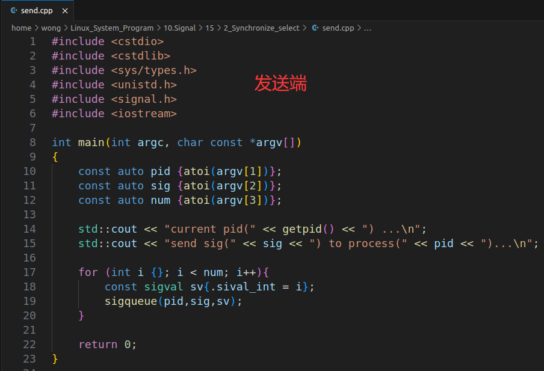 

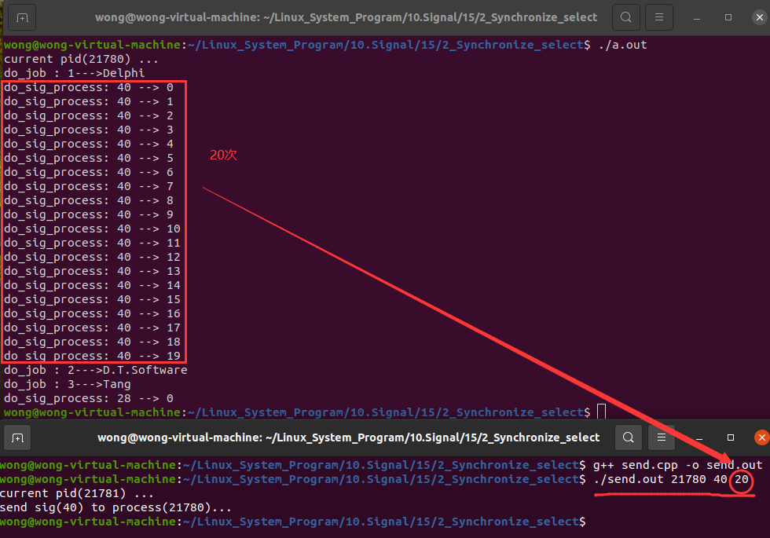 

###### b. 不可靠信号

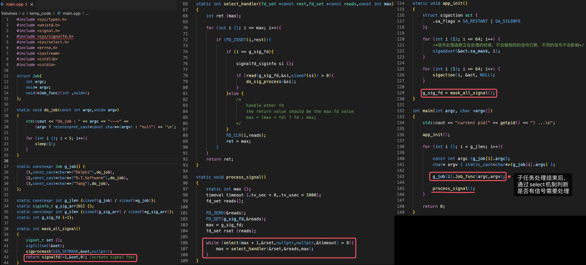 

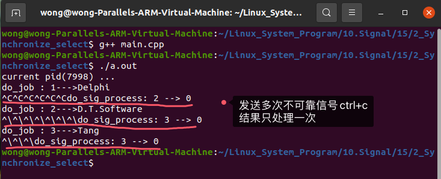 

##### ③ 存在的问题

* 虽然解决了信号丢失的问题 , 但是实时性不好。由于使用了`select(...)` 机制 , 即便没有信号需要处理 , 也需要等待 `select(...)` 超时 , $\color{red}{任务}$ **$\color{red}{实时性}$** $\color{red}{受到影响}$。

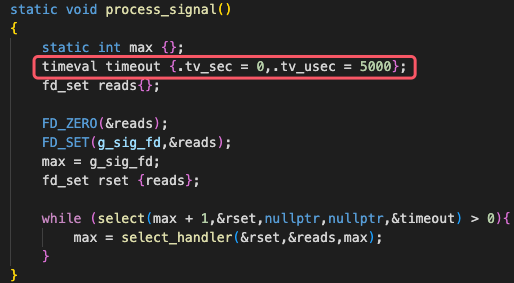 

##### ④ 思考

❓是否可以兼顾 **$\color{red}{信号处理}$** 与 **$\color{red}{任务执行}$** 的实时性?

### 2. 异步解决方案 (多任务) 

* 使用独立任务处理信号 , 程序逻辑在其它任务中执行
* 即 : 通过 **$\color{red}{多线程}$** 分离信号处理与程序逻辑
	* 主线程 : 专用于处理信号
	* 其它线程 : 完成程序功能

#### (1) 问题

❓信号递达进程后 , 在 **$\color{red}{哪一个执行流}$** 中进行处理?

#### (2) 多线程信号处理

* 信号的发送目标是 **$\color{red}{进程}$** , 而不是某个特定的线程
* 发送给进程的信号仅递送给一个线程 ==> 哪一个线程处理？
* 内核在不会阻塞目标信号的线程中进行随机选择 (那个线程没有屏蔽信号 , 就在哪个线程的执行流执行)
* 每个线程拥有独立的信号屏蔽掩码

#### (3) 方案

* 主线程 : 对目标信号设置信号处理的方式
	* 当信号递达进程时 , 只可能是 **$\color{red}{主线程}$** 进行信号处理
* 其它线程 : 首先屏蔽所有可能的信号 (简单粗暴) ,之后执行任务代码
	* 无法接收到信号 , 不具备信号处理能力

#### (4) 进程与线程

**$\color{red}{进程 : 应用程序的一次加载执行 (系统进行资源分配的基本单位)}$**
**$\color{red}{线程 : 进程中的程序执行流}$**

* 一个进程可以存在多个线程 (至少存在一个线程)
* 每个线程执行不同的任务 (多个线程可并行执行)
* 同一个进程中的多个线程共享进程的系统资源

##### ① Linux多线程API函数

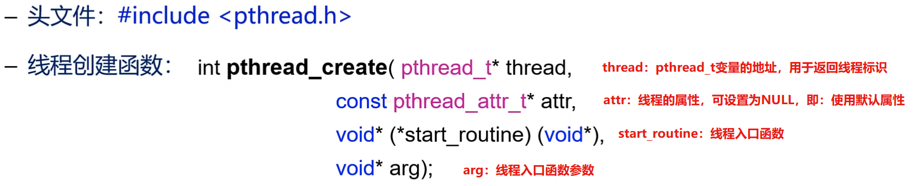 

* 线程标识 : `pthread_t pthread_self(void);`
	* 获取当前线程的ID标识 (tid)
* 线程等待 : `int pthread_join(pthread_t thread, void** retval);`
	* 等待目标线程执行结束

##### ② 多线程编程示例

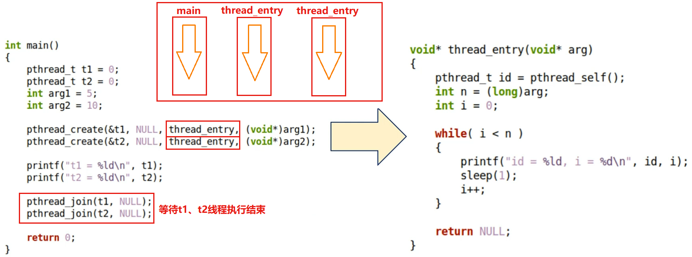 

#### (5) 异步方案示例

##### ①主线程

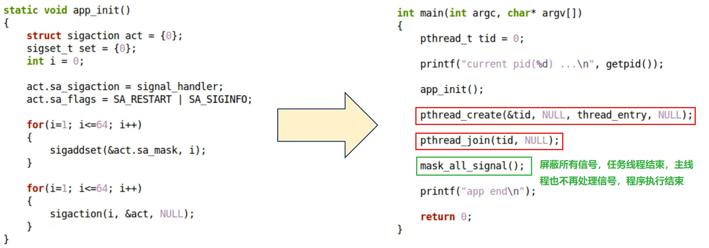 

##### ② 任务线程

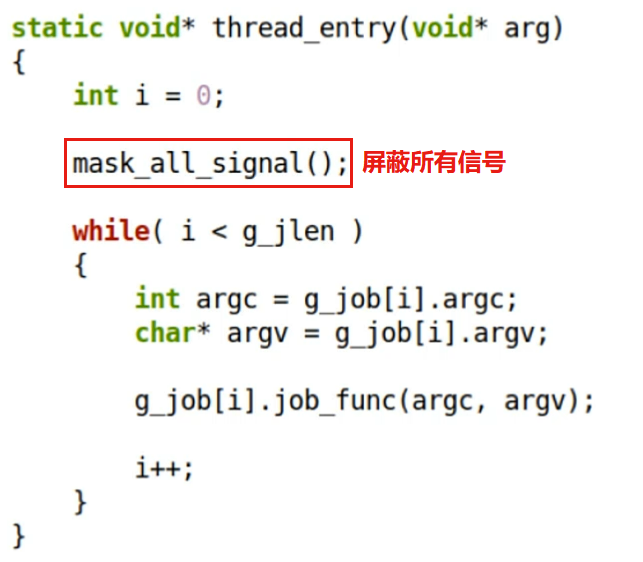 

#### (6) 编程实验 : 多线程信号处理

[多线程信号处理参考代码](https://github.com/WONGZEONJYU/Linux_System_Program/tree/main/10.Signal/15/3_Synchronize_thread)

##### ①不可靠信号

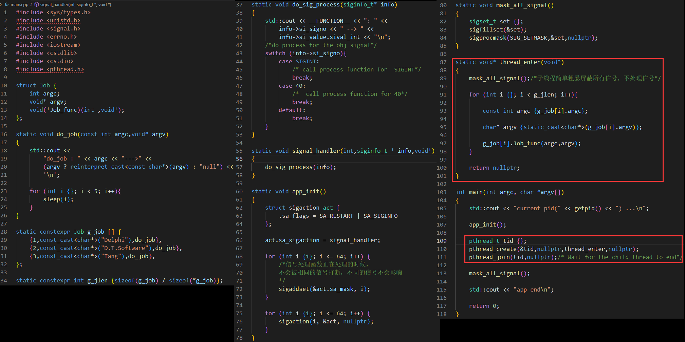 

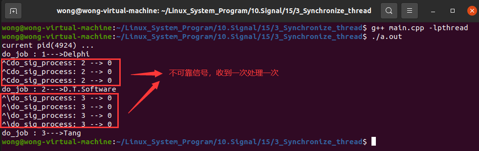 

##### ② 可靠信号(实时信号)

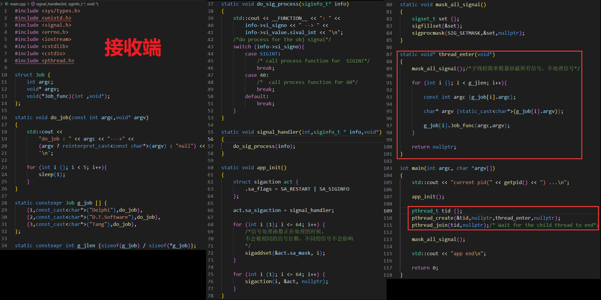 

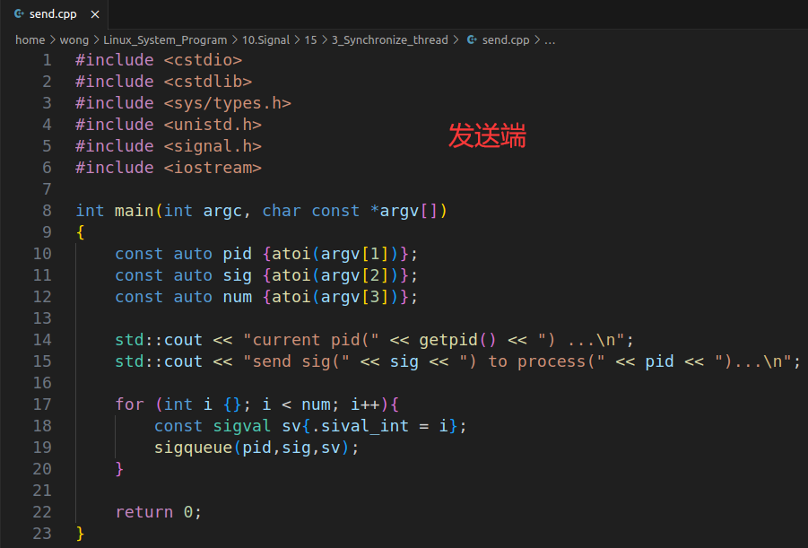 

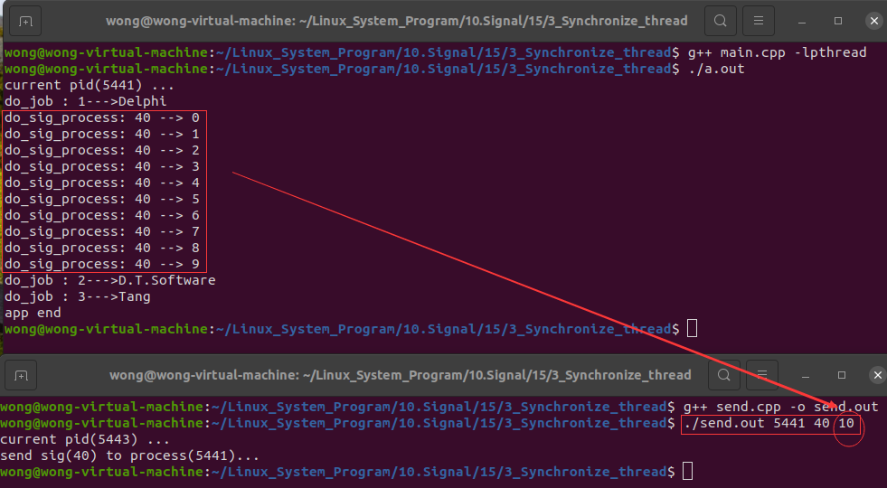 

## (四) 信号设计模式小结

* 多数程序不需要处理信号 , 因此可直接屏蔽信号
* 需要处理信号的程序 , 重点考虑信号安全性问题
	* $\color{red}{同步 处理方案,通过设计让}$ **$\color{red}{任务代码}$** $\color{red}{和}$ **$\color{red}{信号处理代码}$** $\color{red}{交替执行}$
		* 问题 : 信号处理是否及时? 任务执行是否实时?
	* $\color{red}{异步 处理方案,}$ **$\color{red}{任务代码}$** $\color{red}{与}$ **$\color{red}{信号处理代码}$** $\color{red}{位于 不同执行流}$
		* 问题 : 将信号安全性问题转换为线程安全性问题 , 因此 , 程序本身是否做到线程安全?
