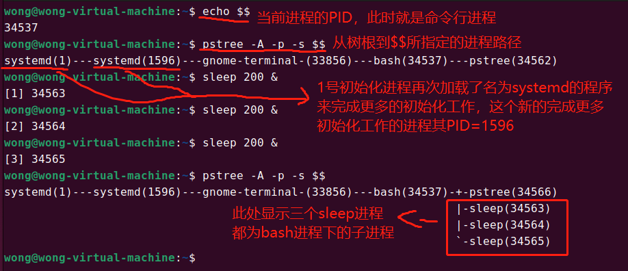
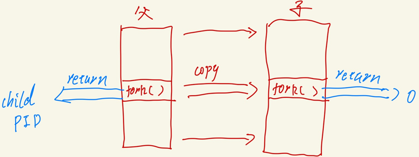
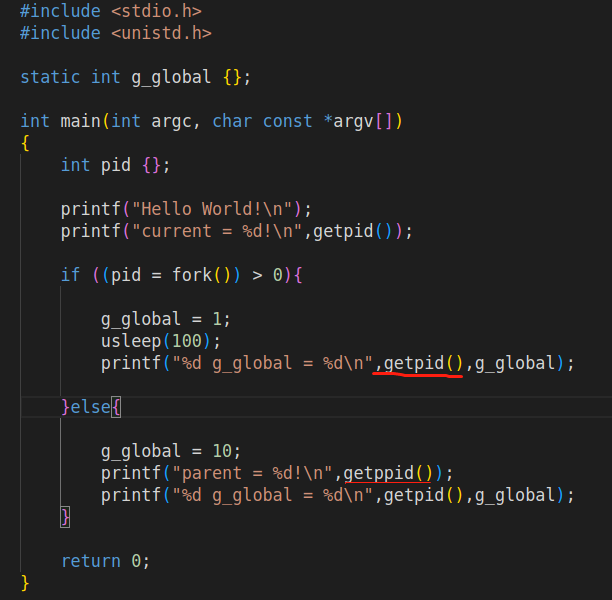
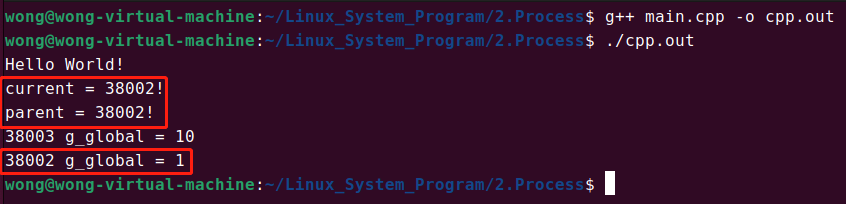
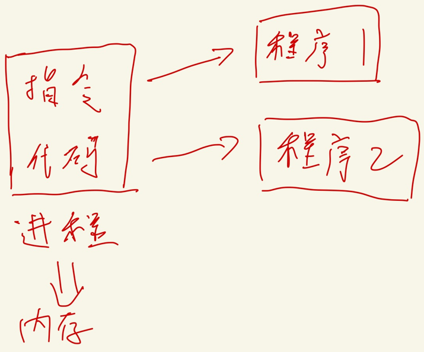
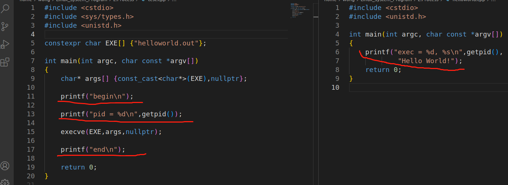
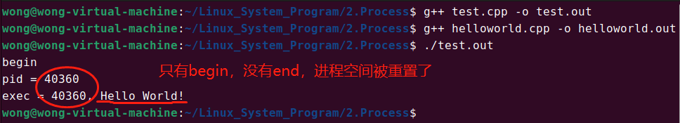
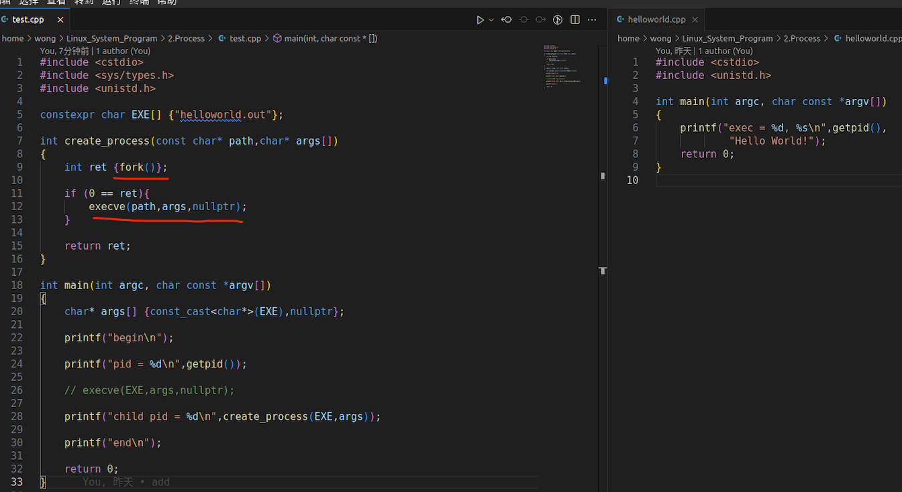
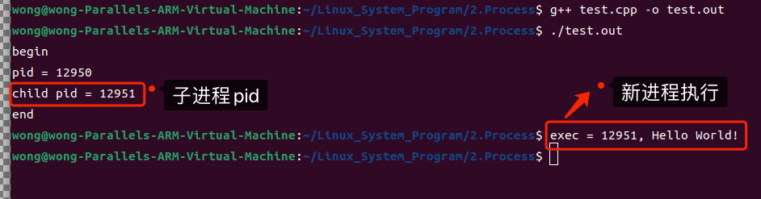

# 三、初识Linux进程

## （一）进程理论状态切换

### 1.问题：

> ❓strace输出中得到`execve(…)`究竟是什么？

### 2.进程生命周期

> 进程是“活”的实体
>
> 

### 3.Linux进程基本概念

> * $\color{red}{进程}$ 是Linux任务的 $\color{red}{执行单元}$ , 也是Linux系统资源的 $\color{red}{分配单元}$
> * 每个Linux应用程序运行后由一个或多个进程构成
> * 每个Linux进程可以执行一个或多个程序
> * Linux进程有多个 $\color{red}{不同状态}$ ( 即 : Linux进程有 $\color{red}{不同"活法"}$ )

### 4.Linux进程生命周期

> * $\color{red}{就绪/运行状态(R)}$ : TASK_RUNNING
> * $\color{red}{阻塞状态}$ : 
>   * 可中断 (S) : TASK_INTERRUPTIBLE
>   * 不可中断 (D) : TASK_UNINTERRUPTIABLE
>   * 区别 : 可中断的阻塞状态可以被唤醒
> * $\color{red}{停止状态 (T)}$ : TASK_STOPPED
> * $\color{red}{退出状态}$ :
>   * 僵尸 (X) : EXIT_ZOMBIE (进程生命周期已经结束 , 内存残留这个进程的相关信息)
>   * 死亡 (Z) : EXIT_DEAD
>
> 

### 5.Linux进程状态剖析

>
>
>```
>😅提示：进程状态解释可以在终端输入 man ps去查看详细信息
>Here are the different values that the s, stat and state output specifiers (header "STAT" or "S") will display to describe the state of a process:
>D    uninterruptible sleep (usually IO)
>R    running or runnable (on run queue)
>S    interruptible sleep (waiting for an event to complete)
>T    stopped by job control signal
>t    stopped by debugger during the tracing
>W    paging (not valid since the 2.6.xx kernel)
>X    dead (should never be seen)
>Z    defunct ("zombie") process, terminated but not reaped by its parent
>For BSD formats and when the stat keyword is used, additional characters may be displayed:
><    high-priority (not nice to other users)
>N    low-priority (nice to other users)
>L    has pages locked into memory (for real-time and custom IO)
>s    is a session leader
>l    is multi-threaded (using CLONE_THREAD, like NPTL pthreads do)
>+    is in the foreground process group
>
>```
>
>```c++
>/*loop.c / loop.cpp */
>int main(int argc, char const *argv[])
>{
>    while(true);
>    return 0;
>}
>```
>
>[参考链接](https://github.com/WONGZEONJYU/Linux_System_Program/blob/main/2.Process/loop.cpp)
>
>

### 6.Linux进程必会知识

>* 每个进程都有一个唯一的标识 $\color{red}{(进程标识符，PID)}$
>* 每个进程都是由另一进程创建而来 ( 即 : **$\color{red}{父进程}$** )
>
>```c++
>#include <sys/types.h>
>#include <unistd.h>
>
>pid_t getpid();    /*获取当前进程的PID*/
>pit_t getppid();    /*获取父进程*/
>
>```
>

### 7. 问题

>❓第1个进程是什么?
>
>❓如何创建进程?

## （二）Linux进程树

> * 整个Linux系统的所有进程构成一个树状结构
> * $\color{red}{树根由内核自动创建,即:IDLE(PID=0)}$
> * 系统中的 $\color{red}{第1个进程 是 初始化进程}$ ( `PID = 1` , 一些Linux版本叫 $\color{red}{init}$ ,一些叫 $\color{red}{systemd}$ )
>   * 0号进程创建1号进程 , 1号进程负责完成内核部分初始化工作
>   * 1号进程加载执行初始化程序 , 演变为用户态1号进程
>
> 
>
> 

## （三）Linux进程创建

> * `pid_t fork(void);` ==> 系统调用
>   * 通过当前进程创建新进程 , 当前进程为父进程 , 新进程为子进程
> * `int execve(const char *pathname, char *const argv[], char *const encp[]);` ==> 系统调用
>   * 在当前进程中执行pathname指定的程序代码
> * $\color{red}{先创建进程,才能执行程序代码}$🔰

### 1. fork()的工作方式

>* 为子进程申请内存空间 , 并将父进程数据 $\color{red}{完全复制}$ 到子进程空间中
>* 两个进程中的程序执行位置完全一致( `fork()` $\color{red}{函数调用位置}$ )
>* 不同之处 :
>   * $\color{red}{父进程:}$ `fork() return child process pid`
>   * $\color{red}{子进程:}$ `fork() return 0`
>     * 通过 `fork()` 返回值判断父子进程 , 执行不同代码
>
>
>
>* 实例 : 
>
>❓下面的程序输出什么?为什么?
>
>[参考代码](https://github.com/WONGZEONJYU/Linux_System_Program/blob/main/2.Process/main.cpp)
>
>```c++
>#include <stdio.h>
>#include <unistd.h>
>
>static int g_global {};
>
>int main(int argc, char const *argv[])
>{
>  printf("Hello World!\n");
>   printf("%d line current = %d!\n",__LINE__,getpid());
>   int pid {};
>   if ((pid = fork()) > 0){
> 
>      g_global = 1;
>       usleep(100);
>       printf("%d line %d g_global = %d\n",__LINE__,getpid(),g_global);
> 
>  }else{
> 
>      g_global = 10;
>       printf("%d line parent = %d!\n",__LINE__,getppid());
>       printf("g_global = %d\n",g_global);
>   }
>   return 0;
> }
>
>/*
>运行结果：
>Hello World!
>current = 37698!
>parent = 37698!
>g_global = 10
>37698 g_global = 1
>
>父进程执行到fork()之后创建子进程并返回子进程的PID，执行if分支，父进程休眠100us
>在此期间子进程执行，从fork返回0，执行else分支
>运行结果看起来就是先执行else分支再执行if分支 
>*/   
>```
>
>
>
>

### 2. 思考

> ❓如何理解“每个Linux进程可以执行一个或多个程序”?
>
>

### 3. `execve(...)`的工作方式

>```c++
>int execve(const char *pathname, char *const argv[], char *const encp[]);
>```
>
>* 根据参数路径 $\color{red}{pathname}$ 加载可执行程序 ==> 加载到当前进程中
>* 通过可执行程序信息构建进程数据 , 并写入当前进程空间
>* 将程序执行位置重置到入口地址处 (即: `main()` )
>* `execve()`将 $\color{red}{重置当前进程空间(代码 and 数据)而不会创建新进程}$

### 4. 问题

>❓下面的程序输出什么?为什么?
>
>[test0.cpp参考链接](https://github.com/WONGZEONJYU/Linux_System_Program/blob/main/2.Process/test0.cpp)
>
>[helloworld.cpp参考链接](https://github.com/WONGZEONJYU/Linux_System_Program/blob/main/2.Process/helloworld.cpp)
>
>
>
>
>
>- `fork()`与`execve()`结合使用创建新进程 : 
>
>[test.cpp参考链接](https://github.com/WONGZEONJYU/Linux_System_Program/blob/main/2.Process/test.cpp)
>
>[helloworld.cpp参考链接](https://github.com/WONGZEONJYU/Linux_System_Program/blob/main/2.Process/helloworld.cpp)
>
>
>
>

