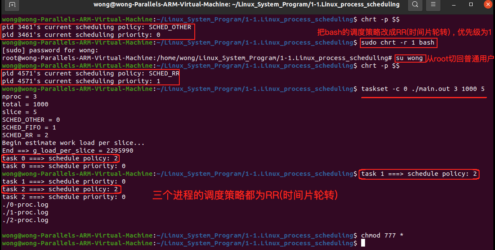

# 1-1初探Linux进程调度

## 1. Linux进程调度的基本概念

### 1.1 已知

**$\color{red}{父进程创建子进程后,父子进程同时运行}$**

### 1.2 问题

❓ 如果计算机 **$\color{red}{只有一个处理器}$** , 父子进程以什么方式同时 **$\color{red}{执行}$** ?

* 运行 : 从 **$\color{red}{可执行文件}$** 变成 **$\color{red}{进程}$** 的过程

* 执行 : 拿到处理器之后 , 执行进程的指令

### 1.3 Linux系统调度

* 内核具有进程调度的能力 , 多个进程可同时运行
* 微观上 , 处理器同一时间只能执行一个进程
* 同时运行多个进程时,  每个进程都会获得适当的执行时间片
* 当执行时间片用完 , 内核调度下一个进程执行

### 1.4 进程调度原理

* n 个进程 ( n >= 2 ) 同时位于内存中
* 处理器执行每个进程 , 每个进程拥有一个时间片
* 时间片用完 , 通过时钟中断完成进程切换 (调度)

 

### 1.5 Linux系统调度策略

#### 1.5.1 普通调度策略

* `SCHED_OTHER` : Linux 默认的调度策略 , 也被成为 `CFS (Completely Fair Scheduler)` , 给每个进程  **$\color{red}{动态计算优先级}$** , 根据 **$\color{red}{优先级}$** 和 **$\color{red}{进程执行的历史记录}$** 来确定下一个执行的进程

#### 1.5.2 实时调度策略

* `SCHED_FIFO` : 
	* 基于 **$\color{red}{优先级顺序}$** **$\color{SkyBlue}{(优先级相同时,按照时间上谁先运行)}$** 调度进程 , 并在一个进程获得CPU时一直执行 , 直到进程主动释放
* `SCHED_RR` : 
	* 基于 **$\color{SkyBlue}{"时间片轮转"}$** 的调度策略 , 给每个进程设置一个 **$\color{red}{固定的时间片}$** , 并按照 **$\color{red}{优先级顺序}$** 对进程进行 **轮流** 调度

### 1.6❓如何验证Linux中的进程调度?

#### 1.6.1实验目标

* 验证 **$\color{red}{同一时刻只有一个进程在执行}$**

* 验证 **$\color{red}{不同调度策略 , 进程执行的连续性不同}$**

#### 1.6.2 实验设计

* n ( n>=2 ) 个进程同时 **$\color{SkyBlue}{运行}$** , 统计各个进程的 $\color{red}{执行}$ 时刻
* 进程运行方式 :
	* 每个slice时间记录如下值 : 进程编号 , 当前时间值 ( 当前进程运行之后,执行多长时间 ) , 完成度
	* 在total时间后结束运行 , 并输出记录的数据
	* 通过记录的数据分析进程调度策略

### 1.7 实验中需要解决的问题

>1. ❓如何让 进程 每次 "固定" 工作slice时间 ( 单位毫秒 ) ?
>2. ❓如何获取和改变进程的调度策略 ?
>3. ❓如何记录数据并输出数据 ( 需要保存数据 ) ?
>4. ❓如何图形化显示数据 ?

#### 1.7.1  如何让 进程 每次 "固定" 工作slice时间 ( 单位毫秒 ) ?

##### 1.7.1.1 Linux中的时间获取

 

* `clk_id` : 
	1. `CLOCK_MONOTONIC` ==> 系统启动后到当前的时间
	2. `CLOCK_REALTIME` ==> 从1970.1.1到当前的时间

##### 1.7.1.2 "固定" 时间工作量估算

 

#### 1.7.2 如何获取和改变进程的调度策略 ?

##### 1.7.2.1 通过系统API

 

##### 1.7.2.2 通过 `chrt` 命令

* `chrt` 命令简介
	* Linux系统中可以使用 `chrt` 命令来 **$\color{red}{查看}$** 、**$\color{red}{设置}$** 一个进程的优先级和调度策略

* 命令用法
	* `char [options] [prio] [pid | command[arg]...]`

* 主要参数
	* `-p,--pid` 操作一个 **$\color{red}{已存在}$** 的PID , 不启动一个新的任务
	* `-f,--fifo` 设置调度策略为 `SCHED_FIFO` 
	* `-m,--max` 显示最小和最大有效优先级 , 然后退出
	* `-o,--other` 设置调度策略为 `SCHED_OTHER` 
	* `-r,--rr` 设置调度策略为 `SCHED_RR` 

* 示例 :
	* 指定目的进程的PID来更改调度策略
		* `char -p -r 99 1328` (99是优先级 , 1328是PID)
	* 更改bash为实时进程 , 优先级为10
		* `char -f 10 bash` 

#### 1.7.3 如何记录数据并输出数据 ( 需要保存数据 ) ?

##### 1.7.3.1 记录进程运行后产生数据

 

#### 1.7.4 如何图形化显示数据 ?

##### 1.7.4.1 图形化数据显示与分析

 

### 1.8 编程实验

[[参考链接]进程调度实验代码](https://github.com/WONGZEONJYU/Linux_System_Program/tree/main/1-1.Linux_process_scheduling)

#### 1.8.1 taskset实验

[[helloworld.cpp代码参考链接]](https://github.com/WONGZEONJYU/Linux_System_Program/blob/main/1-1.Linux_process_scheduling/helloworld.cpp)

 

 

 

>```tex
>‼️ Taskset是一个可以将某进程任务指定到某个CPU上运行
>通过 taskset 命令可将某个进程与某个CPU核心绑定，使得其仅在与之绑定的CPU核心上运行
>可以通过taskset --help查看使用
>```

[[taskset命令详解参考链接]](https://blog.csdn.net/weixin_56270746/article/details/125271338)

#### 1.8.2 进程调度实验

[[main.cpp参考链接]](https://github.com/WONGZEONJYU/Linux_System_Program/blob/main/1-1.Linux_process_scheduling/main.cpp)

[[proc-graph.py参考链接]](https://github.com/WONGZEONJYU/Linux_System_Program/blob/main/1-1.Linux_process_scheduling/proc-graph.py)

>
>```c++
>#include <sys/wait.h>
>#include <sys/resource.h>
>#include <sys/types.h>
>#include <unistd.h>
>#include <time.h>
>#include <sched.h>
>#include <fcntl.h>
>#include <cstdio>
>#include <cstdlib>
>#include <cstring>
>#include <iostream>
>
>using namespace std;
>
>#if 0
>#define NLOOP_FOR_ESTIMATION    1000000000UL
>#define NSECS_PER_MSEC  1000000UL
>#define NSECS_PER_SEC   1000000000UL
>#else
>static constexpr unsigned long NLOOP_FOR_ESTIMATION {1000000000UL};
>static constexpr unsigned long NSECS_PER_MSEC {1000000UL};
>static constexpr unsigned long NSECS_PER_SEC {1000000000UL};
>#endif
>
>#define DiffNS(begin,end)   ((end.tv_sec - begin.tv_sec) * NSECS_PER_SEC \
>                           + (end.tv_nsec - begin.tv_nsec))
>
>static unsigned long g_load_per_slice {};
>static timespec g_time_begin {};
>
>static unsigned long estimate_loops_per_msec() /*1ms有多少次循环*/
>{
>   timespec begin{},end{};
>
>   clock_gettime(CLOCK_MONOTONIC,&begin);
>
>   for(unsigned long i {};i < NLOOP_FOR_ESTIMATION;++i);
>
>   clock_gettime(CLOCK_MONOTONIC,&end);
>
>   return NLOOP_FOR_ESTIMATION * NSECS_PER_MSEC / DiffNS(begin,end);
>   /*以下书写可能更容易理解(小单位化大单位)*/
>   /* NLOOP_FOR_ESTIMATION / DiffNS(begin,end) */ NSECS_PER_MSEC */
>}
>
>static inline void work()
>{
>   /* g_load_per_slice 每个时间片的循环次数
>   	经过 1 个时间片的循环次数后返回,模拟工作 1 个时间片*/
>   for(unsigned long i {};i < g_load_per_slice;++i);
>}
>
>static void test(const int id,timespec* tss,const int nrecord)
>{
>	/*nrecord 记录的时间片数,也就是进程要执行的总时间*/
>   for (int i {}; i < nrecord; i++){
>       work();
>       clock_gettime(CLOCK_MONOTONIC,tss + i);
>   }
>
>   char buf[128]{};
>   sprintf(buf,"./%d-proc.log",id);
>   cout << buf << '\n';
>
>   int fd { open(buf,O_WRONLY | O_CREAT | O_TRUNC) };
>
>   if (-1 != fd){
>
>       for (int i {}; i < nrecord; i++){
>           sprintf(buf,"%d\t%ld\t%d\n",
>                       id,
>                       DiffNS(g_time_begin,tss[i]) / NSECS_PER_MSEC,
>                       (i+1) * 100 / nrecord);
>           write(fd,buf,strlen(buf));
>       }
>   }
>
>   close(fd);
>}
>
>int main(int argc, char const *argv[])
>{
>   int nproc {atoi(argv[1])};  /*需要创建多少个进程*/
>   int total {atoi(argv[2])};  /*每个创建出来的进程需要执行的总时间*/
>   int slice {atoi(argv[3])};  /*时间片*/
>
>   int nrecord {total / slice};/*需要记录多少次系统时间*/
>
>   timespec* logbuf {reinterpret_cast<timespec*>(malloc(nrecord * sizeof(*logbuf)))};
>   pid_t* pids {reinterpret_cast<pid_t*>(malloc(nproc * sizeof(*pids)))};
>   total = total / slice * slice;
>
>   if (logbuf && pids){
>
>       cout << "nproc = " << nproc << '\n';
>       cout << "total = " << total << '\n';
>       cout << "slice = " << slice << '\n';
>
>       cout << "SCHED_OTHER = " << SCHED_OTHER << '\n';
>       cout << "SCHED_FIFO = " << SCHED_FIFO << '\n';
>       cout << "SCHED_RR = " << SCHED_RR << '\n';
>
>		/*每个时间片的循环次数*/
>       cout << "Begin estimate work load per slice...\n";
>       g_load_per_slice = estimate_loops_per_msec() * slice;
>       cout << "End ==> g_load_per_slice = " << g_load_per_slice << '\n';
>
>       int n {};
>
>       /*记录起始时间*/
>       clock_gettime(CLOCK_MONOTONIC,&g_time_begin);
>
>       for (int i {}; i < nproc; i++){
>
>           pids[i] = fork();
>
>           if (pids[i] < 0){
>               /*某个进程创建失败,杀死所有已经创建的子进程*/
>               int j{};
>               while (j < n){
>                   kill(pids[j++],SIGKILL);
>               }
>               cout << "Process create error...\n";
>               break;
>           }else if (0 == pids[i]){
>
>               int sched {sched_getscheduler(0)};
>               int pri {getpriority(PRIO_PROCESS,0)};
>
>               cout << "task " << i << " ===> schedule policy: " << sched << '\n';
>               cout << "task " << i << " ===> schedule priority: " << pri << '\n';
>
>               test(i,logbuf,nrecord);
>
>               exit(0);
>           }else{
>               n++;
>           }
>       }
>   }
>
>   free(logbuf);
>   free(pids);
>
>   return 0;
>}
>
>```
>
>```python
>import sys
>import numpy as np
>import matplotlib.pyplot as plt
>
>flag = sys.argv[1]
>nproc = int(sys.argv[2])
>
>data = []
>colors = []
>
>for fid in range(0,nproc):
>    fname = str(fid) + '-proc.log'
>    fd = open(fname,'r')
>    lines = fd.readlines()
>
>    for s in lines:
>        s = s.strip().split('\t')
>        data.append([int(s[0]),int(s[1]),int(s[2])])
>        
>    fd.close()
>    #print(data)
>
>    color = '#'
>    
>    for c in np.random.randint(0, 255, 3):
>        color += format(c, '02X')
>    
>    colors.append(color)
>
>#print(colors)
>
>x_value = []
>y_value = []
>c_value = []
>
>if flag == 'id-time':
>    for d in data:
>        y_value.append(d[0])
>        x_value.append(d[1])
>        c_value.append(colors[d[0]])
>
>    plt.scatter(x_value,y_value,c = c_value)
>    plt.title('Data Analysis')
>    plt.ylabel('Process No.')
>    plt.xlabel('TIme(ms)')
>    plt.show()
>
>if flag == 'work-time':
>    for d in data:
>        y_value.append(d[2])
>        x_value.append(d[1])
>        c_value.append(colors[d[0]])
>
>    plt.scatter(x_value,y_value,c = c_value)
>    plt.title('Data Analysis')
>    plt.ylabel('Work Load')
>    plt.xlabel('TIme(ms)')
>    plt.show()
>```
>
>```tex
>⚠️没有numpy与matplotlib用下面命令安装:
>pip install numpy
>pip install matplotlib
>```

##### 1.8.2.1 `SCHED_OTHER`

 

 

 

 

 

 

##### 1.8.2.2 `SCHED_RR`

 

 

 

 

 

##### 1.8.2.3 `SCHED_FIFO`

 

 

 
