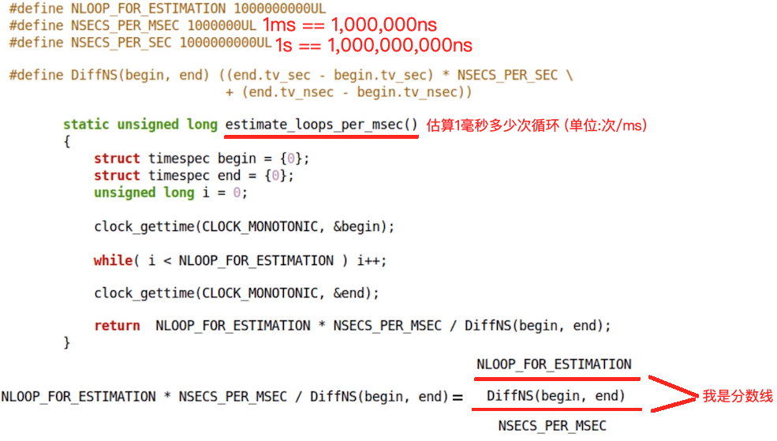

# 1-1.初探Linux进程调度

## 1. Linux进程调度的基本概念

### 1.1 已知

>**$\color{red}{父进程创建子进程后,父子进程同时运行}$**

### 1.2 问题

>❓ 如果计算机 **$\color{red}{只有一个处理器}$** , 父子进程以什么方式同时 **$\color{red}{执行}$** ?
>
>- 运行 : 从 **$\color{red}{可执行文件}$** 变成 **$\color{red}{进程}$** 的过程
>
>- 执行 : 拿到处理器之后 , 执行进程的指令

### 1.3 Linux系统调度

>- 内核具有进程调度的能力 , 多个进程可同时运行
>- 微观上 , 处理器同一时间只能执行一个进程
>- 同时运行多个进程时,  每个进程都会获得适当的执行时间片
>- 当执行时间片用完 , 内核调度下一个进程执行

### 1.4 进程调度原理

>- n 个进程 ( n >= 2 ) 同时位于内存中
>- 处理器执行每个进程 , 每个进程拥有一个时间片
>- 时间片用完 , 通过时钟中断完成进程切换 (调度)
>
>
>
>

### 1.5 Linux系统调度策略

#### 1.5.1 普通调度策略

>- `SCHED_OTHER` : Linux 默认的调度策略 , 也被成为 `CFS (Completely Fair Scheduler)` , 给每个进程  **$\color{red}{动态计算优先级}$** , 根据 **$\color{red}{优先级}$** 和 **$\color{red}{进程执行的历史记录}$** 来确定下一个执行的进程

#### 1.5.2 实时调度策略

>- `SCHED_FIFO` : 
>   - 基于 **$\color{red}{优先级顺序}$** **$\color{SkyBlue}{(优先级相同时,按照时间上谁先运行)}$** 调度进程 , 并在一个进程获得CPU时一直执行 , 直到进程主动释放
>- `SCHED_RR` : 
>   - 基于 **$\color{SkyBlue}{"时间片轮转"}$** 的调度策略 , 给每个进程设置一个 **$\color{red}{固定的时间片}$** , 并按照 **$\color{red}{优先级顺序}$** 对进程进行 **轮流** 调度

### 1.6❓如何验证Linux中的进程调度?

#### 1.6.1实验目标

>- 验证同一时刻只有一个进程在执行
> - 验证不同调度策略 , 进程执行的连续性不同

#### 1.6.2 实验设计

>- n ( n>=2 ) 个进程同时 **$\color{SkyBlue}{运行}$** , 统计各个进程的 $\color{red}{执行}$ 时刻
> - 进程运行方式 :
>   - 每个slice时间记录如下值 : 进程编号 , 当前时间值 ( 当前进程运行之后,执行多长时间 ) , 完成度
>   - 在total时间后结束运行 , 并输出记录的数据
>   - 通过记录的数据分析进程调度策略

### 1.7 实验中需要解决的问题

>1. ❓如何让 进程 每次 "固定" 工作slice时间 ( 单位毫秒 ) ?
>2. ❓如何获取和改变进程的调度策略 ?
>3. ❓如何记录数据并输出数据 ( 需要保存数据 ) ?
>4. ❓如何图形化显示数据 ?

#### 1.7.1  如何让 进程 每次 "固定" 工作slice时间 ( 单位毫秒 ) ?

##### 1.7.1.1 Linux中的时间获取

>
>
>`clk_id` : 
>
>1. `CLOCK_MONOTONIC` ==> 系统启动后到当前的时间
>2. `CLOCK_REALTIME` ==> 从1970.1.1到当前的时间

##### 1.7.1.2 "固定" 时间工作量估算

>

#### 1.7.2 如何获取和改变进程的调度策略 ?

##### 1.7.2.1 通过系统API

>

##### 1.7.2.2 通过 `chrt` 命令

>- `chrt` 命令简介
>   - Linux系统中可以使用 `chrt` 命令来 **$\color{red}{查看}$** 、**$\color{red}{设置}$** 一个进程的优先级和调度策略
>
>- 命令用法
>   - `char [options] [prio] [pid | command[arg]...]`
>
>- 主要参数
>   - `-p,--pid` 操作一个 **$\color{red}{已存在}$** 的PID , 不启动一个新的任务
>   - `-f,--fifo` 设置调度策略为 `SCHED_FIFO` 
>   - `-m,--max` 显示最小和最大有效优先级 , 然后退出
>   - `-o,--other` 设置调度策略为 `SCHED_OTHER` 
>   - `-r,--rr` 设置调度策略为 `SCHED_RR` 
>
>- 示例 :
>   - 指定目的进程的PID来更改调度策略
>     - `char -p -r 99 1328` (99是优先级 , 1328是PID)
>   - 更改bash为实时进程 , 优先级为10
>    - `char -f 10 bash` 

#### 1.7.3 如何记录数据并输出数据 ( 需要保存数据 ) ?

##### 1.7.3.1 记录进程运行后产生数据

>
>
>
