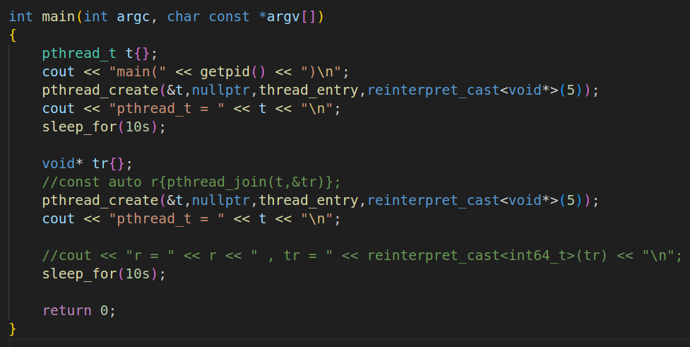

# 1. 再论线程返回值...

> ```c++
> #include <pthread.h>
> int pthread_join(pthread_t thread, void** retval);
> ```

|  返回值   |                    说明                     |
| :-------: | :-----------------------------------------: |
|     0     |                  正常情况                   |
|  `ESRCH`  |       传入的线程标识不存在 , 无此线程       |
| `EINVAL`  |       线程不可连接 或 线程已经被连接        |
| `EDEADLK` | 死锁 , 存在循环连接关系 , 如 : 自己连接自己 |

* 等待的线程未退出 , 则调用线程陷入阻塞状态
* 等待的线程已退出 , 则调用线程将获得线程返回值

## 1.1 `pthread_join() VS wait()`

* 进程之间的等待 **$\color{red}{只能是父进程等待子进程}$**
* 线程之间都可以进行 等待 / 连接
* `wait(...)` 等待任意子进程退出 , `pthread_join(...)` 必须指定目标线程
* `pthread_join(...)` 等待的线程 **$\color{red}{必然是}$** `pthread_create(...)` 创建的线程  

下面的程序输出什么❓为什么❓

   

## 1.2 编程实验

[[test-1.cpp参考链接]](https://github.com/WONGZEONJYU/Linux_System_Program/blob/main/1-10-Thread-connection-and-separation/test-1.cpp)

> ```c++
> #include <iostream>
> #include <thread>
> #include <unistd.h>
> 
> using namespace std;
> using namespace chrono;
> using namespace this_thread;
> 
> void* thread_entry(void* arg)
> {
>     const auto pt{gettid()};
> 
>     const auto n{reinterpret_cast<int64_t>(arg)};
> 
>     for (int64_t i {}; i < n; i++){
>         cout << "thread(" << pt << ") : i = " << i << "\n" << flush;
>         sleep_for(1s);
>     }
> 
>     return reinterpret_cast<void*>(pt);
> }
> 
> void* wait_entry(void* arg)
> {
>     const auto pt{gettid()};
>     
>     const auto t{reinterpret_cast<pthread_t>(arg)};
> 
>     sleep_for(1s);
> 
>     cout << "begin(" << pt << ")\n" << flush;
>     const auto r {pthread_join(t,nullptr)};
>     cout << "end(" << pt << ")\n" << flush;
>     
>     cout << "thread(" << pt << ") r = " << r << "\n";
>     return nullptr;
> }
> 
> int main(int argc, char const *argv[])
> {
>     cout << "main(" << getpid() << ")\n";
>     pthread_t t{},wt{};
>     pthread_create(&t,nullptr,thread_entry,reinterpret_cast<void*>(5));
>     pthread_create(&wt,nullptr,wait_entry,reinterpret_cast<void*>(t));
>     pthread_create(&wt,nullptr,wait_entry,reinterpret_cast<void*>(t));
> 
>     for(;;){
>         sleep_for(6s);
>     }
> 
>     return 0;
> }
> ```

  

> ```tex
> 注意 : 当多个线程同时 join 到同一个线程时 , 行为是未定义的!!
> ```

# 2. 再论 `wait(...) / waitpid(...)` 的意义

* 子进程 退出 / 终止 后 , 部分系统资源会暂留 (为父进程提供重要信息)
* 父进程调用 `wait(...) / waitpid(...)` , 为子进程 "收尸" 处理并释放暂留资源
* 如果子进程得不到回收 , 那么可能影响正常进程的创建 (系统资源无法释放)  

> ```tex
> 注意:Linux中的线程是轻量级进程,创建后占用一个 PID 资源！！！
> ```

思考 : 子线程结束执行 , 是否意味着系统资源被释放❓

下面程序中变量 r 的值输出什么❓为什么❓

   

## 2.1 编程实验

[[test-2.cpp参考链接]](https://github.com/WONGZEONJYU/Linux_System_Program/blob/main/1-10-Thread-connection-and-separation/test-2.cpp)

> ```c++
> #include <iostream>
> #include <thread>
> #include <unistd.h>
> 
> using namespace std;
> using namespace chrono;
> using namespace this_thread;
> 
> void* thread_entry(void* arg)
> {
>     const auto pt{gettid()};
> 
>     const auto n{reinterpret_cast<int64_t>(arg)};
> 
>     for (int64_t i {}; i < n; i++){
>         cout << "thread(" << pt << ") : i = " << i << " , &i = " << &i << "\n" << flush;
>         sleep_for(1s);
>     }
> 
>     return reinterpret_cast<void*>(pt);
> }
> 
> int main(int argc, char const *argv[])
> {
>     pthread_t t{};
>     cout << "main(" << getpid() << ")\n";
>     pthread_create(&t,nullptr,thread_entry,reinterpret_cast<void*>(5));
>     sleep_for(10s);
>     void* tr{};
>     const auto r{pthread_join(t,&tr)};
>     cout << "r = " << r << " , tr = " << reinterpret_cast<int64_t>(tr) << "\n";
>     sleep_for(10s);
>     return 0;
> }
> 
> ```

 

1. 修改一下代码再进行测试 , 获取两个线程的信息

 

  

2. 再次修改

 

 

> ```tex
> 第二个创建出来的资源复用了第一个创建出来的线程的资源
> ```

## 2.2 实验结论

* 默认情况下 , **Linux** **$\color{red}{线程退出后不会主动释放系统资源}$**
* `pthread_join(...)` 除了等待线程执行结束 , 还会释放线程所占用的资源
* 当 **$\color{red}{创建的线程过多}$** 且 **$\color{red}{没有等待操作}$** , 可能造成系统资源严重泄漏  
* 任意线程均可释放其它已经退出线程的系统资源

# 3. 深度探索线程等待

## 3.1 线程的分离

* **$\color{red}{默认情况下}$** , 新创建的线程处于可连接状态 (Joinable)  
* 可连接的线程退出后需要执行连接操作 , 否则线程资源无法释放  
* 实际需求 : 
  * 线程不需要返回值 , 那么退出后就不应该需要连接
  * 线程退出则自动释放资源 , 不需要连接操作

## 3.2 不可连接线程 (分离线程)

* 在创建线程时 , 通过属性参数指定线程为 "分离状态"
  * `int pthread_attr_setdetachstate( pthread_attr_t* attr, int detachstate );`
  * `int pthread_attr_getdetachstate( const pthread_attr_t* attr, int* detachstate );`
* 通过 `pthread_detach(...)` 函数设置线程为 "分离状态"
  * `int pthread_detach( pthread_t thread );`

下面的程序是否会有内存泄漏❓

   

## 3.3 编程实验

[[test-3.cpp参考链接]](https://github.com/WONGZEONJYU/Linux_System_Program/blob/main/1-10-Thread-connection-and-separation/test-3.cpp)

1. 第一种分离方式(通过属性去创建)

> ```c++
> #include <iostream>
> #include <thread>
> #include <unistd.h>
> 
> using namespace std;
> using namespace chrono;
> using namespace this_thread;
> 
> void* thread_entry(void* arg)
> {
>     const auto pt{gettid()};
> 
>     const auto n{reinterpret_cast<int64_t>(arg)};
> 
>     for (int64_t i {}; i < n; i++){
>         cout << "thread(" << pt << ") : i = " << i << " , &i = " << &i << "\n" << flush;
>         sleep_for(1s);
>     }
> 
>     return reinterpret_cast<void*>(pt);
> }
> 
> int main(int argc, char const *argv[])
> {
>     cout << "main(" << getpid() << ")\n";
> 
>     pthread_t t{};
>     pthread_attr_t attr{};
>     pthread_attr_setdetachstate(&attr,PTHREAD_CREATE_DETACHED);
>     pthread_create(&t,&attr,thread_entry,reinterpret_cast<void*>(5));
> 
>     cout << "pthread_t = " << t << "\n";
>     sleep_for(10s);
>     
>     void* tr{};
>     auto r{pthread_join(t,&tr)};
>     cout << "r = " << r << " , tr = " << reinterpret_cast<int64_t>(tr) << "\n";
> 
>     pthread_create(&t,nullptr,thread_entry,reinterpret_cast<void*>(5));
>     cout << "pthread_t = " << t << "\n";
> 
>     sleep_for(10s);
> 
>     r = pthread_join(t,&tr);
>     cout << "r = " << r << " , tr = " << reinterpret_cast<int64_t>(tr) << "\n";
> 
>     return 0;
> }
> ```

 

2. 第二种分离方式(通过线程入口函数自己把自己分离)

> ```c++
> #include <iostream>
> #include <thread>
> #include <unistd.h>
> 
> using namespace std;
> using namespace chrono;
> using namespace this_thread;
> 
> void* thread_entry(void* arg)
> {
>     const auto pt{gettid()};
> 
>     const auto n{reinterpret_cast<int64_t>(arg)};
> 
>     for (int64_t i {}; i < n; i++){
>         cout << "thread(" << pt << ") : i = " << i << " , &i = " << &i << "\n" << flush;
>         sleep_for(1s);
>     }
> 
>     pthread_detach(pthread_self());
> 
>     return reinterpret_cast<void*>(pt);
> }
> 
> int main(int argc, char const *argv[])
> {
>     cout << "main(" << getpid() << ")\n";
> 
>     pthread_t t{};
>     // pthread_attr_t attr{};
>     // pthread_attr_setdetachstate(&attr,PTHREAD_CREATE_DETACHED);
>     // pthread_create(&t,&attr,thread_entry,reinterpret_cast<void*>(5));
> 
>     pthread_create(&t,nullptr,thread_entry,reinterpret_cast<void*>(5));
> 
>     cout << "pthread_t = " << t << "\n";
>     sleep_for(10s);
>     
>     void* tr{};
>     auto r{pthread_join(t,&tr)};
>     cout << "r = " << r << " , tr = " << reinterpret_cast<int64_t>(tr) << "\n";
> 
>     pthread_create(&t,nullptr,thread_entry,reinterpret_cast<void*>(5));
>     cout << "pthread_t = " << t << "\n";
> 
>     sleep_for(10s);
> 
>     r = pthread_join(t,&tr);
>     cout << "r = " << r << " , tr = " << reinterpret_cast<int64_t>(tr) << "\n";
> 
>     return 0;
> }
> ```

 

## 3.4 实验结论

* 线程进入分离状态 , 其它线程无法连接 (不可等待 且 无法获取返回值)
* 分离状态的线程退出后主动释放系统资源 (常规需求)
* 线程的分离状态指线程不可能执行连接操作 (并非脱离进程不可控)
* 在工程开发时 , 一定要做好线程设计(线程间是否需要等待??)

