# 1.抛砖引玉

问题 : 多个线程同时操作一个全局变量 , 会发生什么❓

下面的程序输出什么❓为什么❓

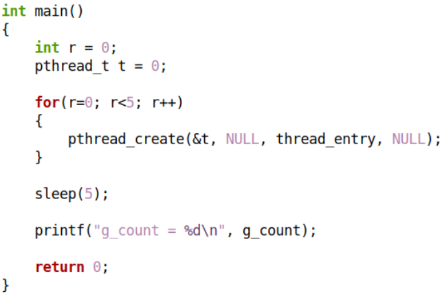  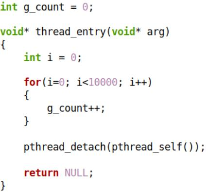 

## 1.1 编程实验

[[test1.cpp参考链接]](https://github.com/WONGZEONJYU/Linux_System_Program/blob/main/1-11.mutex/test1.cpp)

> ```c++
> #include <iostream>
> #include <thread>
> 
> using namespace std;
> using namespace chrono;
> using namespace this_thread;
> 
> int g_count {};
> 
> void* thread_entry(void* arg)
> {  
>     (void)arg;
> 
>     for (size_t i {}; i < 10000; i++){
>         ++g_count;
>     }
> 
>     pthread_detach(pthread_self());
> 
>     return nullptr;
> }
> 
> int main(int argc, char const *argv[])
> {
>     for(int r{}; r < 5; r++){
>         pthread_t t {};
>         pthread_create(&t, nullptr, thread_entry, nullptr);
>     }
> 
>     sleep_for(5s);
>     
>     cout << "g_count = " << g_count << "\n";
> 
>     return 0;
> }
> ```

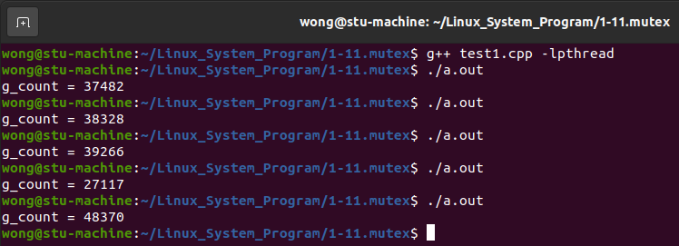  

# 2. 什么是原子操作❓

* 这种操作一旦开始 , 就一直执行到结束 , 中途不会被打断
* 原子操作可以是一个步骤 , 也可以是多个步骤的集合
  * 例 : 一行代码 `i = 0` (赋值语句)
  * 例 : 多行代码 `func()` (函数调用)
* 原子操作的顺序不可以被打乱 , 也不可以被切割而只执行其中的一部分
* 原子操作在多 任务/线程 并发时能够保证操作结果的正确性  

思考 : 程序中的 `i++` 是原子操作吗❓

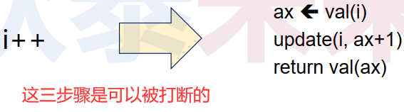 

> ```tex
> i++ 在 C/C++ 语言中不是原子操作,因此在多 任务 / 线程 并发场景中无法保证语义正确性
> ```

 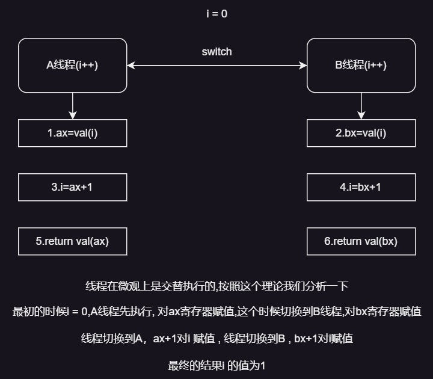 

> ```tex
> 所以,i = 1明显不是我们想要的结果,这个就是由于i++不是原子操作所导致的问题
> ```

* 结论 : 应该避免多个线程同时操作一个全局变量
* 需求 : **$\color{red}{保证操作的原子性}$**
* 临界区 : 
  * 临界区是访问共享资源的代码片段 (共享资源无法同时被访问多线程访问)  
  * 临界区一次仅允许一个线程进入执行 (临界区具有原子性)  
  * 当有线程进入临界区时 , 其它线程必须等待 (线程之间存在竞争关系)  

# 3. 临界区的访问方式

| 非临界区，多个线程可以同时访问 |
| :----------------------------: |
|              LOCK              |
| 临界区，每次最多一个线程可访问 |
|             UNLOCK             |
| 非临界区，多个线程可以同时访问 |

# 4. Linux中的互斥量(互斥锁)

互斥量 : 用来保证临界区的原子性 , 可理解为临界区 "门锁"

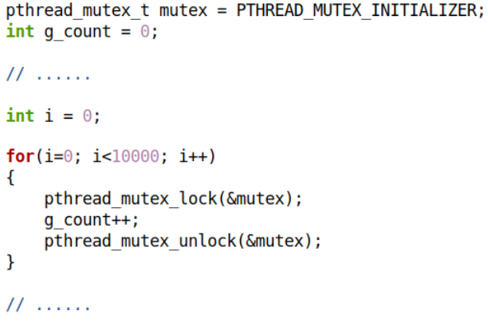 

> ```tex
> pthread_mutex_lock(&mutex); /*上锁,如果锁被别的线程获取了,则等待,没有被获取,就获取锁,进入临界区*/
> 
> 
> pthread_mutex_unlock (&mutex);/*解锁*/
> 
> 如果某个线程的锁没有解锁,所有的带锁的线程都会阻塞在等待锁(永远得不到锁),从而形成了传说中的死锁
> 
> ```

## 4.1编程实验

[[test2.cpp参考链接]](https://github.com/WONGZEONJYU/Linux_System_Program/blob/main/1-11.mutex/test2.cpp)

> ```c++
> #include <iostream>
> #include <thread>
> 
> using namespace std;
> using namespace chrono;
> using namespace this_thread;
> 
> int g_count {};
> 
> pthread_mutex_t mutex (PTHREAD_MUTEX_INITIALIZER);
> 
> void* thread_entry(void* arg)
> {  
>     (void)arg;
> 
>     for (size_t i {}; i < 10000; i++){
> 
>         pthread_mutex_lock(&mutex);
> 
>         ++g_count;
> 
>         pthread_mutex_unlock(&mutex);
>     }
> 
>     pthread_detach(pthread_self());
> 
>     return nullptr;
> }
> 
> int main(int argc, char const *argv[])
> {
>     for(int r{}; r < 5; r++){
>         pthread_t t {};
>         pthread_create(&t, nullptr, thread_entry, nullptr);
>     }
> 
>     sleep_for(5s);
>     
>     cout << "g_count = " << g_count << "\n";
> 
>     return 0;
> }
> ```

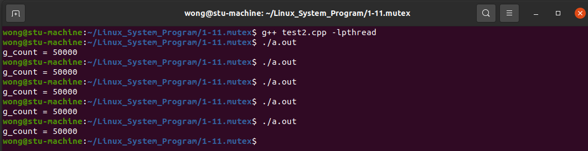 

> ```tex
> 加锁后,每次的结果都一样了,是期望的结果
> ```

## 4.2 Linux中的互斥量 API 函数

> ```c++
> #include <pthread.h>
> 
> pthread_mutex_t mutex = PTHREAD_MUTEX_INITIALIZER;
> 
> /*通过互斥量属性初始化互斥量*/
> int pthread_mutex_init (pthread_mutex_t* mutex,const pthread_mutexattr_t* attr);
> 
> pthread_mutexattr_t mattr = {0};
> 
> int pthread_mutexattr_init (pthread_mutexattr_t* mattr);
> 
> int pthread_mutexattr_setpshared (pthread_mutexattr_t* mattr, int pshared);
> 
> int pthread_mutexattr_settype (pthread_mutexattr_t* mattr , int type);
> 
> int pthread_mutexattr_destroy (pthread_mutexattr_t* mattr);
> 
> ```

> ```c++
> #include <pthread.h>
> 
> // 尝试获取互斥量
> // 互斥量处于未锁定状态,调用线程对互斥量上锁
> // 互斥量处于锁定状态,调用线程陷入阻塞状态
> int pthread_mutex_lock (pthread_mutex_t* mutex);
> 
> // 解锁互斥量,其它线程可竞争上锁权
> int pthread_mutex_unlock (pthread_mutex_t* mutex);
> 
> // 尝试获取互斥量
> // 若成功则上锁,若失败则返回（不阻塞）
> int pthread_mutex_trylock (pthread_mutex_t* mutex);
> 
> ```

另一个多线程示例

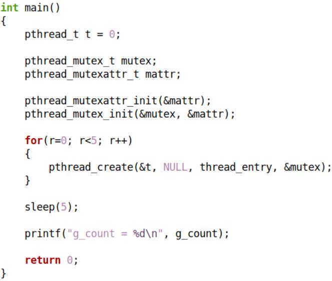 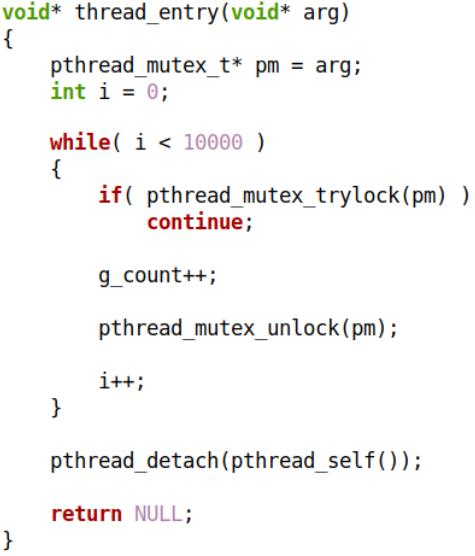 

### 4.2.1 编程实验

[[test3.cpp参考链接]](https://github.com/WONGZEONJYU/Linux_System_Program/blob/main/1-11.mutex/test3.cpp)

> ```c++
> #include <iostream>
> #include <thread>
> 
> using namespace std;
> using namespace chrono;
> using namespace this_thread;
> 
> int g_count {};
> 
> void* thread_entry(void* arg)
> {  
>     auto pm {static_cast<pthread_mutex_t*>(arg)};
>     int i{};
> 
>     while(i < 10000){
> 
>         if( pthread_mutex_trylock(pm)){
>             continue;
>         }
> 
>         ++g_count;
> 
>         pthread_mutex_unlock(pm);
> 
>         ++i;
>     }
> 
>     pthread_detach(pthread_self());
> 
>     return nullptr;
> }
> 
> int main(int argc, char const *argv[])
> {
>     pthread_mutex_t mutex{};
>     pthread_mutexattr_t mattr{};
> 
>     auto r {pthread_mutexattr_init(&mattr)};
>     r = pthread_mutex_init(&mutex, &mattr);
> 
>     for(int i{}; i < 5; i++){
>         pthread_t t {};
>         pthread_create(&t, nullptr, thread_entry, &mutex);
>     }
> 
>     sleep_for(5s);
>     
>     cout << "g_count = " << g_count << "\n";
> 
>     return 0;
> }
> ```

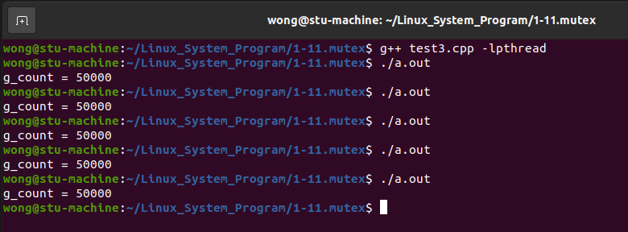 

# 5.哲学家进餐问题

> ```tex
> 有五个哲学家,他们的生活方式是交替地进行思考和进餐,哲学家们共用一张圆桌,分别坐在周围的五张椅子上,在圆桌上有五个碗和五支筷子,平时哲学家进行思考,饥饿时便试图取其左、右最靠近他的筷子,只有在他拿到两只筷子时才能进餐,该哲学家进餐完毕后,放下左右两只筷子又继续思考
> ```

> ```tex
> 约束条件
> (1)只有拿到两只筷子时,哲学家才能吃饭
> (2)如果筷子已被别人拿走,则必须等别人吃完之后才能拿到筷子
> (3)哲学家未拿到两只筷子吃完饭前,不会放下手中已经拿到的筷子
> ```

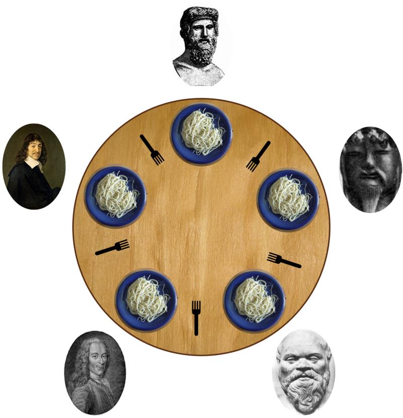 

## 5.1 多线程模型建立

* 哲学家 : 线程模拟 , 只有两个动作 `think()` 和 `eat()`
* 筷子 : 互斥量模拟 , 每个互斥量代表一只筷子  

对于第 i 个哲学家

> ```c++
> while( 1 ){
>     think(i);
>     pick_up_left(i);
>     pick_up_right(i);
>     eat(i);
>     put_down_right(i);
>     put_down_left(i);
> }
> ```

## 5.2 编程实验

[[philosopher.cpp参考链接]](https://github.com/WONGZEONJYU/Linux_System_Program/blob/main/1-11.mutex/philosopher.cpp)

> ```c++
> #include <iostream>
> #include <thread>
> 
> using namespace std;
> using namespace chrono;
> using namespace this_thread;
> 
> static constexpr auto N {5};
> 
> static pthread_mutex_t g_chopsticks[N]{};
> 
> static void pick_up(const int i)
> {
>     pthread_mutex_lock(&g_chopsticks[i]);
> }
> 
> static void put_down(const int i)
> {
>     pthread_mutex_unlock(&g_chopsticks[i]);
> }
> 
> static void pick_up_left(const int i)
> {
>     pick_up(i);
> }
> 
> static void pick_up_right(const int i)
> {
>     pick_up((i+1) % N);
> }
> 
> static void put_down_left(const int i)
> {
>     put_down(i);
> }
> 
> static void put_down_right(const int i)
> {
>     put_down((i+1)%N);
> }
> 
> static void think(int i)
> {
>     cout << "philosopher " << i << ": thinking...\n" << flush;
>     sleep_for(200ms);
> }
> 
> static void eat(int i)
> {
>     cout << "philosopher " << i << ": eating...\n" << flush;
>     sleep_for(500ms);
> }
> 
> static void* philosopher(void* arg)
> {  
>     auto i {reinterpret_cast<long>(arg)};
> 
>     while( true ){
>         think(i);
>         pick_up_left(i);
>         pick_up_right(i);
>         eat(i);
>         put_down_right(i);
>         put_down_left(i);
>     }
> 
>     return nullptr;
> }
> 
> int main(int argc, char const *argv[])
> {
>     pthread_mutexattr_t mattr{};
>     pthread_mutexattr_init(&mattr);
> 
>     for (auto & i : g_chopsticks){
>         pthread_mutex_init(&i,&mattr);
>     }
> 
>     for(long r{}; r<N; r++){
>         pthread_t t{};
>         pthread_create(&t, nullptr, philosopher, reinterpret_cast<void*>(r));
>     }
> 
>     for(;;){
>         sleep_for(1s);
>     }
> 
>     return 0;
> }
> ```

