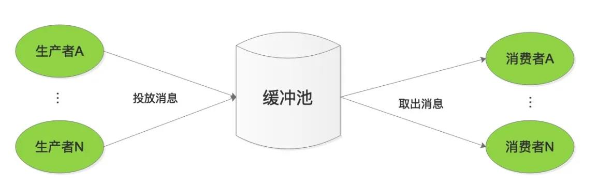
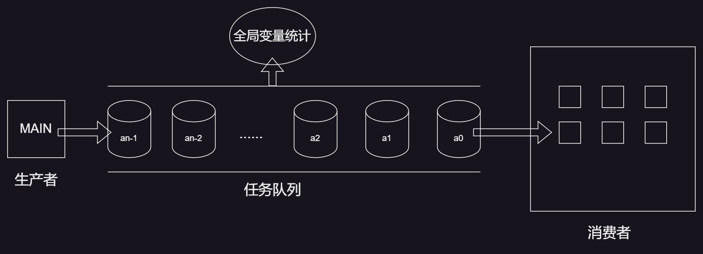

# 1. 排队模型回顾

 

## 1.1 问题分析

* 如何模拟工作窗口 (即 : 如何模拟工作人员) ?
* 如何模拟等待中的顾客 (即 : 如何模拟待执行的任务) ?  
* 如何维护等待队列? (队列数据结构?)  
* 工作时间如何模拟?新顾客如何模拟?

## 1.2 新概念 : 线程池

* 背景 : 
  * 线程的 创建 / 销毁 会消耗额外的资源 (时间 & 空间)  
  * 进程中不能无限制的创建新的线程 (太多线程反而降低执行效率)  
* 方案 : **$\color{SkyBlue}{将多个线程预先存储在⼀个 "池子" 内 , 当需要线程时直接从"池子" 取出}$**
* 优势 : **$\color{red}{降低 创建 / 销毁 线程所带来的时间开销及系统资源开销}$**

## 1.3 解决方案设计

* 利用线程池模拟工作窗口 , 每个线程表示一个工作人员
* 定义任务结构体 `CusTask` 模拟顾客 ( `CusTask` 变量表示具体顾客 )
* 使用队列数据结构表示等待队列 , 队列中存储 `CusTask` 变量 (顾客排队模拟)
* 线程从队列中取出任务执行 (服务顾客模拟)  

## 1.4 线程安全性数据结构

> ```tex
> 数据结构具有原子性,即:数据结构的操作具有原子性
> ```

## 1.5 实现细节

* 各个线程从队列中取任务时是互斥操作 (每次只能一个线程操作队列)
* 如果队列为空 , 那么线程处于等待状态
* 主线程可以动态产生任务 , 并将任务放入等待队列
* 全局统计变量 , 用于统计工作量  

## 1.6 问题升华 : 生产消费者问题

 

> ```tex
> 约束条件:
> 缓冲池一次只能有一个线程访问
> 只要缓冲池未满,生产者就可以把产品送入缓冲池
> 只要缓冲池未空,消费者就可以从缓冲池中取走产品
> ```

 

> ```tex
> 注:全局统计变量 和 任务队列 是线程安全的数据结构
> ```

