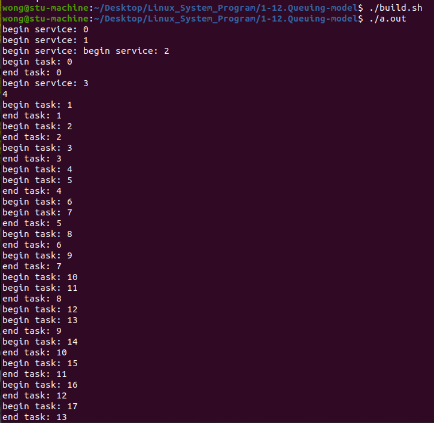

# 1. 排队模型回顾

 

## 1.1 问题分析

* 如何模拟工作窗口 (即 : 如何模拟工作人员) ?
* 如何模拟等待中的顾客 (即 : 如何模拟待执行的任务) ?  
* 如何维护等待队列? (队列数据结构?)  
* 工作时间如何模拟?新顾客如何模拟?

## 1.2 新概念 : 线程池

* 背景 : 
  * 线程的 创建 / 销毁 会消耗额外的资源 (时间 & 空间)  
  * 进程中不能无限制的创建新的线程 (太多线程反而降低执行效率)  
* 方案 : **$\color{SkyBlue}{将多个线程预先存储在⼀个 "池子" 内 , 当需要线程时直接从"池子" 取出}$**
* 优势 : **$\color{red}{降低 创建 / 销毁 线程所带来的时间开销及系统资源开销}$**

## 1.3 解决方案设计

* 利用线程池模拟工作窗口 , 每个线程表示一个工作人员
* 定义任务结构体 `CusTask` 模拟顾客 ( `CusTask` 变量表示具体顾客 )
* 使用队列数据结构表示等待队列 , 队列中存储 `CusTask` 变量 (顾客排队模拟)
* 线程从队列中取出任务执行 (服务顾客模拟)  

## 1.4 线程安全性数据结构

> ```tex
> 数据结构具有原子性,即:数据结构的操作具有原子性
> ```

## 1.5 实现细节

* 各个线程从队列中取任务时是互斥操作 (每次只能一个线程操作队列)
* 如果队列为空 , 那么线程处于等待状态
* 主线程可以动态产生任务 , 并将任务放入等待队列
* 全局统计变量 , 用于统计工作量  

## 1.6 问题升华 : 生产消费者问题

 

> ```tex
> 约束条件:
> 缓冲池一次只能有一个线程访问
> 只要缓冲池未满,生产者就可以把产品送入缓冲池
> 只要缓冲池未空,消费者就可以从缓冲池中取走产品
> ```

 

> ```tex
> 注:全局统计变量 和 任务队列 是线程安全的数据结构
> ```

## 1.7 编程实验

[[排队模型代码]](https://github.com/WONGZEONJYU/Linux_System_Program/tree/main/1-12.Queuing-model)

仅仅展示主函数部分代码,其余代码看链接

> ```c++
> #include <iostream>
> #include <thread>
> #include <exception>
> #include "custom_rand.hpp"
> #include "queue.hpp"
> #include "conint.hpp"
> 
> using namespace std;
> using namespace chrono;
> using namespace this_thread;
> 
> static constexpr auto N{20};
> 
> struct CusTask {
>     QueueNode head{};
>     void(*task)(void* arg){};
>     void* arg{};
> } ;
> 
> static Queue g_queue {};
> static ConInt g_count {};
> 
> static void customer_task(void* arg)
> {
>     const auto v {reinterpret_cast<long>(arg)};
>     
>     cout << "begin task: " << v << "\n" << flush;
>     
>     for(long i{}; i < v; i++){
>         sleep_for(chrono::microseconds(rand_() % N * 50000));
>         
>     }
> 
>     cout << "end task: " << v << "\n" << flush;
> }
> 
> static void* service_thread(void* arg)
> {  
>     cout << "begin service: " << reinterpret_cast<long>(arg) << "\n" << flush;
>     
>     while( ConInt_Value(g_count) < N ){
> 
>         if( Queue_Length(g_queue) ){
> 
>             auto t {reinterpret_cast<CusTask*>(Queue_Remove(g_queue))};
> 
>             if(t){
>                 t->task(t->arg);
>                 delete t;
>                 ConInt_Add(g_count, 1);
>             }
>         }else{
>             sleep_for(50ms);
>         }
>     }
> 
>     cout << "end service: " << reinterpret_cast<long>(arg) << "\n" << flush;
> 
>     return nullptr;
> }
> 
> int main(int argc, char const *argv[])
> {
>     constexpr auto T{5};
>     rand_();
> 
>     g_queue = Queue_Create();
>     g_count = ConInt_Create(0);
> 
>     pthread_t t[T]{};
> 
>     for (long i{}; i < T; i++){
>         pthread_create(t + i,nullptr,service_thread,reinterpret_cast<void*>(i));
>     }
> 
>     for(long i{}; i < N; i++){
>         try{
>             auto ct {new CusTask};
>             ct->task = customer_task;
>             ct->arg = reinterpret_cast<void*>(i);
>             Queue_Add(g_queue, reinterpret_cast<QueueNode*>(ct));
>             sleep_for(1s);
>         }catch(const std::bad_alloc& e){
>             std::cerr << e.what() << '\n';
>             return -1;
>         }
>     }
> 
>     for(auto &i : t){
>         pthread_join(i,nullptr);
>     }
> 
>     ConInt_Destroy(g_count);
>     Queue_Destroy(g_queue);
> 
>     return 0;
> }
> 
> ```

 

> ```tex
> wong@stu-machine:~/Desktop/Linux_System_Program/1-12.Queuing-model$ ./build.sh 
> wong@stu-machine:~/Desktop/Linux_System_Program/1-12.Queuing-model$ ./a.out 
> begin service: 0
> begin service: 1
> begin service: begin service: 2
> begin task: 0
> end task: 0
> begin service: 3
> 4
> begin task: 1
> end task: 1
> begin task: 2
> end task: 2
> begin task: 3
> end task: 3
> begin task: 4
> begin task: 5
> end task: 4
> begin task: 6
> begin task: 7
> end task: 5
> begin task: 8
> end task: 6
> begin task: 9
> end task: 7
> begin task: 10
> begin task: 11
> end task: 8
> begin task: 12
> begin task: 13
> end task: 9
> begin task: 14
> end task: 10
> begin task: 15
> end task: 11
> begin task: 16
> end task: 12
> begin task: 17
> end task: 13
> begin task: 18
> end task: 14
> begin task: 19
> end task: 15
> end task: 16
> end task: 18
> end task: 17
> end task: 19
> end service: 0
> end service: 2
> end service: 1
> end service: 3
> end service: 4
> 
> ```

