问题 : 一个线程多次尝试获取同一个互斥量 , 会发生什么❓

# 1. 不同类型的互斥量

| 类型                               | 意义                                 |
| ---------------------------------- | ------------------------------------ |
| `PTHREAD_MUTEX_NORMAL`             | 默认类型,线程获取互斥量失败将等待    |
| `PTHREAD_MUTEX_RECURSIVE` (递归锁) | 允许同一个线程多次获取同一个互斥量   |
| `PTHREAD_MUTEX_ERRORCHECK`         | 不允许同一个线程多次获取同一个互斥量 |
| `PTHREAD_MUTEX_DEFAULT`            | `PTHREAD_MUTEX_NORMAL`               |

另外 : (历史原因)

> ```c++
> PTHREAD_MUTEX_NORMAL => PTHREAD_MUTEX_TIMED_NP
> PTHREAD_MUTEX_RECURSIVE => PTHREAD_MUTEX_RECURSIVE_NP
> PTHREAD_MUTEX_ERRORCHECK => PTHREAD_MUTEX_ERRORCHECK_NP
> PTHREAD_MUTEX_DEFAULT => PTHREAD_MUTEX_NORMAL
> ```

# 2. Linux上的示例程序

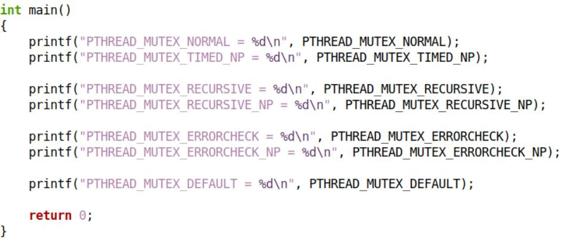 

## 2.1 编程实验

[[test1.cpp参考链接]](https://github.com/WONGZEONJYU/Linux_System_Program/blob/main/1-13.mutex_2/test1.cpp)

> ```c++
> #include <iostream>
> #include <thread>
> 
> using namespace std;
> 
> int main(int argc, char const *argv[])
> {
>     cout << "PTHREAD_MUTEX_NORMAL = " << PTHREAD_MUTEX_NORMAL << "\n" << 
>             "PTHREAD_MUTEX_TIMED_NP = " << PTHREAD_MUTEX_TIMED_NP << "\n" << 
>             "PTHREAD_MUTEX_RECURSIVE = " << PTHREAD_MUTEX_RECURSIVE << "\n" <<
>             "PTHREAD_MUTEX_RECURSIVE_NP = " << PTHREAD_MUTEX_RECURSIVE_NP << "\n" << 
>             "PTHREAD_MUTEX_ERRORCHECK = " << PTHREAD_MUTEX_ERRORCHECK << "\n" << 
>             "PTHREAD_MUTEX_ERRORCHECK_NP = " << PTHREAD_MUTEX_ERRORCHECK_NP << "\n" <<
>             "PTHREAD_MUTEX_DEFAULT = " << PTHREAD_MUTEX_DEFAULT << "\n";
> 
>     return 0;
> }
> ```

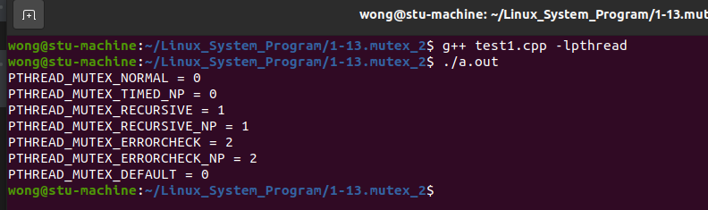 

# 3. 死锁的概念

* 等待关系
  * 线程所需资源被其它线程所持有 , 进而必须等待 (无法继续执行)
* 循环等待
  * 当线程之间出现循环等待关系时 , 即 : 发生死锁

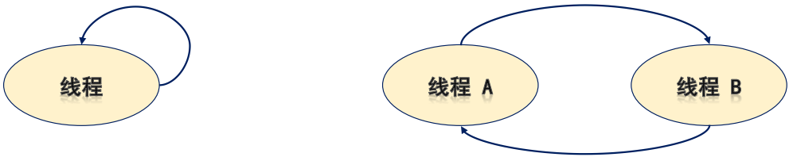 

下面的程序有问题吗❓为什么❓

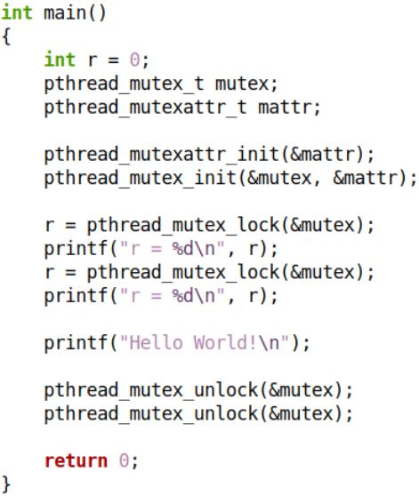 

## 3.1 编程实验

[[test2.cpp参考链接]](https://github.com/WONGZEONJYU/Linux_System_Program/blob/main/1-13.mutex_2/test2.cpp)

> ```c++
> #include <iostream>
> #include <thread>
> 
> using namespace std;
> 
> int main(int argc, char const *argv[])
> {
>     pthread_mutex_t mutex{};
>     pthread_mutexattr_t mattr{};
>     pthread_mutexattr_init(&mattr);
>     pthread_mutex_init(&mutex,&mattr);
> 
>     auto r {pthread_mutex_lock(&mutex)};
>     cout << "r = " << r << "\n";
>     r = pthread_mutex_lock(&mutex);
>     cout << "r = " << r << "\n";
> 
>     cout << "hello world\n";
> 
>     pthread_mutex_unlock(&mutex);
>     pthread_mutex_unlock(&mutex);
> 
>     pthread_mutex_destroy(&mutex);
>     pthread_mutexattr_destroy(&mattr);
> 
>     return 0;
> }
> ```

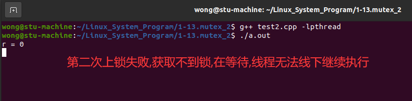 

# 4. 互斥量的类型设置

> ```c++
> #include <pthread.h>
> pthread_mutexattr_t mattr = {0};
> int pthread_mutexattr_init (pthread_mutexattr_t* mattr);
> int pthread_mutexattr_settype (pthread_mutexattr_t* mattr , int type);
> int pthread_mutexattr_gettype (pthread_mutexattr_t* mattr , int* type);
> int pthread_mutexattr_destroy (pthread_mutexattr_t* mattr);
> ```

## 4.1 不同类型的互斥量示例

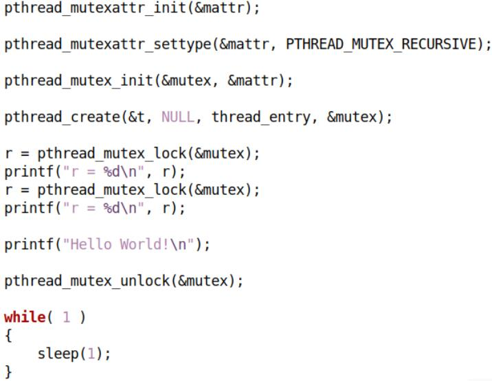  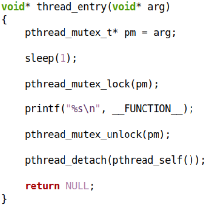 

## 4.2 编程实验

[[test3.cpp参考链接]](https://github.com/WONGZEONJYU/Linux_System_Program/blob/main/1-13.mutex_2/test3.cpp)

### 4.2.1 `PTHREAD_MUTEX_RECURSIVE` (递归锁)

> ```c++
> #include <iostream>
> #include <thread>
> 
> using namespace std;
> using namespace chrono;
> using namespace this_thread;
> 
> void* thread_entry(void* arg)
> {  
>     auto pm {static_cast<pthread_mutex_t*>(arg)};
>     
>     sleep_for(1s);
>     
>     pthread_mutex_lock(pm);
> 
>     cout << __FUNCTION__ << "\n";
>         
>     pthread_mutex_unlock(pm);
>     
>     pthread_detach(pthread_self());
>     
>     return nullptr;
> }
> 
> int main(int argc, char const *argv[])
> {
>     pthread_mutex_t mutex{};
>     pthread_mutexattr_t mattr{};
> 
>     pthread_mutexattr_init(&mattr);
> 
>     pthread_mutexattr_settype(&mattr, PTHREAD_MUTEX_RECURSIVE);
> 
>     pthread_mutex_init(&mutex,&mattr);
> 
>     pthread_t t{};
>     pthread_create(&t, nullptr, thread_entry, &mutex);
> 
>     auto r {pthread_mutex_lock(&mutex)};
>     cout << "r = " << r << "\n";
> 
>     r = pthread_mutex_lock(&mutex);
>     cout << "r = " << r << "\n";
>     
>     cout << "hello world\n";
>     
>     pthread_mutex_unlock(&mutex);
>     //pthread_mutex_unlock(&mutex);
> 
>     for(;;){
>         sleep_for(1s);
>     }
> 
>     pthread_mutex_destroy(&mutex);
>     pthread_mutexattr_destroy(&mattr);
> 
>     return 0;
> }
> ```

1. 只解锁一次的结果

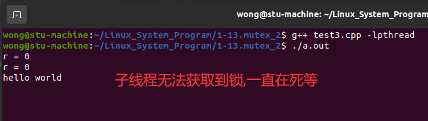 

2. 解锁两次的结果

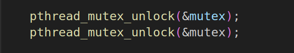 

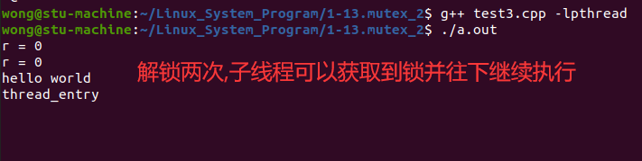 

### 4.2.2 `PTHREAD_MUTEX_ERRORCHECK` (带错误检查)

> ```c++
> #include <iostream>
> #include <thread>
> 
> using namespace std;
> using namespace chrono;
> using namespace this_thread;
> 
> void* thread_entry(void* arg)
> {  
>     auto pm {static_cast<pthread_mutex_t*>(arg)};
>     
>     sleep_for(1s);
>     
>     pthread_mutex_lock(pm);
> 
>     cout << __FUNCTION__ << "\n";
>         
>     pthread_mutex_unlock(pm);
>     
>     pthread_detach(pthread_self());
>     
>     return nullptr;
> }
> 
> int main(int argc, char const *argv[])
> {
>     pthread_mutex_t mutex{};
>     pthread_mutexattr_t mattr{};
> 
>     pthread_mutexattr_init(&mattr);
> 
>     //pthread_mutexattr_settype(&mattr, PTHREAD_MUTEX_RECURSIVE);
>     pthread_mutexattr_settype(&mattr, PTHREAD_MUTEX_ERRORCHECK);
> 
>     pthread_mutex_init(&mutex,&mattr);
> 
>     pthread_t t{};
>     pthread_create(&t, nullptr, thread_entry, &mutex);
> 
>     auto r {pthread_mutex_lock(&mutex)};
>     cout << "r = " << r << "\n";
> 
>     r = pthread_mutex_lock(&mutex);
>     cout << "r = " << r << "\n";
>     
>     cout << "hello world\n";
>     
>     pthread_mutex_unlock(&mutex);
>     //pthread_mutex_unlock(&mutex);
> 
>     for(;;){
>         sleep_for(1s);
>     }
> 
>     pthread_mutex_destroy(&mutex);
>     pthread_mutexattr_destroy(&mattr);
> 
>     return 0;
> }
> ```

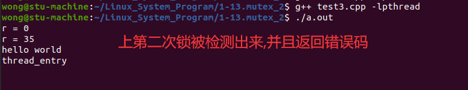 

# 5. 互斥量小结

* `PTHREAD_MUTEX_NORMAL`
  * 一旦互斥量 "上锁" , 任何线程(包括自身线程)均无法再次获取互斥量
* `PTHREAD_MUTEX_RECURSIVE`
  * 同一个线程可多次获取互斥量 , 同时需要相同次数的释放互斥量
* `PTHREAD_MUTEX_ERRORCHECK`
  * 同一个线程再次获取互斥量时 , 将错误返回  

下面的程序执行后会发生什么❓

  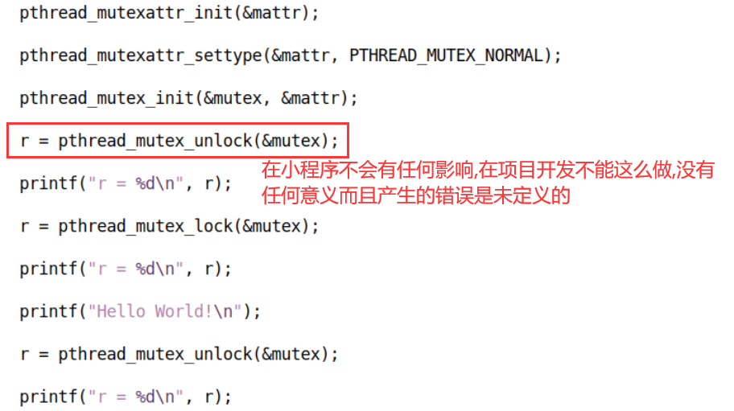 

