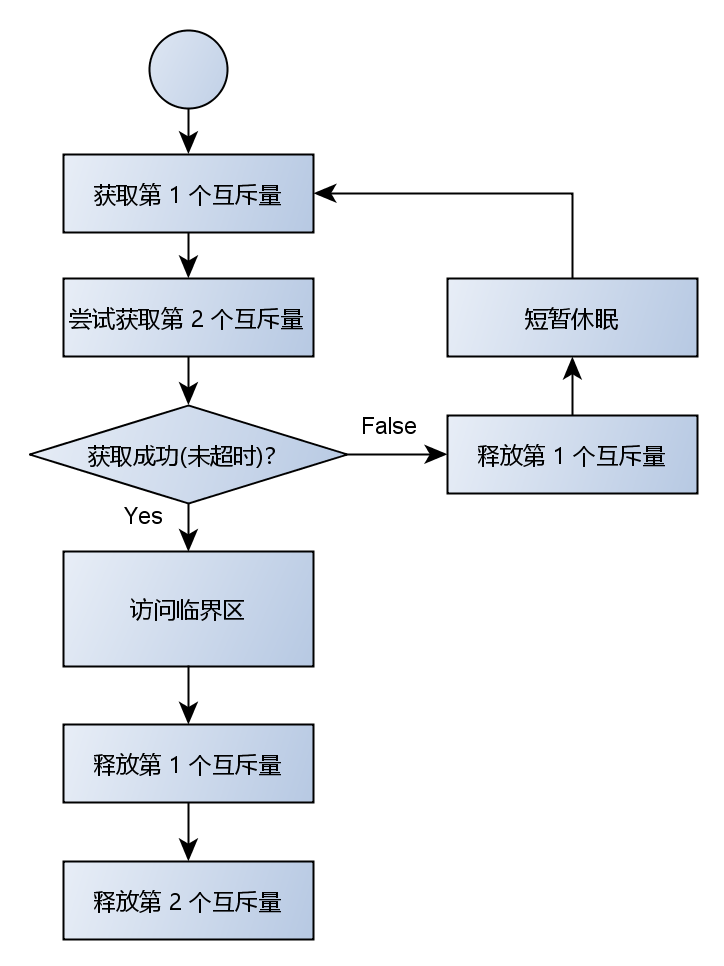
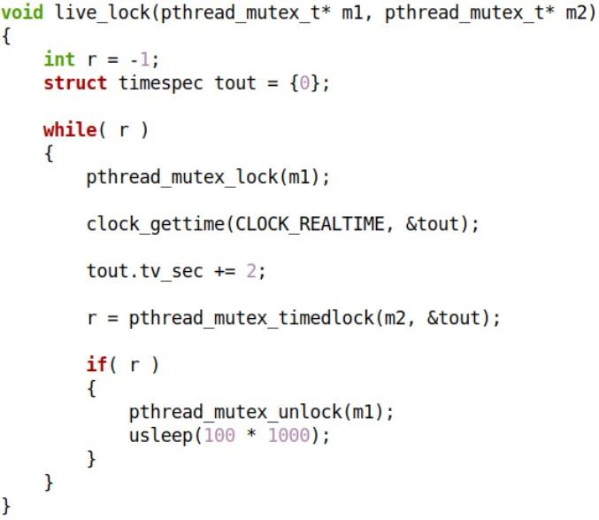
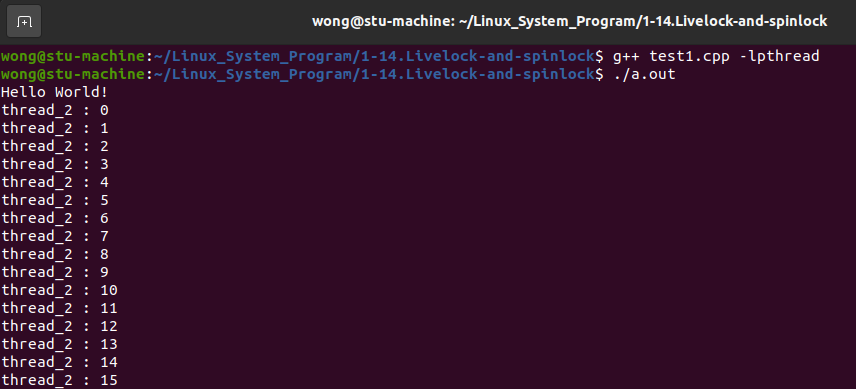
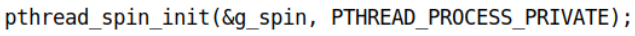
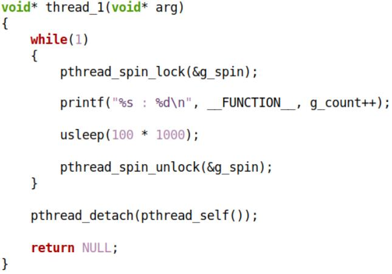
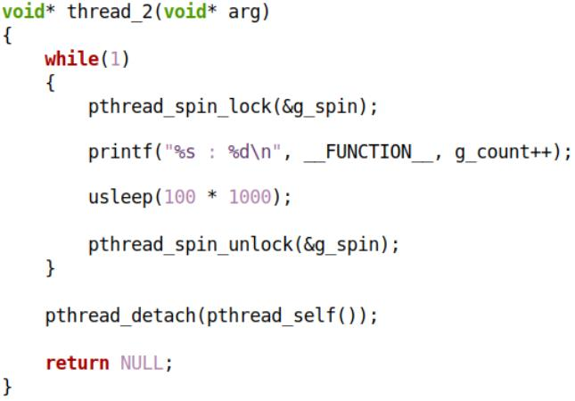
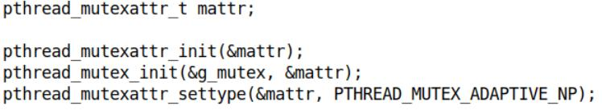
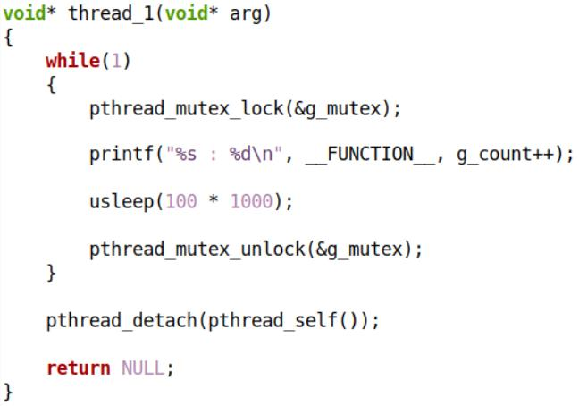
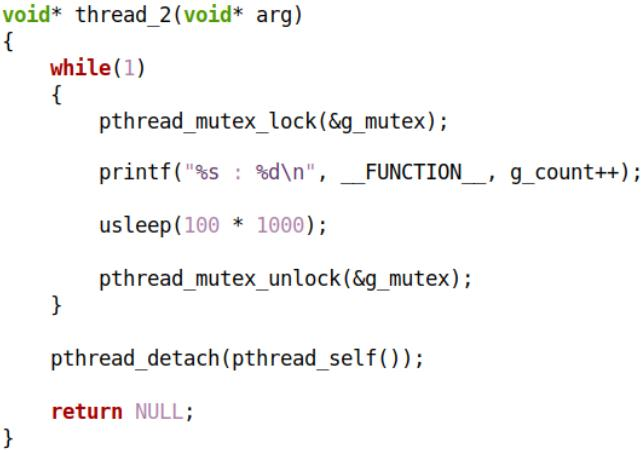

问题 : 如何设置获取互斥量时的等待时间❓如果等待超时 , 如何避免死锁❓

# 1. 活锁

## 1.1 避免死锁 -- 设置等待超时

解决方案 : 

1. 尝试获取第 1 个互斥量 : 
   * 若成功 , 则转 2 执行；若失败 , 则等待;

2. 尝试在规定时间内获取第 2 个互斥量 : 

   * 若成功 , 则执行临界区代码  

   * 若失败 , 则释放第 1 个互斥量 , 休眠后转 1 执行  

 

## 1.2 互斥量获取超时 API 函数

> ```c++
> #include <pthread.h>
> 
> // 尝试获取互斥量
> // 互斥量处于未锁定状态，调用线程对互斥量上锁
> // 互斥量处于锁定状态，调用线程短暂陷入等待状态
> int pthread_mutex_timedlock (pthread_mutex_t* mutexconst struct timespec* tsptr);
> 
> // 解锁互斥量，其它线程可竞争上锁权
> int pthread_mutex_unlock (pthread_mutex_t* mutex);
> 
> #include <time.h>
> struct timespec {
>     time_t tv_sec; /* seconds */
>     long tv_nsec; /* nanoseconds */
> };
> 
> // 获取 clk_id 所指定的时间，获取成功则 tp 保存时间值
> int clock_gettime (clockid_t clk_id, struct timespec* tp);
> 
> ```

## 1.3 "活锁" 解决方案实现

 

### 1.3.1 编程实验

[[test1.cpp参考链接]](https://github.com/WONGZEONJYU/Linux_System_Program/blob/main/1-14.Livelock-and-spinlock/test1.cpp)

> ```c++
> #include <iostream>
> #include <thread>
> 
> using namespace std;
> using namespace chrono;
> using namespace this_thread;
> 
> static pthread_mutex_t m1 (PTHREAD_MUTEX_INITIALIZER);
> static pthread_mutex_t m2 (PTHREAD_MUTEX_INITIALIZER);
> 
> static int g_count {};
> 
> void live_lock(pthread_mutex_t* pm[], const int n)
> {
>     int r = -1;
>     
>     while( r ){
>         for(int i{}; i < n; i++){
>             timespec tout {};
>             clock_gettime(CLOCK_REALTIME, &tout);
>             tout.tv_sec += 1; 
>             r = pthread_mutex_timedlock(pm[i], &tout);
> 
>             if( r ){
>                 for(int j{}; j < i; j++) {
>                     pthread_mutex_unlock(pm[j]);
>                 }
>                 sleep_for(100ms);
>                 break;
>             }
>         }
>     }
> }
> 
> void live_unlock(pthread_mutex_t* pm[], const int n)
> {
>     for (int i {}; i < n; i++){
>         pthread_mutex_unlock(pm[i]);
>     }
> }
> 
> void* thread_1(void* )
> {  
>     pthread_mutex_t* pm[] {&m1, &m2};
>     constexpr auto n {sizeof(pm)/sizeof(*pm)};
> 
>     for(;;){
>         live_lock(pm, n);
> 
>         cout << __FUNCTION__ << " : " << g_count++ << "\n";
>         
>         sleep_for(100us);
> 
>         live_unlock(pm, n);
>     }
>     
>     pthread_detach(pthread_self());
>     
>     return nullptr;
> }
> 
> void* thread_2(void* )
> {  
>     pthread_mutex_t* pm[] {&m2, &m1};
>     constexpr auto n {sizeof(pm)/sizeof(*pm)};
>     
>     for(;;){
>         live_lock(pm, n);
> 
>         cout << __FUNCTION__ << " : " << g_count++ << "\n";
>         
>         sleep_for(100us);
> 
>         live_unlock(pm, n);
>     }
>     
>     pthread_detach(pthread_self());
>     
>     return nullptr;
> }
> 
> int main(int argc, char const *argv[])
> {
>     pthread_t t{};
>     
>     pthread_create(&t, nullptr, thread_1, nullptr);
>     pthread_create(&t, nullptr, thread_2, nullptr);
>     
>     cout << "Hello World!\n";
>     
>     for(;;){
>         sleep_for(1s);
>     }
> 
>     return 0;
> }
> 
> ```

 

思考 : 线程获取互斥量失败后究竟发生了什么❓

从观察上看,线程进入阻塞状态

从内核上观察,线程进入了等待的队列,线程被切走了

# 2. 自旋锁

## 2.1 Linux中的自旋锁

* 自旋锁也是一种用来保证临界区的原子性的机制
* 自旋锁与互斥量类似 , **$\color{red}{在任何时刻 , 最多只能有一个持有者}$**
* 自旋锁与互斥量在内部机制上不同 : 
  * 互斥量 : 
    * 如果已经被其它线程持有 , 则当前线程进入等待状态 (不占用处理器 , 进入等待队列)
  * 自旋锁 : 
    * 如果已经被其它线程持有 , 则当前线程一直循环查看自旋锁是否再次可持有  

## 2.2 互斥量 vs 自旋锁

* 应用场景
  * **$\color{SkyBlue}{互斥量是一种普适的解决方案 , 通用性强 , 副作用小}$**
  * **$\color{SkyBlue}{自旋锁是一种特定场景下的解决方案 , 通用性弱 , 副作用大}$**
    * 特定场景 : 临界区非常小 , 并且不存在放弃处理器的操作
* 实现机制
  * **$\color{red}{互斥量涉及线程上下文切换 , 因此在效率上存在不足 (消耗时间资源)}$**
  * **$\color{red}{线程一直尝试获取自旋锁 , 因此不会进入阻塞状态 (消耗处理器资源)}$**

## 2.3 Linux中的自旋锁 API 函数

> ```c++
> #include <pthread.h>
> 
> pthread_spinlock_t lock;
> 
> int pthread_spin_init (pthread_spinlock_t* lock, int pshared);
> int pthread_spin_destroy (pthread_spinlock_t* lock);
> int pthread_spin_lock (pthread_spinlock_t* lock);
> int pthread_spin_trylock (pthread_spinlock_t* lock);
> int pthread_spin_unlock (pthread_spinlock_t* lock);
> 
> /*自旋锁类型：
> PTHREAD_PROCESS_PRIVATE => 进程内自旋锁(同一进程中的线程可用)
> PTHREAD_PROCESS_SHARED => 进程间自旋锁(任意进程的任意线程可用)
> */
> ```

下面的多线程程序有问题吗❓

 

 

 

## 2.4 编程实验

[[test2.cpp参考链接]](https://github.com/WONGZEONJYU/Linux_System_Program/blob/main/1-14.Livelock-and-spinlock/test2.cpp)

> ```c++
> 
> ```


## 2.5 自旋锁使用细则

* 轻量级锁定 , 即 : 临界区相对短小 , 自旋锁持有时间非常短
* 同一线程不可重复获取自旋锁 (导致死锁)
* 如果只有一个单核处理器 , 不建议使用自旋锁
* 线程一旦获取自旋锁 , 则不能让出处理器使用权
* 即 : 线程 获取锁 到 释放锁 的时间内只有一个执行流 

## 2.5 有没有一种可能。。。

* 存在一种 "锁" 类型 : 
  * 效率高 => 不会轻易发生上下文切换 , 使得线程进入阻塞状态
  * 无死锁 => 不会无限制自旋 , 适合的时间让出处理器使用权  

 

## 2.6 关于 `PTHREAD_MUTEX_ADAPTIVE_NP` 类型

* 一种特殊类型的互斥量 , 又名 : 自适应锁
* 自适应锁先以自旋的方式持续尝试获取目标锁
* 当超时未能获取目标锁 , 则让出处理器使用权 , 线程进入阻塞状态
* 自适应锁相对普通互斥量效率更高 , 相对自旋锁安全性更好  

下面的多线程程序有问题吗❓

 

 

 

