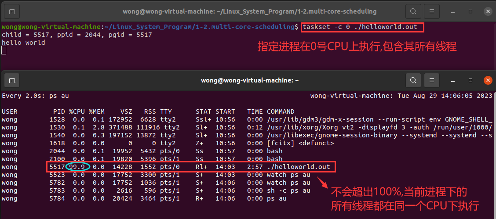

# 1-2 多核调度

❓问题 : 内核对进程调度时发送了什么 ?

# 1. 进程调度的本质

## 1.1 **任务** / **进程** 切换

>- **$\color{red}{即 : 上下文切换 , 内核对处理器上执行的进程进行切换}$**
>-  "上下文" 指 : 寄存器的值
>- "上下文切换" 指 : 
>   - 将寄存器的值保存到内存中 (进程被剥夺处理器，停止执行)
>   - 将另一组寄存器的值从内存中加载到寄存器 (调度下一个进程执行)
>
>
>
>
>

## 1.2 进程调度的本质

>- 当时间片耗完 , 不管进程正在执行什么代码 , 都一定会发生上下文切换! 
>
>
>
>- 上下文切换必然导致进程状态的状态
>- 上下文切换由中断触发 (时钟中断 , IO中断 , 等)
>
>
>
>❓有趣的问题 : 上下文切换时 , 突然收到一个中断会发生什么?
>
>现代操作系统在进行上下文切换之前,一般都会把中断关掉 , 切换完成再把中断打开去响应

## 1.3 详解 Linux 进程状态 ( `ps au` )

>

## 1.4 编程实验

[[参考链接:null]]()

### 1.4.1 主线程有 `sleep(...)`

>
>
>

### 1.4.2 主线程没有 `sleep(...)`

>
>
>

### 1.4.3 加入子线程

>
>
>
>
>
>
>
>
>```tex
>通过 watch ps au 命令看到CPU达到199% , 再通过lscpu命令看到当前电脑是一个多核CPU
>可以推出:
>当前进程占用了两个CPU核心,每一个CPU核心都在执行当前进程中的每一个线程
>
>以上实验得出一个结论:
>对于linux来说,调度的基本单位是线程
>```

### 1.4.4 指定CPU执行

>
>
>```
>通过以上实验得出:
>linux会把线程调度到不同的CPU核心上执行
>```

# 2. Linux性能

## 2.1 细说空闲状态

>- 处理器上电后 , **$\color{red}{开始一直不停的向下执行指令}$**
>- 当系统中没有进程时 , 会执行一个 **$\color{SkyBlue}{"不执行任何操作"}$** 的空闲进程
>- 空闲进程的职责 : 执行 **特殊指令** 使处理器进入 **休眠状态 (低功耗状态)**
>- **$\color{red}{空闲状态是一种暂态}$** , 但凡出现就绪态进程 , 空闲状态立即结束

## 2.2 Linux性能工具简介

>- `ps` -- 查看进程运行时数据 (`ps au`)
>- `top` -- Linux整体性能监测工具 (类似任务管理器)
>- `sar` -- Linux活动情况报告 (系统性能分析工具)

## 2.3 Linux系统平均负载

>- 即 : **$\color{SkyBlue}{Linux系统负载平均值}$** (Linux System Load Averages)
>- 该值表示的是一段时间内任务对系统资源需求的平均值 ( 1,5 和 15分钟 )
>   - **$\color{red}{如果平均值接近0 , 意味着系统处于空闲状态}$**
>   - **$\color{red}{如果平均值大于1, 意味着系统繁忙 , 任务需要等待 , 无法及时执行}$**
>     - 如果 1 min 平均值高于 5 min 或 15 min 平均值 , 则负载正在增加
>     - 如果 1 min 平均值低于 5 min 或 15 min 平均值 , 则负载正在减少

## 2.4 详解 `sar -q`

>- `runq-sz` : 执行队列的长度 (正在被执行的线程)
>- `plist-sz` : 运行中的任务（进程 & 线程）总数
>- `ldavg-1` : 最近 1 min 系统平均负载
>- `ldavg-5` : 最近 5 min 系统平均负载
>- `ldavg-15` : 最近 15 min 系统平均负载
>
>如果它们大于处理器的数量 , 那么系统极有可能遇到了性能问题

## 2.5 系统调度观察实验

### 2.5.1 通过 Linux 性能工具观察进程调度

#### 2.5.1.1 单处理器运行过程

>
>
>

#### 2.5.1.2 多处理器运行过程

>
>
>
