# 1-3 多核调度实验设计

> ❓问题 : 如何验证处理器 , 经常数量 , 吞吐量之间的关系 ? ? ?

# 1.多处理器调度实验

## 1.1 实验方法

> 1. "同时" 创建多个相同进程 , 每个进程执行相同任务 , 并在固定时间后结束
> 2. 记录不同进程数量时的延迟 , 计算吞吐量
> 3. 增加处理器数量 , 重复实验 , 并记录结果
> 4. 将实验数据整理为一张表格

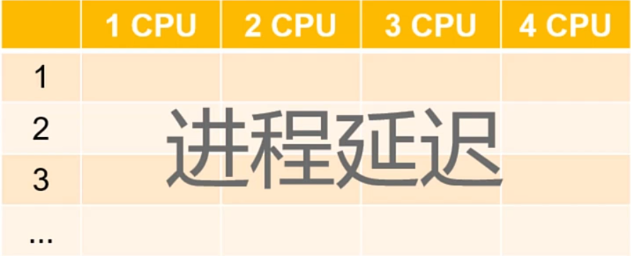 

## 1.2 实验目标

* 处理器数量固定 , 增加进程数量 , 观察系统吞吐量的变化
* 进程数量固定 , 增加处理器数量 , 观察系统吞吐量

## 1.3 验证结论 

* 当处理器数量大于 1 , 只有多个进程并行执行才能提高吞吐量
* 吞吐量存在上限 , 当进程数量多于处理器数量时 , 吞吐量不会提高

## 1.4 实验代码设计

 

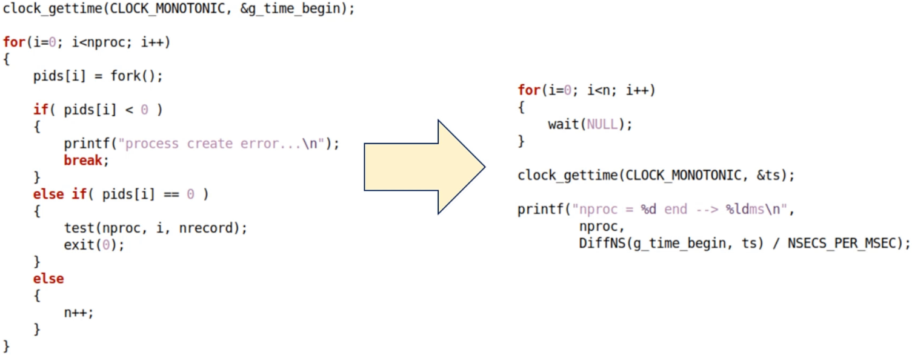 

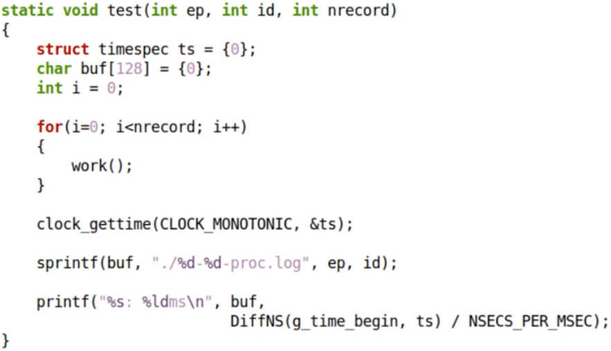 

## 1.5 实验

[[参考代码]](https://github.com/WONGZEONJYU/Linux_System_Program/blob/main/1-2-1-3.multi-core-scheduling/main.cpp)

>```c++
>#include <sys/wait.h>
>#include <sys/resource.h>
>#include <sys/types.h>
>#include <unistd.h>
>#include <time.h>
>#include <sched.h>
>#include <fcntl.h>
>#include <cstdio>
>#include <cstdlib>
>#include <cstring>
>#include <iostream>
>
>using namespace std;
>
>#if 0
>#define NLOOP_FOR_ESTIMATION    1000000000UL
>#define NSECS_PER_MSEC  1000000UL
>#define NSECS_PER_SEC   1000000000UL
>#else
>static constexpr unsigned long NLOOP_FOR_ESTIMATION {1000000000UL};
>static constexpr unsigned long NSECS_PER_MSEC {1000000UL};
>static constexpr unsigned long NSECS_PER_SEC {1000000000UL};
>#endif
>
>#define DiffNS(begin,end)   ((end.tv_sec - begin.tv_sec) * NSECS_PER_SEC \
>                            + (end.tv_nsec - begin.tv_nsec))
>
>static unsigned long g_load_per_slice {};
>static timespec g_time_begin {};
>
>static unsigned long estimate_loops_per_msec() /*1ms有多少次循环*/
>{
>    timespec begin{},end{};
>    clock_gettime(CLOCK_MONOTONIC,&begin);
>    for(unsigned long i {};i < NLOOP_FOR_ESTIMATION;++i);
>    clock_gettime(CLOCK_MONOTONIC,&end);
>    return NLOOP_FOR_ESTIMATION * NSECS_PER_MSEC / DiffNS(begin,end);
>    /*以下书写可能更容易理解*/
>    /* NLOOP_FOR_ESTIMATION / DiffNS(begin,end) * NSECS_PER_MSEC */
>}
>
>static inline void work()
>{
>    /* g_load_per_slice 每个时间片的循环次数
>    	经过 1 个时间片的循环次数后返回,模拟工作 1 个时间片*/
>    for(unsigned long i {};i < g_load_per_slice;++i);
>}
>
>static void test(const int ep, const int id, const int nrecord)
>{
>    timespec ts {};
>    char buf[128]{};
>    for (int i {}; i < nrecord; i++){
>        work();
>    }
>
>    clock_gettime(CLOCK_MONOTONIC,&ts);
>
>    sprintf(buf,"./%d-%d-proc.log",ep,id);
>
>    cout << buf << (DiffNS(g_time_begin,ts) / NSECS_PER_MSEC) << '\n';
>}
>
>static void epoch(const int nproc,int total,const int slice)
>{
>    const auto nrecord {total / slice};
>    pid_t* pids {reinterpret_cast<pid_t*>(malloc(nproc * sizeof(*pids)))};
>    total = total / slice * slice;
>
>    if (pids){
>
>        cout << "nproc = " << nproc << " begin\n";
>        cout << "total = " << total << '\n';
>        cout << "slice = " << slice << '\n';
>
>        timespec ts {};
>        clock_gettime(CLOCK_MONOTONIC,&g_time_begin);/*记录起始时间*/
>
>        int n{};
>        for (int i {}; i < nproc; i++){
>            
>            pids[i] = fork();
>
>            if (pids[i] < 0){
>                cout << "process create error...\n";
>                break;
>            }else if (0 == pids[i]){
>                test(nproc,i,nrecord);
>                exit(0);
>            }else{
>                ++n;
>            }
>        }
>
>        for (int i {}; i < n; i++){
>            wait(nullptr);
>        }
>
>        clock_gettime(CLOCK_MONOTONIC,&ts);
>
>        cout << "nproc = " << nproc << " end -->" << (DiffNS(g_time_begin,ts) / NSECS_PER_MSEC);
>    }
>
>    free(pids);
>}
>
>int main(int argc, char* argv[])
>{
>    const auto nproc {atoi(argv[1])};  /*需要创建多少个进程*/
>    const auto total {atoi(argv[2])};  /*每个创建出来的进程需要执行的总时间*/
>    const auto slice {atoi(argv[3])};  /*时间片*/
>
>    cout << "SCHED_OTHER = " << SCHED_OTHER << '\n';
>    cout << "SCHED_FIFO = " << SCHED_FIFO << '\n';
>    cout << "SCHED_RR = " << SCHED_RR << '\n';
>
>    /*每个时间片的循环次数*/
>    cout << "Begin ==> estimate work load per slice...\n";
>    g_load_per_slice = estimate_loops_per_msec() * slice;
>    cout << "End ==> g_load_per_slice = " << g_load_per_slice << '\n';
>
>    for (int i {1}; i <= nproc; i++){
>        epoch(i,total,slice);
>    }
>
>    return 0;
>}
>
>```

[[实验数据]](https://github.com/WONGZEONJYU/Linux_System_Program/tree/main/1-2-1-3.multi-core-scheduling)

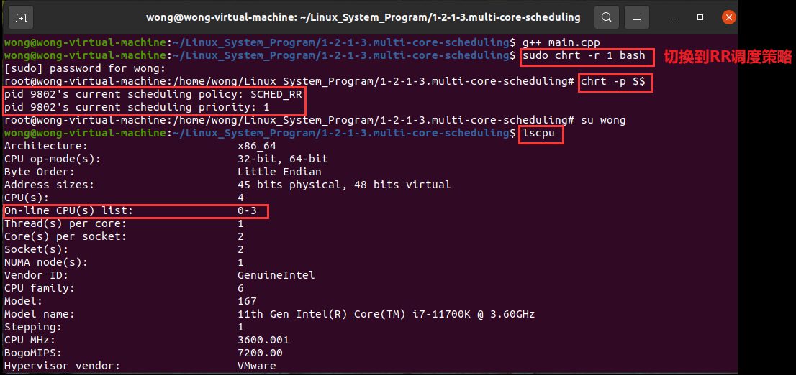 

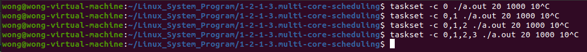 

>```tex
>taskset -c 0 ./a.out 20 1000 10
>taskset -c 0,1 ./a.out 20 1000 10
>taskset -c 0,1,2 ./a.out 20 1000 10
>taskset -c 0,1,2,3 ./a.out 20 1000 10
>增加一个处理器,做一次实验,程序结束后,把终端的输出拷贝到n-CPU.log,n代表处理器数量
>```

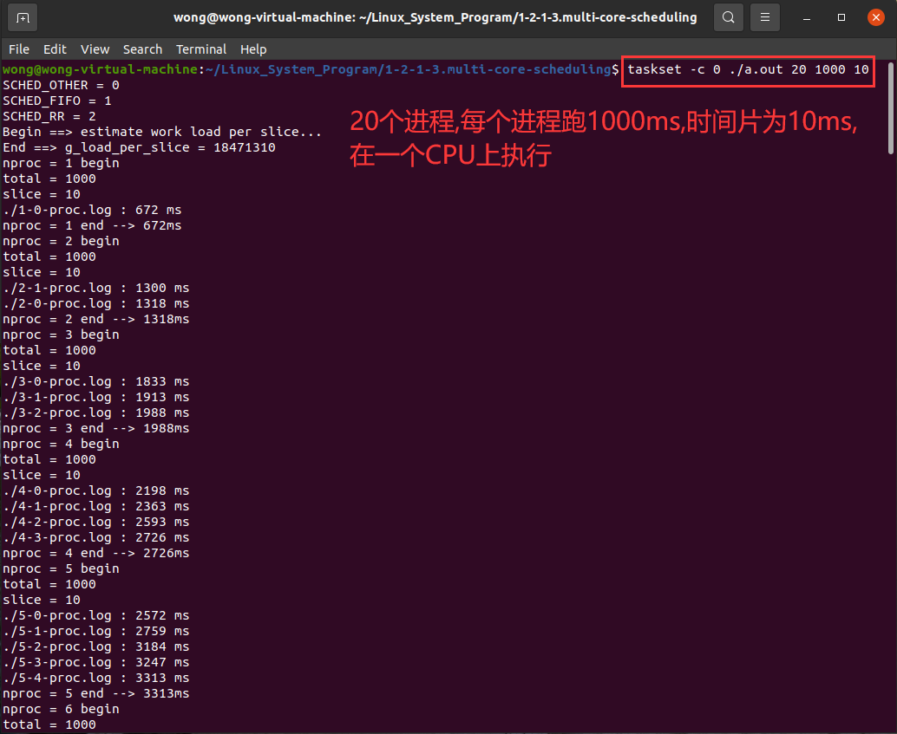 

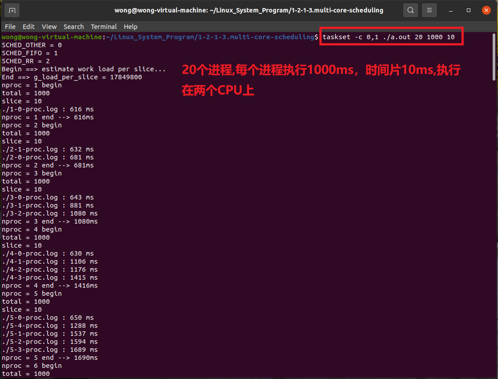 

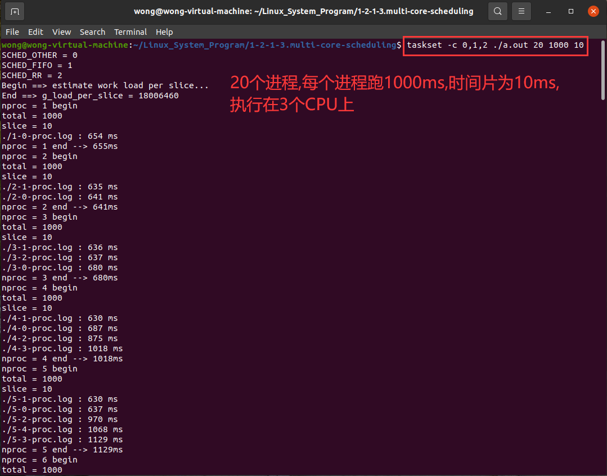 

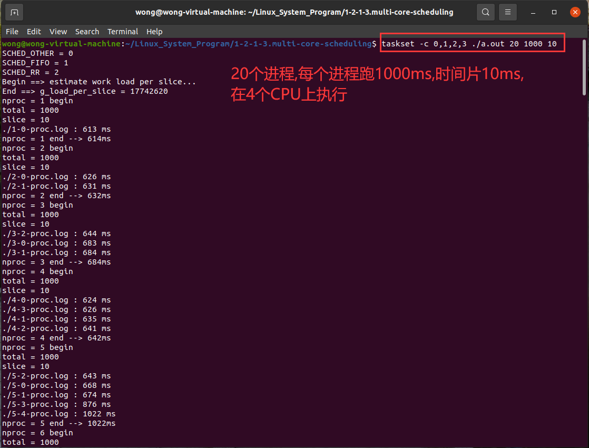 

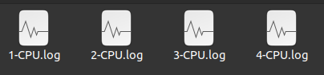 

## 1.6 数据汇总

### 1.6.1 提取感兴趣数据

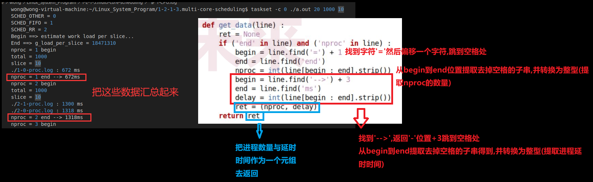 

### 1.6.2 汇总数据

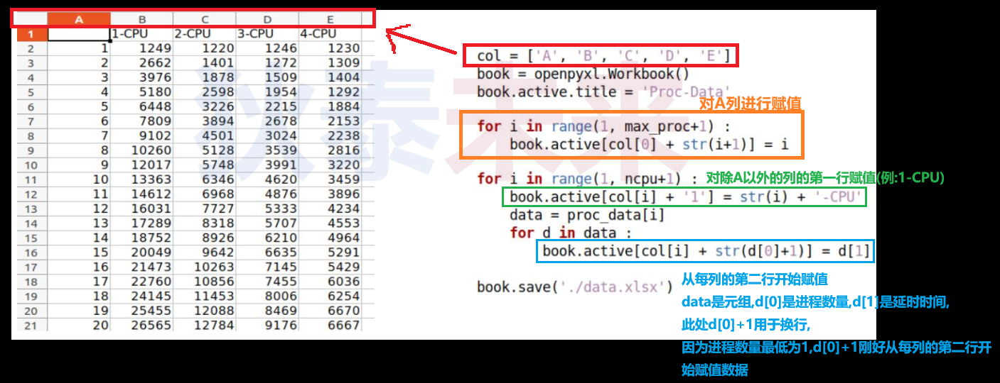 

### 1.6.3 程序代码

[[参考代码proc-data.py]](https://github.com/WONGZEONJYU/Linux_System_Program/blob/main/1-2-1-3.multi-core-scheduling/proc-data.py)

>```python
>import sys
>import openpyxl
>
>ncpu = int(sys.argv[1])
>
>proc_data = [None]
>
>def get_data(line) :
>ret = None
>
>if ('end' in line) and ('nproc' in line) :
>  begin = line.find('=') + 1
>  end = line.find('end')
>  nproc = int(line[begin : end].strip())
>  begin = line.find('-->') + 3
>  end = line.find('ms')
>  delay = int(line[begin : end].strip())
>  ret = (nproc, delay)
>
>return ret
>
>max_proc = 0
>
>for i in range(1, ncpu+1) :
>fname = str(i) + '-cpu.log'
>fd = open(fname, 'r')
>lines = fd.readlines()
>data = []
>
>for s in lines :
>   r = get_data(s)
>   if r != None :
>       max_proc = r[0]
>       data.append(r)  
>
>proc_data.append(data)
>
>fd.close()   
>
>col = ['A', 'B', 'C', 'D', 'E']    
>book = openpyxl.Workbook()
>book.active.title = 'Proc-Data'
>
>for i in range(1, max_proc+1) :
>book.active[col[0] + str(i+1)] = i
>
>for i in range(1, ncpu+1) :
>book.active[col[i] + '1'] = str(i) + '-CPU'
>data = proc_data[i]
>for d in data :
>   book.active[col[i] + str(d[0]+1)] = d[1]
>
>book.save('./data.xlsx')
>
>```

 

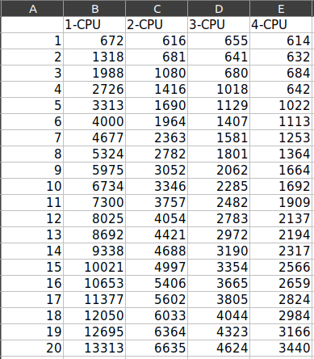 

## 1.7 吞吐量图形化分析

### 1.7.1 图形化分析程序代码

[[参考代码proc-tp.py]](https://github.com/WONGZEONJYU/Linux_System_Program/blob/main/1-2-1-3.multi-core-scheduling/proc-tp.py)

>```python
>import sys
>import openpyxl
>import matplotlib.pyplot as plt
>
>xlsx = sys.argv[1]
>workbook = openpyxl.load_workbook(xlsx)
>sheet = workbook['Proc-Data']
>
>cols = ['B','C','D','E']
>row_num = sheet.max_row
>
>nproc_data = [None]
>
>for c in cols:
>    data = [0]
>    for i in range(1,row_num):
>        nproc = sheet['A' + str(i+1)].value
>        delay = sheet[c + str(i+1)].value
>        throughput = nproc / delay * 1000 ##吞吐量计算公式
>        data.append(throughput)
>    nproc_data.append(data)
>
>plt.title('Process Throughput')
>plt.style.use('bmh')
>plt.xlabel('Proc')
>plt.ylabel('TP')
>
>
>for i in range(1,len(cols) + 1):
>    x = [j for j in range(0,row_num)]
>    y = nproc_data[i]
>    l = str(i) + '-CPU'
>    plt.plot(x,y,label=l)
>
>plt.legend()
>plt.show()
>```

### 1.7.2 图形化输出结果

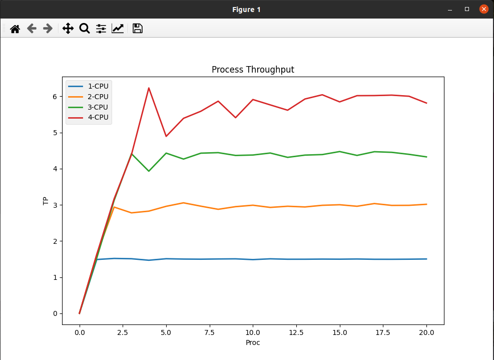 

## 1.8 实验结论

* 执行进程数量 <= 处理器数量 : 延迟最小 (由进程本身决定)
* **$\color{red}{执行进程数量 = 处理器数量}$** : 吞吐量达到顶峰
* 执行进程数量 > 处理器数量 : 延迟增加 , 吞吐量不变
* 实验系统中存在噪声 , 实验结果会被影响 , 然而从趋势可知 : 
	* 吞吐量存在理论上限值 , 进程数量多于处理器数量时 , **$\color{Pink}{吞吐量只能逼近理论上限值}$**
	* **$\color{SkyBlue}{进程切换需要时间 , 因此实际系统中的吞吐量无法到达理论上限值}$**
