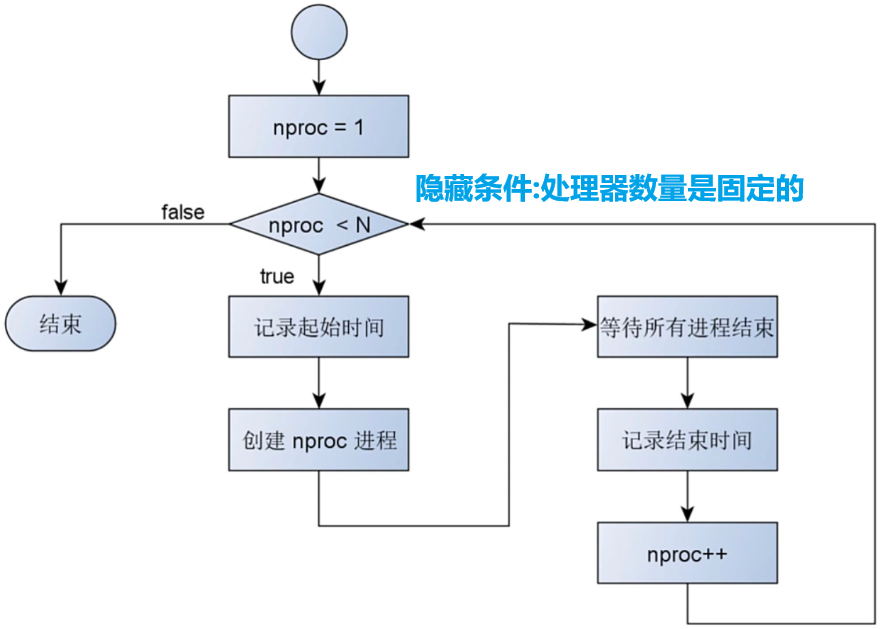

# 1-3 多核调度实验设计

问题 : 如何验证处理器 , 经常数量 , 吞吐量之间的关系 ? ? ?

# 1.多处理器调度实验

## 1.1 实验方法

>- "同时" 创建多个相同进程 , 每个进程执行相同任务 , 并在固定时间后结束
>- 记录不同进程数量时的延迟 , 计算吞吐量
>- 增加处理器数量 , 重复实验 , 并记录结果
>- 将实验数据整理为一张表格
>
>

## 1.2 实验目标

>- 处理器数量固定 , 增加进程数量 , 观察系统吞吐量的变化
>- 进程数量固定 , 增加处理器数量 , 观察系统吞吐量

## 1.3 验证结论 

>- 当处理器数量大于 1 , 只有多个进程并行执行才能提高吞吐量
>- 吞吐量存在上限 , 当进程数量多于处理器数量时 , 吞吐量不会提高

## 1.4 实验代码设计

>
>
>

