# 1-4-5 浅析进程优先级

# 1. 什么是进程优先级？

>- 进程优先级 : **$\color{SkyBlue}{将处理器资源分配给进程的先后顺序}$**
>- Linux 中每个进程都有相应的优先级 ( **$\color{red}{优先级可能动态改变}$** )
>- 进程优先级决定进程 何时执行 和 获得的处理器时间
>- 进程优先级通常表现为一个整数值 ( **$\color{Violet}{数值大小决定优先级高低}$** )

# 2. Linux 中的进程类型 

## 2.1 用户观点

### 2.1.1 交互型进程

>- 表现 : 较多的人机交互 , 进程会不断进入阻塞状态 , 等待用户输入
> - 特点 : 用户输入后 , 必须被及时唤醒执行处理逻辑

### 2.1.2 批处理型进程

>- 表现 : 不需要人机交互 , 在后台执行
> - 特点 : 对时间不敏感 , 常用于数据处理

## 2.2 内核观点 

### 2.2.1 普通进程

>- 使用完全公平策略进行调度的进程 ( `SCHED_OTHER` )
> - 不能保证时间要求严格或者高优先级的进程优先执行

### 2.2.2 实时进程

>- 使用 `SCHED_FIFO` 和 `SCHED_RR` 进行调度的进程
> - 根据进程优先级进行实时调度 , 在一定程度上保证实时性

# 3. 进程实时性与优先级

## 3.1 实时性

>- 硬实时 : 对响应时间要求非常严格 , 必须保证在一定时间内完成
>- 软实时 : 硬实时的弱化形式 , 可接受一定程度上小概率的超时响应

## 3.2 进程分类

>- 普通进程 : 优先级 --> `[ 100, 139 ]` --> 默认120 , **$\color{red}{值越小}$** 优先级 **$\color{red}{越高}$**
>- 实时进程 : 优先级 --> `[ 0, 99 ]` --> `sudo chrt -f 11 ./a.out`  , **$\color{SkyBlue}{值越大}$** 优先级 **$\color{SkyBlue}{越高}$**

# 4. 细说进程优先级

>
>
>注意 :
>
>- 一般情况下动态优先级等于规范优先级
>- 不同之处在于 , 动态优先级可能暂时被提高
>- 对进程的处理都以动态优先级为准
>
>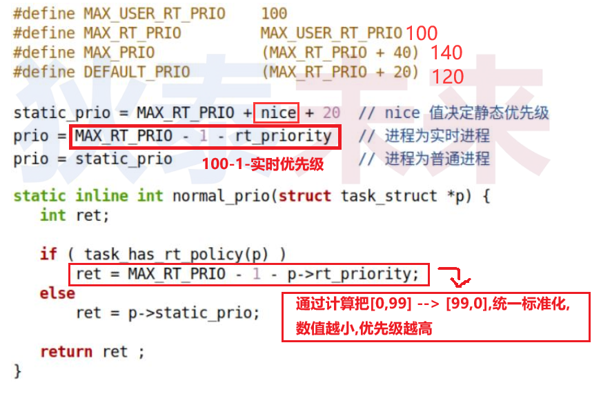

# 5. top 命令中的 PR 指什么?

>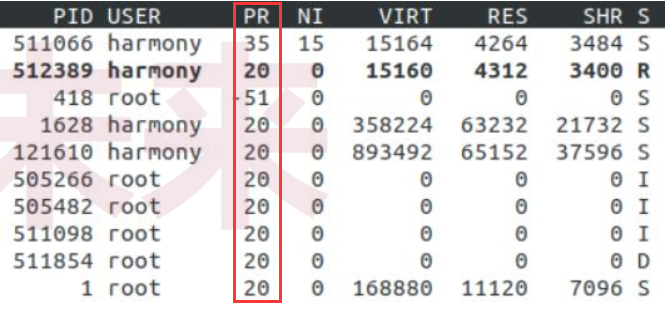
>
>问题 : 
>
>1. 都是实时进程吗?
>2. 优先级可以为负数吗?

## 5.1实时进程

>PR = 规范优先级 - 100
>PR = rt --> rt_priority == 99

## 5.2 普通进程

>PR = 规范优先级 - 100 + nice_value

# 6. 实验一

[[参考代码]](https://github.com/WONGZEONJYU/Linux_System_Program/blob/main/1-4-1-5.process_prio/helloworld.cpp)

>`helloworld.cpp`
>
>```c++
>#include <sys/wait.h>
>#include <sys/resource.h>
>#include <sys/types.h>
>#include <pthread.h>
>#include <unistd.h>
>#include <time.h>
>#include <sched.h>
>#include <fcntl.h>
>#include <cstdio>
>#include <cstdlib>
>#include <cstring>
>#include <iostream>
>
>using namespace std;
>
>int main(int argc, char const *argv[])
>{
>cout << "child = " << getpid() << 
>       ", ppid = " << getppid() << 
>       ", pgid = " << getpgrp() << 
>       "\nhello world\n";
>
>for(;;){
>}
>
>return 0;
>}
>
>```
>
>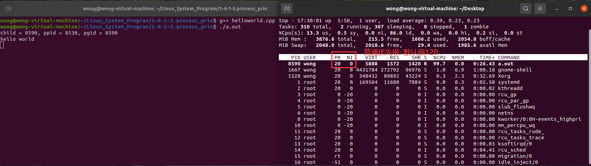
>
>======================在TOP窗口按下 `R` 键 begin======================
>
>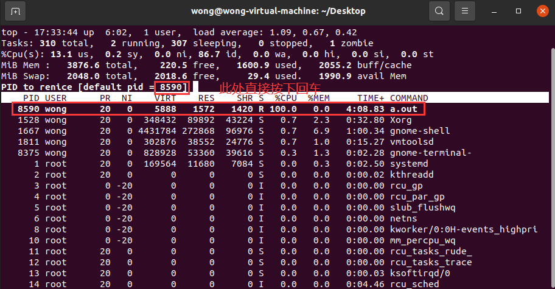
>
>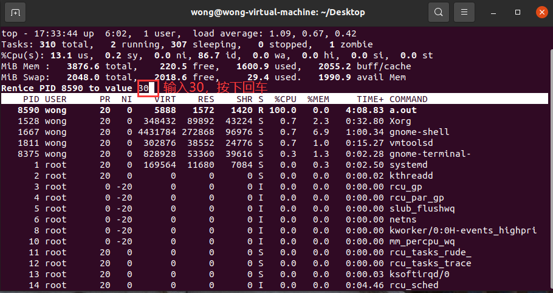
>
>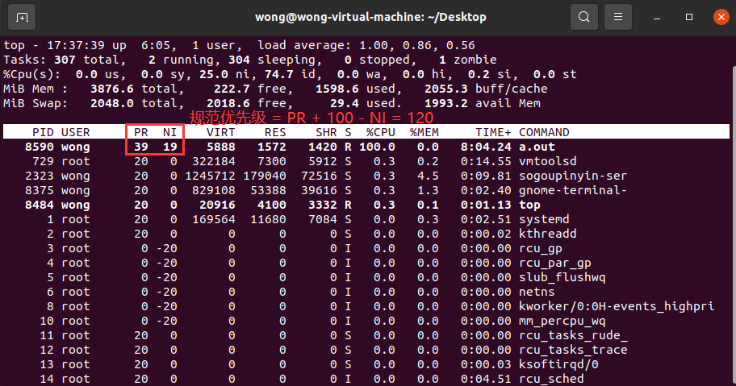
>
>======================在TOP窗口按下 `R` 键 end======================
>
>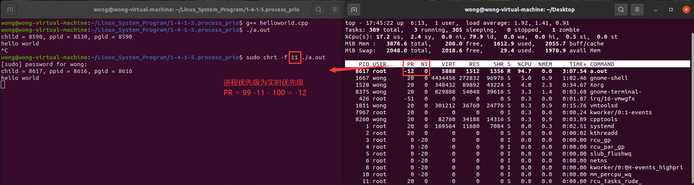
>
>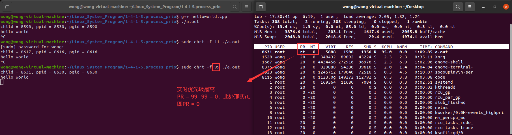

# 7. 再论完全公平策略 (Completely Fair Scheduler) 

>- "完全公平" 并非意味着所有进程获得相等时间片
>- "完全公平" 指的是所有进程都能够获得时间片 (时间片未必相等)
>- 问题 : 完全公平策略中如何确定进程的执行时间片?
>   - 引入权重 (weight) , 进程间按照权重比例分配时间片
>   - `weight = 1024 / (1.25 ^ nice_value)`
>   - `nice_value` --> 取值范围 [ -20, 19 ] ，默认值为 0 , 值越高权重越低

# 8. `nice_value` 对于普通的意义

>假设 A 和 B 是处理相同计算任务的进程 : 
>
>- A 进程 : nice == 0 , 则 : weight == 1024
>- B 进程 : nice == 5 , 则 : weight == 335.5432
>- 所以 : A 进程获取的处理器时间大致是 B 进程的 3 倍

# 9. 实验设计

>- 父进程创建子进程 , 并开始复杂计算
>- 子进程设置 nice_value 为 5 , 并开始复杂计算
>- 期望 : 父进程占用的处理器时间是子进程的 3 倍左右
>
>如何编写实验代码?
>
>如何验证验证实验结果?

# 10.普通进程 nice_value 接口

>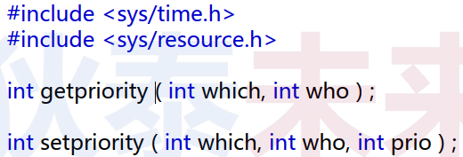
>
>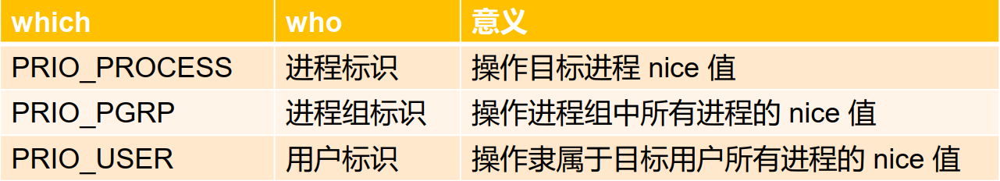
>
>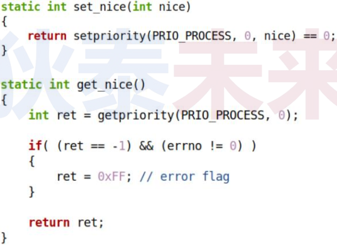
