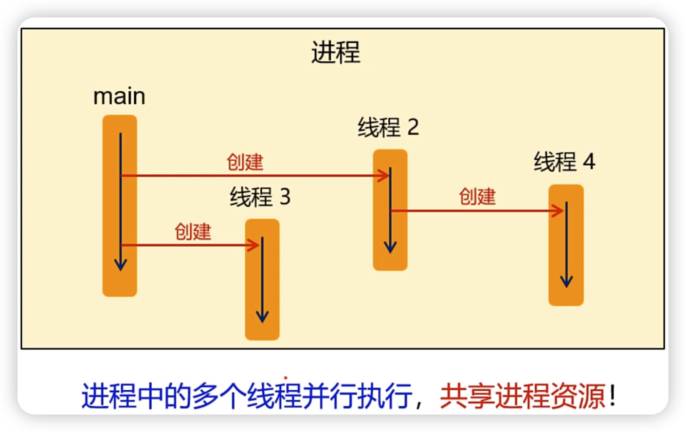
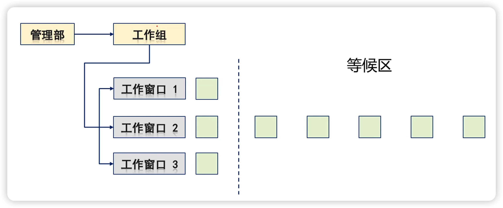
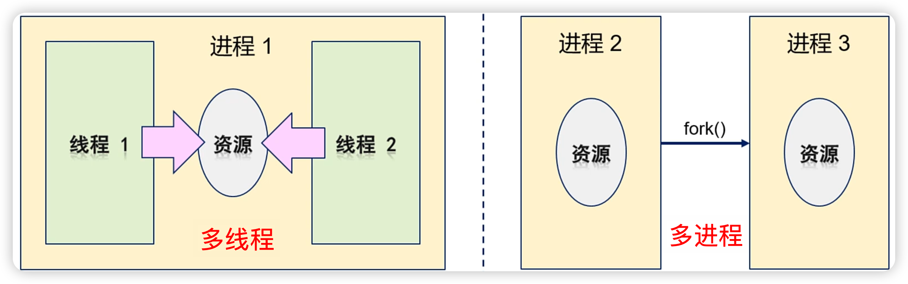

# 1. 一些历史背景

* Linux间接起源于Unix , 而Linux 诞生时并不存在 "线程" 的概念
* 在 20 世纪 90年代才流行起来, POSIX Thread 标准于 1995 年确立
* Unix 中引入 Thread 之后 , 大量函数被重写 , 信号机制也变得复杂
* 2005 年之后 , 处理器生产厂商向超线程和多核架构靠拢

>```tex
>超线程是英特尔开发出来的一项技术,使得单个处理器可以像两个逻辑处理器那样运行,这样单个处理器可以并行执行线程
>```

# 2. 一些常见的概念。。。

* **$\color{SkyBlue}{物理处理器}$** : 安装在主机上的真实的处理器硬件
* **$\color{red}{逻辑处理器}$** : 处理器与超线程技术相关
  * 不支持超线程 : 逻辑处理器的数量 **等于** 核心数的数量
  * 支持超线程 : 逻辑处理器的数量是处理器核心数的 **两倍** 
* 核心数 : 即多核处理器中的内核数量
  * 通过工艺手段将多个完整的CPU塞进一个处理器封装中 (每个CPU就是一个核)

# 3. 线程与进程的关系

* 进程 : **$\color{SkyBlue}{应用程序的一次加载执行}$** (系统进行资源分配的基本单位)
* 线程 : **$\color{red}{进程中的程序执行流}$**
  * 一个线程中可以存在多个线程 (至少存在一个线程)
  * 每个线程执行不同的任务 (多个线程可并行执行)
  * 同一个进程中的多个线程共享进程的系统资源

 

# 4. 初探线程编程模型

 

# 5. 多线程 VS 多进程

 

* 创建 / 销毁 线程花费的时间 < 创建 / 销毁 进程花费的时间
* 多线程切换开销 < 多进程切换开销
* 线程间数据共享复杂度 < 进程间数据共享复杂度
* 多线程代码稳定性 < 多进程代码稳定性
* 多线程代码复杂性 > 多进程代码复杂性

# 6. Linux多线程API函数

* 头文件 : `#include<pthread.h>`

* 线程创建函数 : `int pthread_create(pthread_t* thread,`

  ​							`const pthread_attr_t* arr,`

  ​							`void*(*start_routine)(void*),`

  ​							`void* arg);`

  * thread : pthread_t 变量的地址 , 用于返回线程标识

  * attr : 线程属性设置 , 可设置为NULL , 即 : 使用默认属性

  * start_routine : 线程入口函数

  * arg : 线程入口参数

