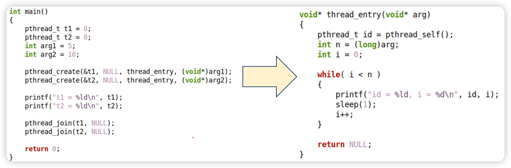
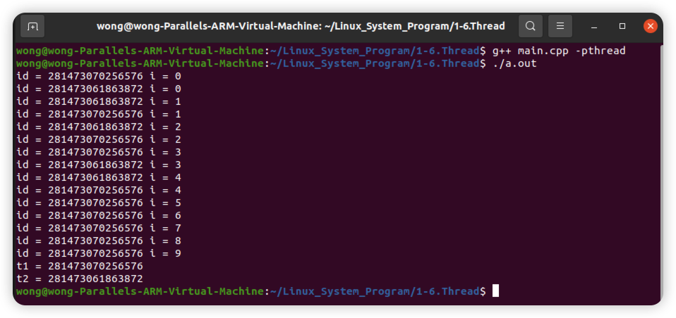
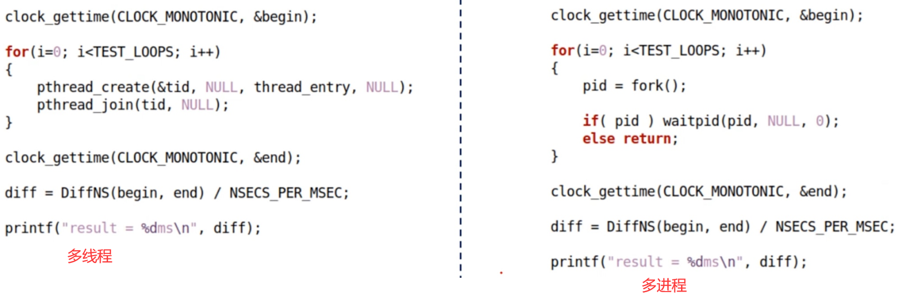
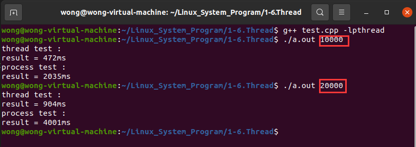
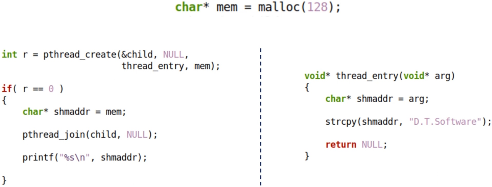
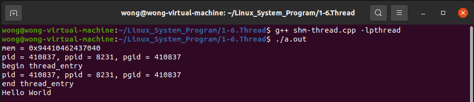
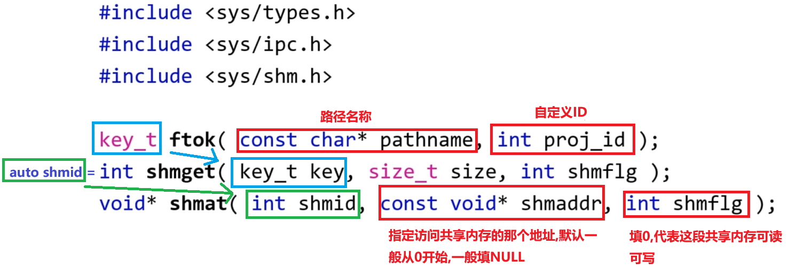
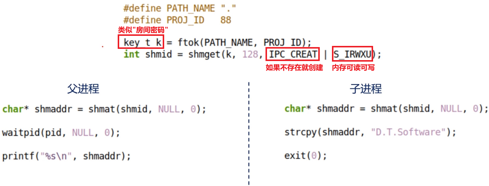
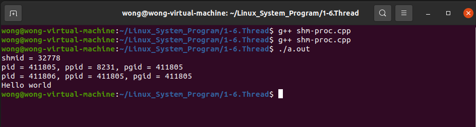

# 1. 一些历史背景

* Linux间接起源于Unix , 而Linux 诞生时并不存在 "线程" 的概念
* 在 20 世纪 90年代才流行起来, POSIX Thread 标准于 1995 年确立
* Unix 中引入 Thread 之后 , 大量函数被重写 , 信号机制也变得复杂
* 2005 年之后 , 处理器生产厂商向超线程和多核架构靠拢

>```tex
>超线程是英特尔开发出来的一项技术,使得单个处理器可以像两个逻辑处理器那样运行,这样单个处理器可以并行执行线程
>```

# 2. 一些常见的概念。。。

* **$\color{SkyBlue}{物理处理器}$** : 安装在主机上的真实的处理器硬件
* **$\color{red}{逻辑处理器}$** : 处理器与超线程技术相关
  * 不支持超线程 : 逻辑处理器的数量 **等于** 核心数的数量
  * 支持超线程 : 逻辑处理器的数量是处理器核心数的 **两倍** 
* 核心数 : 即多核处理器中的内核数量
  * 通过工艺手段将多个完整的CPU塞进一个处理器封装中 (每个CPU就是一个核)

# 3. 线程与进程的关系

* 进程 : **$\color{SkyBlue}{应用程序的一次加载执行}$** (系统进行资源分配的基本单位)
* 线程 : **$\color{red}{进程中的程序执行流}$**
  * 一个线程中可以存在多个线程 (至少存在一个线程)
  * 每个线程执行不同的任务 (多个线程可并行执行)
  * 同一个进程中的多个线程共享进程的系统资源

   

# 4. 初探线程编程模型

  

# 5. 多线程 VS 多进程

  

* 创建 / 销毁 线程花费的时间 < 创建 / 销毁 进程花费的时间
* 多线程切换开销 < 多进程切换开销
* 线程间数据共享复杂度 < 进程间数据共享复杂度
* 多线程代码稳定性 < 多进程代码稳定性
* 多线程代码复杂性 > 多进程代码复杂性

# 6. Linux多线程API函数

* 头文件 : `#include<pthread.h>`

* 线程创建函数 : 
  ```c++
  int pthread_create(pthread_t* thread,
              const pthread_attr_t* arr,
              void*(*start_routine)(void*),
              void* arg);
  ```

    * thread : pthread_t 变量的地址 , 用于返回线程标识
    * attr : 线程属性设置 , 可设置为NULL , 即 : 使用默认属性
    * start_routine : 线程入口函数
    * arg : 线程入口参数
  
* 线程标识:
  * `pthread_t pthread_self(void);`
  * 获取当前线程的 ID 标识
* 线程等待 : 
  * `int pthread_join(pthread_t thread,void** retval);`
  * 等待目标线程执行结束

## 6.1 多线程编程示例

 

## 6.2 编程实验

### 6.2.1 创建线程

[[参考链接]](https://github.com/WONGZEONJYU/Linux_System_Program/blob/main/1-6.Thread/main.cpp)

>```c++
>#include <ctime>
>#include <unistd.h>
>#include <cstdlib>
>#include <cstring>
>#include <thread>
>#include <iostream>
>
>using namespace std;
>
>void* thread_entry(void* arg)
>{
>    const auto id {pthread_self()};
>    const auto n{reinterpret_cast<long long>(arg)};
>    for (size_t i {}; i < n; i++){
>        
>        cout << "id = " << id << " i = " << i << "\n" << flush;
>        this_thread::sleep_for(1s);
>    }
>
>    return nullptr;
>}
>
>int main(int argc, char const *argv[])
>{
>    pthread_t t1{},t2{};
>    long long arg1{10},arg2{5};
>    pthread_create(&t1,nullptr,thread_entry,reinterpret_cast<void*>(arg1));
>    pthread_create(&t2,nullptr,thread_entry,reinterpret_cast<void*>(arg2));
>    pthread_join(t1,nullptr);
>    pthread_join(t2,nullptr);
>
>    cout << "t1 = " << t1 << "\nt2 = " << t2 << "\n";
>
>    return 0;
>}
>
>```

 

### 6.2.2 性能对比

[[参考链接]](https://github.com/WONGZEONJYU/Linux_System_Program/blob/main/1-6.Thread/test.cpp)

* 相同功能的多线程程序 VS 多进程程序
* 对比项 : 创建 / 销毁



>```c++
>#include <fcntl.h>
>#include <iostream>
>#include <thread>
>#include <ctime>
>#include <sys/time.h>
>#include <unistd.h>
>#include <sys/types.h>
>#include <sys/wait.h>
>
>using namespace std;
>
>static constexpr auto NSECS_PER_MSEC {1000000UL};
>static constexpr auto NSECS_PER_SEC {1000000000UL};
>static constexpr auto TEST_LOOPS {10000};
>
>#define DiffNS(begin,end) ((end.tv_sec - begin.tv_sec) * NSECS_PER_SEC + (end.tv_nsec - begin.tv_nsec))
>
>static void* thread_entry(void*){
>    return {};
>}
>
>static void thread_test(const int t) {
>
>    cout << "thread test : \n";
>    timespec begin{},end{};
>    
>    clock_gettime(CLOCK_MONOTONIC,&begin);
>    
>    for (int i {}; i < t; i++){
>        pthread_t tid{};
>        pthread_create(&tid,nullptr,thread_entry,nullptr);
>        pthread_join(tid,nullptr);
>    }
>
>    clock_gettime(CLOCK_MONOTONIC,&end);
>
>    auto diff{DiffNS(begin,end)/NSECS_PER_MSEC};
>
>    cout << "result = " << diff << "ms\n";
>    
>}
>
>static void process_test(const int t)
>{
>    cout << "process test : \n";
>    timespec begin{},end{};
>
>    clock_gettime(CLOCK_MONOTONIC,&begin);
>
>    for (int i {}; i < t; i++) {
>        const auto pid{fork()};
>        if (pid){
>            waitpid(pid,nullptr,0);
>        }else{
>            return;
>        }
>    }
>    
>    clock_gettime(CLOCK_MONOTONIC,&end);
>
>    auto diff{DiffNS(begin,end)/NSECS_PER_MSEC};
>
>    cout << "result = " << diff << "ms\n";
>}
>
>int main(int argc, char const *argv[]) {
>    
>    if (argc < 2){
>        cerr << "error\n";
>        return -1;
>    }
>
>    auto t{atoi(argv[1])};
>    
>    thread_test(t);
>    process_test(t);
>    return 0;
>}
>```

 

### 6.2.3 数据共享

* 多线程程序共享一段内存 -> "全局变量"
* 多进程程序共享一段内存 -> "机制复杂"

#### 6.2.3.1 多线程内存共享

[[参考链接]](https://github.com/WONGZEONJYU/Linux_System_Program/blob/main/1-6.Thread/shm-thread.cpp)

 

>```c++
>#include <iostream>
>#include <thread>
>#include <cstring>
>#include <cstdlib>
>#include <unistd.h>
>
>using namespace std;
>
>void* thread_entry(void*arg)
>{
>    cout << "begin " <<__FUNCTION__ << "\n"
>        << "pid = " << getpid() << ", ppid = " 
>        << getppid() << ", pgid = " << getpgrp() << "\n";
>
>    auto shmaddr {static_cast<char*>(arg)};
>
>    strcpy(shmaddr,"Hello World\n");
>
>    cout << "end " <<__FUNCTION__ << "\n";
>    return {};
>}
>
>int main(int argc, char const *argv[])
>{
>    char* mem {};
>
>    try{
>        mem = new char[128];
>    }catch(const std::bad_alloc& e){
>        cerr << e.what() << '\n';
>        exit(-1);
>    }
>    
>    cout << "mem = 0x" << reinterpret_cast<long long>(mem) << "\n";
>
>    pthread_t child{};
>    
>    const auto r{pthread_create(&child,nullptr,thread_entry,mem)};
>
>    if (!r){
>        cout << "pid = " << getpid() << ", ppid = " 
>            << getppid() << ", pgid = " << getpgrp() << "\n";
>
>        auto shmaddr {mem};
>        pthread_join(child,nullptr);
>        cout << mem << "\n";
>    }else{
>        cerr << "create thread error...\n";
>    }
>
>    delete []mem;
>    mem = nullptr;
>    return 0;
>}
>
>```

 

#### 6.2.3.2 多进程内存共享

[[参考链接]](https://github.com/WONGZEONJYU/Linux_System_Program/blob/main/1-6.Thread/shm-proc.cpp)

  



>```c++
>#include <cstring>
>#include <iostream>
>#include <unistd.h>
>#include <cstdlib>
>#include <cstdio>
>#include <math.h>
>#include <sys/types.h>
>#include <sys/ipc.h>
>#include <sys/shm.h>
>#include <sys/wait.h>
>#include <fcntl.h>
>
>using namespace std;
>
>#define PATH_NAME "."
>#define PROJ_ID 88
>
>int main(int argc, char const *argv[])
>{
>    const auto k {ftok(PATH_NAME,PROJ_ID)};
>
>    const auto shmid {shmget(k,128,IPC_CREAT | S_IRWXU)};
>
>    cout << "shmid = " << shmid << "\n";
>
>    if (-1 == shmid){
>        cerr << "shmget error\n";
>        exit(-1);
>    }
>
>    const auto pid {fork()};
>
>    if (pid > 0){
>
>        cout << "pid = " << getpid() << ", ppid = " 
>            << getppid() << ", pgid = " << getpgrp() << "\n";
>
>        auto shmaddr{static_cast<char*>(shmat(shmid,nullptr,0))};
>
>        waitpid(pid,nullptr,0);
>
>        cout << shmaddr << "\n";
>
>    }else if(!pid){
>
>        cout << "pid = " << getpid() << ", ppid = " 
>            << getppid() << ", pgid = " << getpgrp() << "\n";
>
>        auto shmaddr{static_cast<char*>(shmat(shmid,nullptr,0))};
>
>        strcpy(shmaddr,"Hello world");
>
>        exit(0);
>    }else{
>        cerr << "child process create error...\n";
>    }
>    
>    shmctl(shmid,IPC_RMID,nullptr);
>
>    return 0;
>}
>
>```

 

