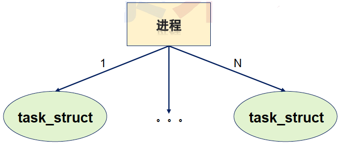

# 1. Linux 中的线程本质

* 线程接口由Native **POSIX** Thread Library 提供 , 即 : NPTL 库函数
* 线程被称为 **$\color{red}{轻量级进程}$** (Light Weighted Process)
* 每一个线程在内核中都对应一个调度实体 , 拥独立的结构体 (**task_struct**)
  * 内核设计 : 一个进程对应内核中的一个结构体 , 对应一个进程标识
  * 引入线程 : 线程是内核的调度实体 , 在内核中必然对应一个结构体
* 不同模式下
  * 用户模式 : 一个进程中存在多个线程
  * 内核模式 : 每个线程是一个独立的调度实体

 

问题 : 内核怎么知道某个调度实体属于哪一个进程?

# 2. 另一种视角。。。

* 拥有多线程的进程 , 又被称为线程组 (谁是线程组长?)
* 在内核数据结构 **task_struct** 中存在pid 和 tgid :
  * pid_t pid ==> 线程标识符 (Thread ID)
  * pid_t tgid ==> 线程组标识符 (Thread Group ID)

|  用户模式  |       系统调用        | task_struct |
| :--------: | :-------------------: | :---------: |
| 线程标识符 | `pid_t gettid(void);` | pid_t pid;  |
| 进程标识符 | `pid_t getpid(void);` | pid_t tgid  |

