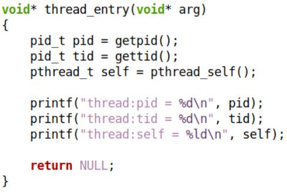

# 1. Linux 中的线程本质

* 线程接口由Native **POSIX** Thread Library 提供 , 即 : NPTL 库函数
* 线程被称为 **$\color{red}{轻量级进程}$** (Light Weighted Process)
* 每一个线程在内核中都对应一个调度实体 , 拥独立的结构体 (**task_struct**)
  * 内核设计 : 一个进程对应内核中的一个结构体 , 对应一个进程标识
  * 引入线程 : 线程是内核的调度实体 , 在内核中必然对应一个结构体
* 不同模式下
  * 用户模式 : 一个进程中存在多个线程
  * 内核模式 : 每个线程是一个独立的调度实体

 

问题 : 内核怎么知道某个调度实体属于哪一个进程?

# 2. 另一种视角。。。

* 拥有多线程的进程 , 又被称为线程组 (谁是线程组长? 主线程是线程组长 pid==tgid  )
* 在内核数据结构 `task_struct` 中存在 pid 和 tgid :
  * `pid_t pid` ==> 线程标识符 (Thread ID)
  * `pid_t tgid` ==> 线程组标识符 (Thread Group ID)

|  用户模式  |       系统调用        |  task_struct  |
| :--------: | :-------------------: | :-----------: |
| 线程标识符 | `pid_t gettid(void);` | `pid_t pid;`  |
| 进程标识符 | `pid_t getpid(void);` | `pid_t tgid;` |

* 进程创建后默认拥有一个线程 , 即 : **$\color{SkyBlue}{主线程 (默认执行流)}$**
* 主线程的 LWP 标识符与进程标识符相同 , 即 : **$\color{red}{主线程为线程组长}$**
* 其它子线程创建后隶属于当前进程 : 
  * 子线程的 LWP 标识符各不相同 , 且与进程标识符不同
  * 子线程调用 `getpid()` 的结果相同 (why❓)

# 3. 下面的程序输出什么❓为什么❓

  

# 4. 实验一

[[参考链接]]()

>```c++
>#include <sys/types.h>
>#include <sys/wait.h>
>#include <sys/syscall.h>
>#include <unistd.h>
>#include <iostream>
>#include <thread>
>
>using namespace std;
>
>#if 0
>pid_t gettid()
>{
>    return syscall(SYS_gettid);
>}
>#endif
>
>static void* thread_entry(void*)
>{
>    const auto pid {getpid()};
>    const auto tid {gettid()};
>    const auto self {pthread_self()};
>    
>    cout << "thread:pid = " << pid << "\n";
>    cout << "thread:tid = " << tid << "\n";
>    cout << "thread:self = " << self << "\n";
>    return nullptr;
>}
>
>int main(int argc, char const *argv[])
>{
>    const auto self {pthread_self()};
>    const auto pid {getpid()};
>    const auto tid {gettid()};
>    
>    cout << "main:pid = " << pid << "\n";
>    cout << "main:tid = " << tid << "\n";
>    cout << "main:self = " << self << "\n";
>
>    pthread_t t {};
>    pthread_create(&t, nullptr, thread_entry, nullptr);
>    
>    cout << "main:t = " << t << "\n";
>
>    pthread_join(t, nullptr);
>    
>    return 0;
>}
>
>```

 

❓问题 : 对于线程来说 , `pthread_t` 类型的标识符 与 `pid_t` 类型标识有什么不同 ❓

* 线程 `pid_t` 是全局范围内对调度实体的唯一标识 (内核调度使用 , 不希望用户获取)
* 线程 `pthread_t` 是应用程序中对线程的局部描述 (不同进程的子线程有可能出现相同ID)

# 5. 使用 ps 命令查看线程信息

* ps [Options]
  * -e ==> Select all processes
  * -L ==> Show threads , possibly with LWP(tid->内核调度使用) and NLWP(轻量级线程的数量) columns
  * -f ==> Do full-format listing  
* ps -eLf ==> To get info about threads
  * 通过 ps -eLf 可查看 线程 与 进程 , 线程 与 线程 间的关系。

## 5.1 实验程序

    

问题 : 既然线程有独立的标识符 , 那么通过标识符kill线程会发生什么 ❓

## 5.2 实验

[[参考链接]]()

> ```c++
> #include <sys/types.h>
> #include <sys/wait.h>
> #include <sys/syscall.h>
> #include <unistd.h>
> #include <iostream>
> #include <thread>
> 
> using namespace std;
> 
> #if 0
> pid_t gettid()
> {
>     return syscall(SYS_gettid);
> }
> #endif
> 
> static void* thread_entry(void*)
> {   
>     cout << "thread: " << pthread_self() << "\n" << fflush;
> 
>     for(;;){
>         const auto pid {getpid()},tid {gettid()};
>         cout << "pid = " << pid << ", tid = " << tid << "\n";
>         sleep(5);
>     }
>     
>     return nullptr;
> }
> 
> int main(int argc, char const *argv[])
> {
>     cout << "main:pid = " << getpid() << "\n" <<
>         "main:tid = " << gettid() << "\n";
> 
>     for(int i {}; i<4; i++){
>         pthread_t t{};
>         pthread_create(&t, nullptr, thread_entry, nullptr);
>     }
> 
>     for(;;){
>         sleep(1);
>     }
> 
>     return 0;
> }
> 
> ```

 

> ```tex
> 通过ps -eLf 命令查看信息
> ```

 

> ```tex
> 通过kill命令对某一tid发送信号
> ```

 

> ```tex
> 信号是针对整个进程 , 进程收到kill发来的信号 , 整个进程就终止了
> ```

> ```tex
> 通过proc目录查看进程中的线程
> ```

 

# 6. 多线程内核模型  

* Linux 内核中的基本调度单位为 `task_struct` , 即 : 内核中以“任务”作为调度的基本单位  

 


>```tex
>创建线程不需要进行资源的申请,只需创建task_struct,指向进程空间的地址
>```

# 7. 值得思考的问题❓

* 多线程之间是否有"父子关系" ?
* 主线程如果先于子线程结束会发生什么 ?
* 使用 `kill` 命令是否能够“杀死”指定线程 ?
* `pthread_t` 究竟是什么数据类型？

## 7.1 多线程之间是否有"父子关系" ?

* 答 : 无 !

 

## 7.2 主线程如果先于子线程结束会发生什么?

* Linux 中主线程如果执行结束 , 则进程结束
* 进程结束则进程资源被释放 , 子线程被迫结束

### 7.2.1 实验

[[参考链接]]()

> ```c++
> /*test3.cpp*/
> 
> #include <sys/types.h>
> #include <sys/wait.h>
> #include <sys/syscall.h>
> #include <unistd.h>
> #include <iostream>
> #include <thread>
> 
> using namespace std;
> 
> #if 0
> pid_t gettid()
> {
>     return syscall(SYS_gettid);
> }
> #endif
> 
> static void* thread_entry(void*)
> {   
>     cout << "thread: " << pthread_self() << "\n" << fflush;
> 
>     for(;;){
>         const auto pid {getpid()},tid {gettid()};
>         cout << "pid = " << pid << ", tid = " << tid << "\n";
>         sleep(1);
>     }
> 
>     return nullptr;
> }
> 
> int main(int argc, char const *argv[])
> {
>     cout << "main:pid = " << getpid() << "\n" <<
>         "main:tid = " << gettid() << "\n";
> 
>     for(int i {}; i<4; i++){
>         pthread_t t{};
>         pthread_create(&t, nullptr, thread_entry, nullptr);
>     }
> 
>     sleep(5);
> 
>     return 0;
> }
> ```

 

## 7.3 使用 kill 命令是否能够 "杀死" 指定线程 ?

* kill 命令默认发送信号 SIGTERM，而信号的目标是进程
* 因此, kill 任意子线程的 pid_t 将导致整个进程结束  

> ```tex
> 用kill命令向pthread_t tid发送信号,会报错,kill不识别pthread_t类型的tid
> ```

 

## 7.4 pthread_t 究竟是什么数据类型?

* `pthread_t` 是 POSIX Thread 中的接口 , 具体定义与系统相关  
* 通常情况下 , `pthread_t` 的具体定义是一个整型值
  * Linux 中 `pthread_t` 的定义是 64 位整型 (保存地址值)
  * 其它系统中 ,  `pthread_t` 直接映射为 Task ID 值
  * 对于一些特殊的系统， `pthread_t` 是一个结构体  

# 8. Linux 多线程 API 函数 

* 线程标识相等判断 : 
  * `int pthread_equal(pthread_t t1, pthread_t t2);`
  * 如果 t1 与 t2 相等 , 返回非 0 值 , 否则返回 0 值
  * 注意 : 
    * Linux 系统编程时 , 可直接用 t1 == t2 的方式判断是否相等
    * **$\color{red}{编写可移植的多线程代码}$** , 使用 `pthread_equal()` 判断是否相等  
