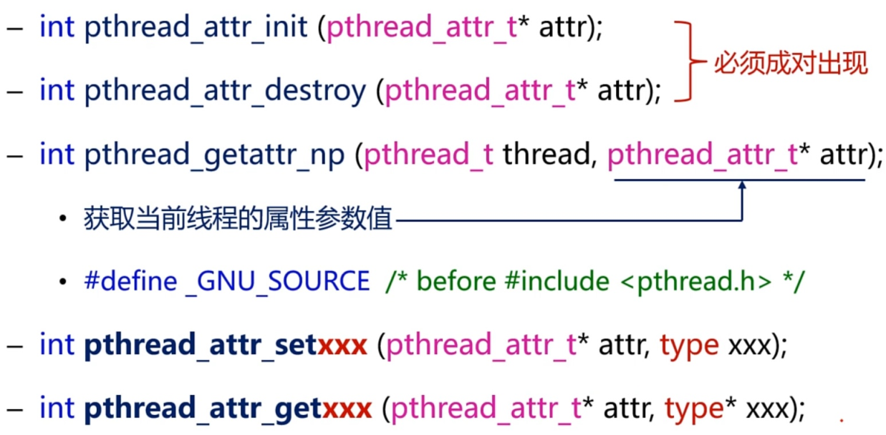
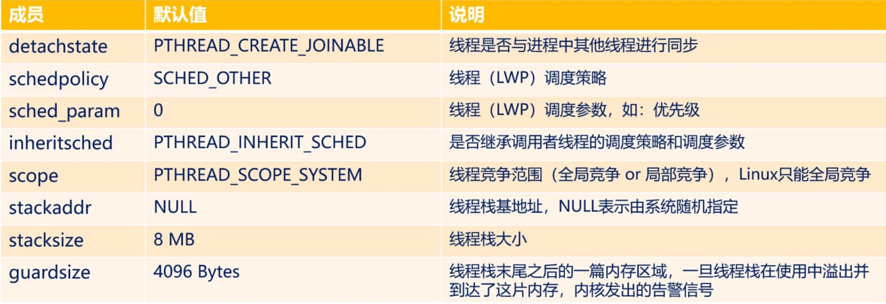
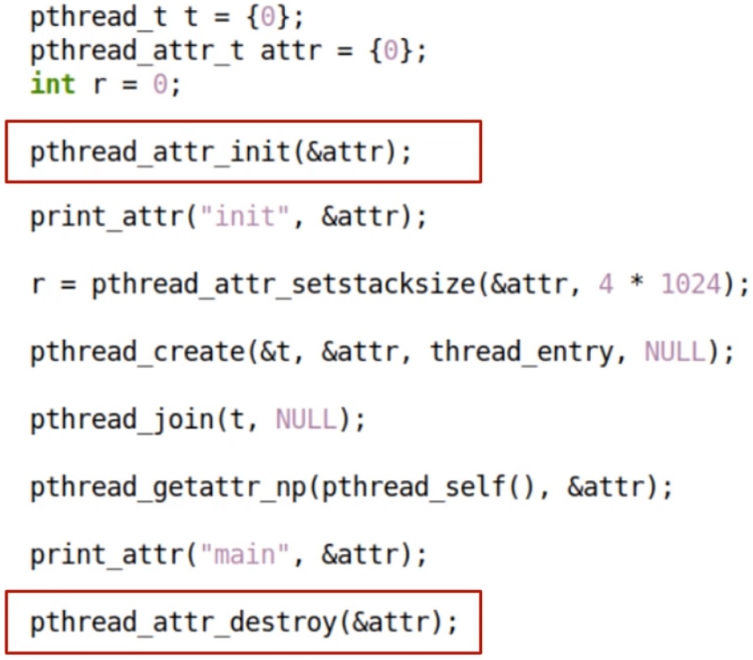

# 1. 再论线程创建函数

```c++
int pthread_create (pthread_t* thread,
			   const pthread_attr_t* attr,/*线程属性参数*/
			   void *(*start_routine) (void *),/*线程入口*/
			   void * arg);
```

|  返回值  |                 描述                  |
| :------: | :-----------------------------------: |
|    0     |             线程创建成功              |
| `EAGAIN` |    系统资源不够 或 线程数超出限制     |
| `EINVAL` | 属性参数 `attr` 不合法 (成员值不合法) |
| `EPERM`  | 没有足够的权限设置调度策略和调度参数  |

# 2. 详解线程属性 `pthread_attr_t attr` 参数

```c++
typedef struct /*一种可能的定义*/
{
       int                       detachstate;     //线程的分离状态
       int                       schedpolicy;     //线程调度策略
       struct sched_param        schedparam;      //线程的调度参数
       int                       inheritsched;    //线程的继承性
       int                       scope;           //线程的作用域
       size_t                    guardsize;       //线程栈末尾的警戒缓冲区大小
       int                       stackaddr_set;	  //线程的栈设置
       void *                    stackaddr;       //线程栈的位置
       size_t                    stacksize;       //线程栈的大小
}pthread_attr_t;
```

# 3. 详解线程属性 API 函数

 

# 4. 详解线程属性 `pthread_attr_t attr` 参数

 

# 5. 线程属性函数示例

 

# 6. 编程实验

[[参考链接]]()

