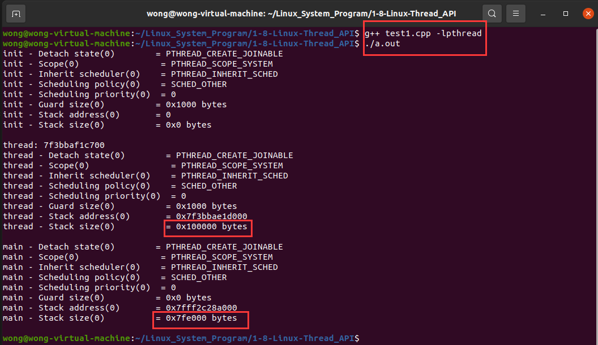
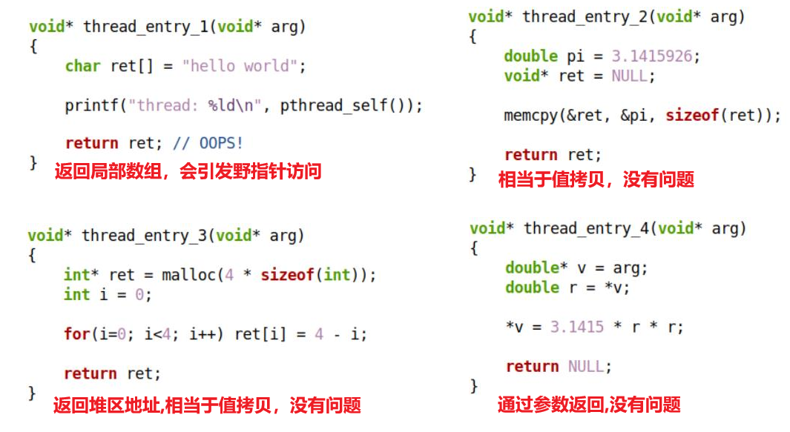
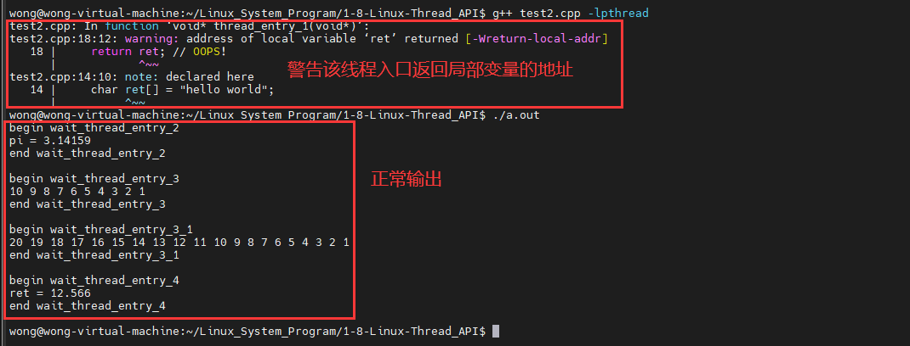
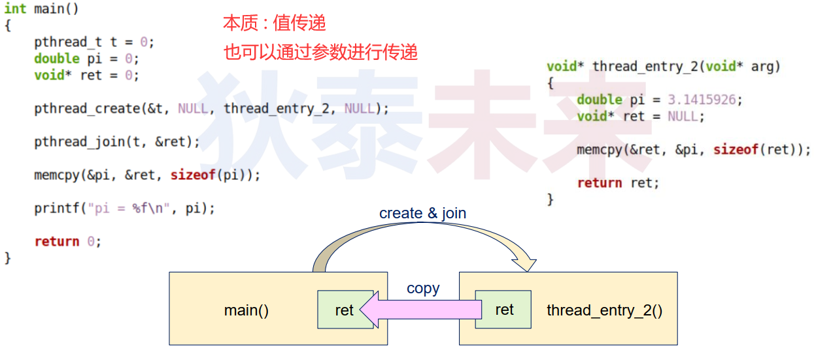
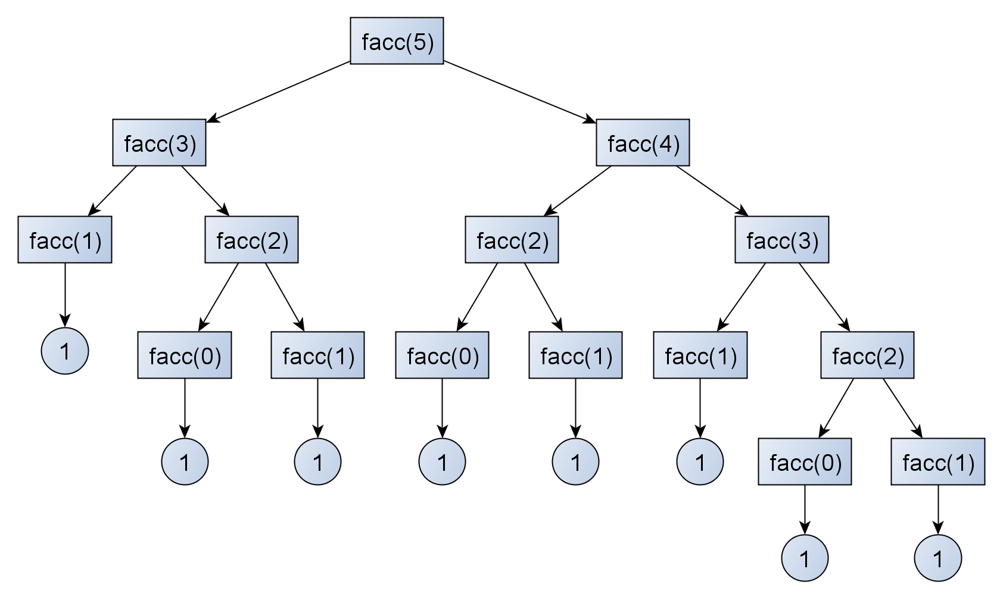
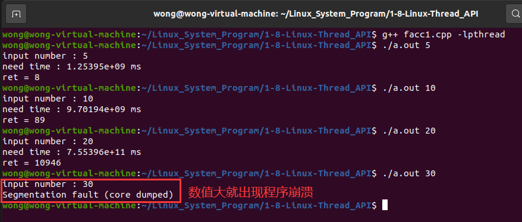
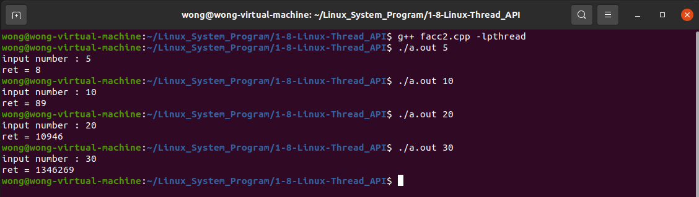

# 1. 再论线程创建函数

```c++
int pthread_create (pthread_t* thread,
			   const pthread_attr_t* attr,/*线程属性参数*/
			   void *(*start_routine) (void *),/*线程入口*/
			   void * arg);
```

|  返回值  |                 描述                  |
| :------: | :-----------------------------------: |
|    0     |             线程创建成功              |
| `EAGAIN` |    系统资源不够 或 线程数超出限制     |
| `EINVAL` | 属性参数 `attr` 不合法 (成员值不合法) |
| `EPERM`  | 没有足够的权限设置调度策略和调度参数  |

# 2. 详解线程属性 `pthread_attr_t attr` 参数

```c++
typedef struct /*一种可能的定义*/
{
       int                       detachstate;     //线程的分离状态
       int                       schedpolicy;     //线程调度策略
       struct sched_param        schedparam;      //线程的调度参数
       int                       inheritsched;    //线程的继承性
       int                       scope;           //线程的作用域
       size_t                    guardsize;       //线程栈末尾的警戒缓冲区大小
       int                       stackaddr_set;	  //线程的栈设置
       void *                    stackaddr;       //线程栈的位置
       size_t                    stacksize;       //线程栈的大小
}pthread_attr_t;
```

# 3. 详解线程属性 API 函数

 

# 4. 详解线程属性 `pthread_attr_t attr` 参数

 

# 5. 线程属性函数示例

 

## 5.1 编程实验

[[参考链接]](https://github.com/WONGZEONJYU/Linux_System_Program/blob/main/1-8-Linux-Thread_API/test1.cpp)

> ```c++
> //#define _GNU_SOURCE     /* To get pthread_getattr_np() declaration */
> #include <thread>
> #include <iostream>
> #include <cstdlib>
> #include <unistd.h>
> #include <errno.h>
> 
> using namespace std;
> 
> static void print_attr(const char* prefix,const pthread_attr_t* attr)
> {
>     int i {};
>     auto r { pthread_attr_getdetachstate(attr, &i)};
>     cout << (prefix ? prefix : "") << " - Detach state(" << r << ")        = " << ((i == PTHREAD_CREATE_DETACHED) ? "PTHREAD_CREATE_DETACHED" :
>                                                                             (i == PTHREAD_CREATE_JOINABLE) ? "PTHREAD_CREATE_JOINABLE" :"???") << "\n";
> 
>     r = pthread_attr_getscope(attr, &i);
>     cout << (prefix ? prefix : "") << " - Scope(" << r << ")                = " << ((i == PTHREAD_SCOPE_SYSTEM)  ? "PTHREAD_SCOPE_SYSTEM" :
>                                                                                 (i == PTHREAD_SCOPE_PROCESS) ? "PTHREAD_SCOPE_PROCESS" :"???") << "\n";
> 
>     r = pthread_attr_getinheritsched(attr, &i);
>     cout << (prefix ? prefix : "") << " - Inherit scheduler(" << r << ")    = " << ((i == PTHREAD_INHERIT_SCHED)? "PTHREAD_INHERIT_SCHED" :
>                                                                                 (i == PTHREAD_EXPLICIT_SCHED)? "PTHREAD_EXPLICIT_SCHED" :"???") << "\n";
> 
>     r = pthread_attr_getschedpolicy(attr, &i);
>     cout << (prefix ? prefix : "") << " - Scheduling policy(" << r << ")    = " << ((i == SCHED_OTHER) ? "SCHED_OTHER" :
>                                                                                 (i == SCHED_FIFO)  ? "SCHED_FIFO" : 
>                                                                                 (i == SCHED_RR)? "SCHED_RR" :"???") << "\n";
> 
>     sched_param sp {};
>     r = pthread_attr_getschedparam(attr, &sp);
>     cout << (prefix ? prefix : "") << " - Scheduling priority(" << r << ")  = " << sp.sched_priority << "\n";
> 
>     size_t v {};
>     r = pthread_attr_getguardsize(attr, &v);
>     cout << (prefix ? prefix : "") << " - Guard size(" << r << ")          = 0x" << hex << v << " bytes\n";
> 
>     void* stkaddr {};
>     r = pthread_attr_getstack(attr, &stkaddr, &v);
>     cout << (prefix ? prefix : "") << " - Stack address(" << r << ")       = " << stkaddr << "\n";
>     cout << (prefix ? prefix : "") << " - Stack size(" << r << ")          = 0x" << hex << v << " bytes\n\n";
> 
> }
> 
> static void* thread_entry(void*)
> {   
>     cout << "thread: " << pthread_self() << "\n";
> 
>     pthread_attr_t attr{};
>     pthread_getattr_np(pthread_self(), &attr);
>     
>     print_attr("thread", &attr);
>     return {};
> }
> 
> int main(int argc, char const *argv[])
> {
>     pthread_attr_t attr{};
> 
>     pthread_attr_init(&attr);
> 
>     print_attr("init", &attr);
>     
>     //auto r {pthread_attr_setstacksize(&attr, 4 * 1024)}; /*不建议手动设置栈大小*/
>     /*设置4K会出错*/
> 
>     auto r {pthread_attr_setstacksize(&attr, 1024 * 1024)};
> 
>     pthread_t t{};
>     pthread_create(&t, &attr, thread_entry, nullptr);
>     pthread_join(t, nullptr);
> 
>     pthread_getattr_np(pthread_self(), &attr);
>     
>     print_attr("main", &attr);
>     
>     pthread_attr_destroy(&attr);
> 
>     return {};
> }
> 
> ```

 

# 6. 线程的结束方式

* 线程入口函数执行了 `return` 语句 , 并返回指定值
  * `return (void*)ret`
* 线程执行流调用 `pthread_exit(...)` 函数 ( 注意 : 不是 `void exit(int status);` )
  * `void pthread_exit(void* ret);`
  * 可以在线程执行流下任意一个函数执行 , 可立即退出线程
* 其它线程对指定线程调用 `pthread_cancel(...)` 函数 (不安全)
  * `int pthread_cancel(pthread_t thread);`
  * 一个线程结束另外一个线程

# 7. 关于线程的返回值 

* 基础类型的值
  * 直接返回 : `pthread_exit((void*)ret);` or `return (void*)ret;`
* 结构体类型值
  * 利用全局变量返回 or 通过 `malloc(...)` 利用堆内存返回
* 字符串返回值 (不推荐)
  * 利用静态字符串返回 or 字符串字面量返回

 

* `int pthread_join ( pthread_t tid, void** retval );`
  * 该函数用于等待指定的线程 ( tid ) 执行结束
  * 如果指定线程已经执行结束 , 则函数调用立即返回
  * 如果指定线程必须不可连接 , 则函数调用失败
  * 参数 `retval` 用于接收线程返回值

> ```tex
> 注意 : 当多个线程同时 join 到同一个线程时,行为是未定义的!!
> ```

## 7.1 实验

[[参考实验]](https://github.com/WONGZEONJYU/Linux_System_Program/blob/main/1-8-Linux-Thread_API/test2.cpp)

> ```c++
> //#define _GNU_SOURCE     /* To get pthread_getattr_np() declaration */
> #include <thread>
> #include <cstdio>
> #include <cstdlib>
> #include <unistd.h>
> #include <memory.h>
> #include <iostream>
> #include <type_traits>
> 
> using namespace std;
> 
> static void* thread_entry_1(void* )
> {   
>     char ret[] = "hello world";
>     
>     cout << "thread : " << pthread_self() << "\n";
> 
>     return ret; // OOPS!
> }
> 
> static void* thread_entry_2(void*)
> {   
>     double pi {3.1415926};
>     void* ret {};
> 
>     memcpy(&ret, &pi, sizeof(ret));
> 
>     return ret;
> }
> 
> static void* thread_entry_3(void* arg)
> {   
>     const auto n {*static_cast<int*>(arg)};
> 
>     auto ret {static_cast<int*>(malloc(n * sizeof(int)))};
> 
>     for(int i {}; i < n; i++) {
>         ret[i] = n - i;
>     }
> 
>     return ret;
> }
> 
> static void child_func(const int n)
> {
>     auto ret {static_cast<int*>(malloc(n * sizeof(int)))};
> 
>     for(int i {}; i < n; i++) {
>         ret[i] = n - i;
>     }
>     pthread_exit(ret);
> }
> 
> static void* thread_entry_3_1(void* arg)
> {   
>     child_func(*static_cast<int*>(arg));
>     cout << "end " << __FUNCTION__ << "\n\n";
>     return{};
> }
> 
> static void* thread_entry_4(void* arg)
> {   
>     double* v {static_cast<double*>(arg)};
>     auto r {*v};
>     *v = 3.1415 * r * r;
>     return {};
> }
> 
> static void wait_thread_entry_2()
> {
>     cout << "begin " << __FUNCTION__ << "\n";
> 
>     pthread_t t {};
>     double pi{};
>     void* ret {};
>     
>     pthread_create(&t, nullptr, thread_entry_2, nullptr);
>     
>     pthread_join(t, &ret);
>     
>     memcpy(&pi, &ret, sizeof(pi));
>     
>     cout << "pi = " << pi << "\n";
> 
>     cout << "end " << __FUNCTION__ << "\n\n";
> }
> 
> static void wait_thread_entry_3()
> {
>     cout << "begin " << __FUNCTION__ << "\n";
> 
>     pthread_t t {};
>     void* ret {};
>     int n{10};
> 
>     pthread_create(&t, nullptr, thread_entry_3, &n);
>     pthread_join(t, &ret);
> 
>     for (decltype(n) i {}; i < n; i++){
>         cout << static_cast<int*>(ret)[i] << " ";
>     }
> 
>     cout << "\n";
>     free(ret);
> 
>     cout << "end " << __FUNCTION__ << "\n\n";
> }
> 
> static void wait_thread_entry_3_1()
> {
>     cout << "begin " << __FUNCTION__ << "\n";
> 
>     pthread_t t {};
>     void* ret {};
>     int n{20};
> 
>     pthread_create(&t, nullptr, thread_entry_3_1, &n);
>     pthread_join(t, &ret);
> 
>     for (decltype(n) i {}; i < n; i++){
>         cout << static_cast<int*>(ret)[i] << " ";
>     }
> 
>     cout << "\n";
>     free(ret);
> 
>     cout << "end " << __FUNCTION__ << "\n\n";
> }
> 
> static void wait_thread_entry_4()
> {
>     cout << "begin " << __FUNCTION__ << "\n";
> 
>     pthread_t t {};
>     double ret{2};
>     pthread_create(&t, nullptr, thread_entry_4, &ret);
>     pthread_join(t, nullptr);
>     cout << "ret = " << ret << "\n";
> 
>     cout << "end " << __FUNCTION__ << "\n\n";
> }
> 
> int main(int argc, char const *argv[])
> {
>     wait_thread_entry_2();
>     wait_thread_entry_3();
>     wait_thread_entry_3_1();
>     wait_thread_entry_4();
>     return 0;
> }
> 
> ```

 

 

# 8. 新解斐波那契数列

* 定义 : 
  * `facc(n) = facc(n-1) + facc(n-2)  `
  * `facc(1) = 1` : n ==> 1  
  * `facc(0) = 1` : n ==> 0  

 

## 8.1 编程实验

### 8.1.1 第一种写法

[[参考链接]](https://github.com/WONGZEONJYU/Linux_System_Program/blob/main/1-8-Linux-Thread_API/facc1.cpp)

> ```c++
> #include <thread>
> #include <cstdio>
> #include <cstdlib>
> #include <unistd.h>
> #include <memory.h>
> #include <iostream>
> #include <chrono>
> 
> using namespace std;
> using namespace chrono;
> 
> static void* thread_facc(void* arg)
> {
>     const auto n{reinterpret_cast<long long>(arg)};
>     long long ret{};
> 
>     if (n > 1){
>         
>         pthread_t t1{},t2{};
>         void* r1{},*r2{};
>         pthread_create(&t1,nullptr,thread_facc,reinterpret_cast<void*>(n-1)),
>         pthread_create(&t2,nullptr,thread_facc,reinterpret_cast<void*>(n-2));
> 
>         pthread_join(t1,&r1),
>         pthread_join(t2,&r2);
> 
>         ret = reinterpret_cast<long long>(r1) + reinterpret_cast<long long>(r2);
> 
>     }else{
>         ret = 1;
>     }
> 
>     return reinterpret_cast<void*>(ret);
> }
> 
> int main(int argc, char const *argv[])
> {
>     if (argc < 2){
>         cerr << "[ERROR] parm miss\n";
>         return -1;
>     }
>     
>     pthread_t t {};
>     void* ret {};
>     const auto n{atoll(argv[1])};
>     cout << "input number : " << n << "\n";
> 
>     const auto begin_time {high_resolution_clock::now()};
>     
>     pthread_create(&t, nullptr, thread_facc, reinterpret_cast<void*>(n));
>     pthread_join(t, &ret);
> 
>     const auto end_time {high_resolution_clock::now()};
> 
>     const auto duration {end_time - begin_time};
> 
>     const auto time_ms {duration.count() * 1000.0};
> 
>     cout << "need time : " << time_ms << " ms\n";
>     cout << "ret = " << reinterpret_cast<long long>(ret) <<"\n";
>     return {};
> }
> 
> ```

 

> ```tex
> ⚠️⚠️⚠️这种写法的会出现当数值大，程序崩溃现象!
> ```

问题 : 该如何解决该问题❓

### 8.1.2 第二种写法(改进写法)

[[参考链接]](https://github.com/WONGZEONJYU/Linux_System_Program/blob/main/1-8-Linux-Thread_API/facc2.cpp)

> ```c++
> #include <thread>
> #include <cstdio>
> #include <cstdlib>
> #include <unistd.h>
> #include <memory.h>
> #include <iostream>
> #include <chrono>
> 
> using namespace std;
> using namespace chrono;
> using namespace this_thread;
> 
> struct Array{
>     unsigned int i,* arr;
> } ;
> 
> static void thread_facc(Array* pa)
> {
>     auto a{pa};
>     const auto k{a->i};
> 
>     if (!a->arr[k]){
>         Array a1{k-1,a->arr},a2{k-2,a->arr};
> 
>         thread th2(thread_facc,&a2);
> 
>         sleep_for(k * 200us);
> 
>         thread th1(thread_facc,&a1);
> 
>         th2.join();
>         th1.join();
> 
>         a->arr[k] = a->arr[k-1] + a->arr[k-2];
>     }
> }
> 
> long long facc(unsigned int n)
> {
>     auto arr {new unsigned int[n]};
>     long long ret {};
>     
>     if( arr ){
>         Array a { n - 1, arr }; 
> 
>         a.arr[0] = 1;
>         a.arr[1] = 1;
> 
>         thread th(thread_facc,&a);
> 
>         th.join();
> 
>         ret = a.arr[n-1] + a.arr[n-2];
>     }
>     
>     delete[] arr;
>     
>     return ret;
> }
> 
> int main(int argc, char const *argv[])
> {
>     if (argc < 2){
>         cerr << "[ERROR] parm miss\n";
>         return -1;
>     }
>     
>     const auto n{atoll(argv[1])};
>     cout << "input number : " << n << "\n";
> 
>     cout << "ret = " << facc(n) << "\n";
> 
>     return {};
> }
> 
> ```

 

>```tex
>注意 : 如果数值太大,同样会崩溃!
>```


