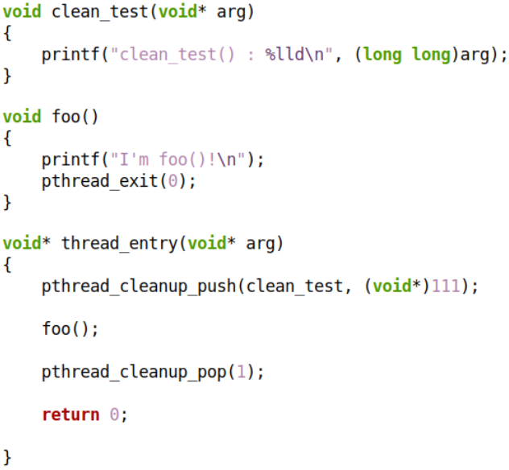
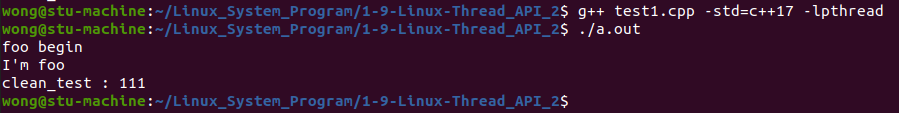
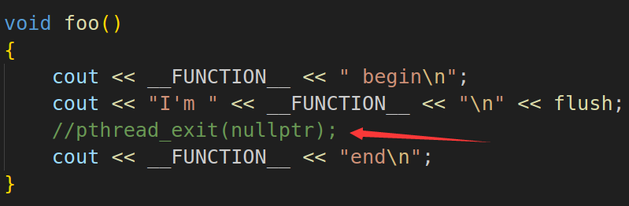
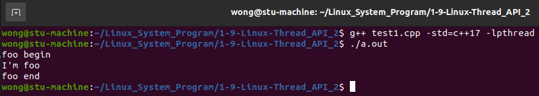
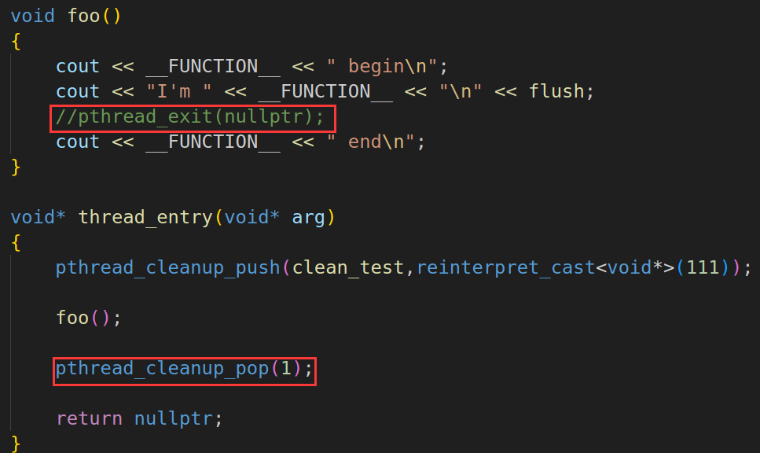
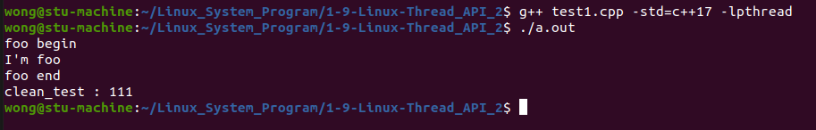
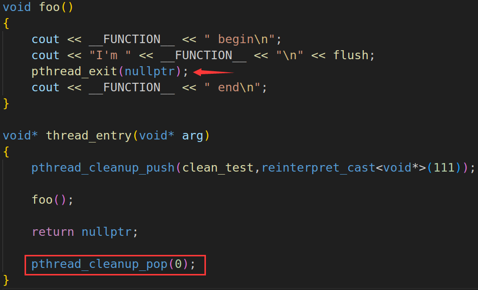
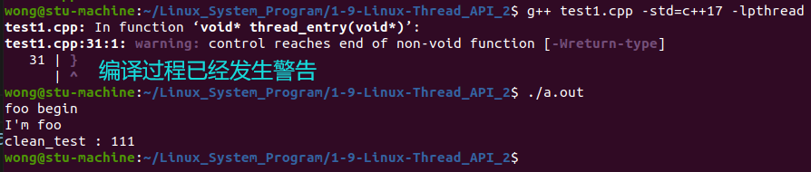
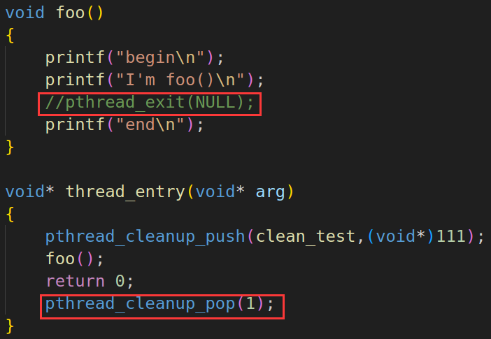
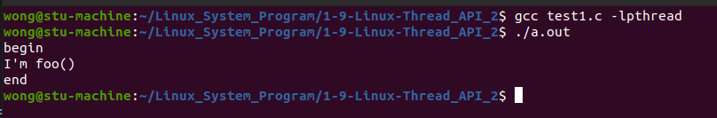

# Linux线程 API 详解

问题 : 一个线程执行后申请了资源 , 中途又不得不提前结束 , 该怎么办 ❓

# 1. 线程清理函数

> ```c++
> #include <pthread.h>
> /*注册清理函数*/
> void pthread_cleanup_push(void (*start_routine) (void*),void* arg);
> /*线程入口函数正常退出的时候,参数决定是否调用清理函数,非0值调用,0值不调用*/
> /*如果线程入口函数中途异常退出( 中途调用了pthread_exit(...)函数 , 参数不起作用 )*/
> void pthread_cleanup_pop( int execute );
> ```

> ```tex
> Linux中这两个函数必须同时出现在同一个作用域中!!!
> 只写一个,会发生编译报错
> 
> ```

* `pthread_cleanup_push` : 
  * 注册线程 "被迫" 结束时 , 需要执行的函数(资源释放可在函数中完成)  
* `pthread_cleanup_pop` : 
  * "弹出" 之前注册的函数 , 根据参数决定是否执行函数
  * "弹出操作" 必须位于 return 语句之前  

## 1.1下面的程序输出什么❓为什么❓

 

## 1.2 编程实验一

[[test1.cpp参考链接]](https://github.com/WONGZEONJYU/Linux_System_Program/blob/main/1-9-Linux-Thread_API_2/test1.cpp)

[[test1.c参考链接]](https://github.com/WONGZEONJYU/Linux_System_Program/blob/main/1-9-Linux-Thread_API_2/test1.c)

> ```c++
> #include <iostream>
> #include <thread>
> 
> using namespace std;
> 
> void clean_test(void* arg)
> {
>     cout << __FUNCTION__ << " : " << reinterpret_cast<long long>(arg) << "\n";
> }
> 
> void foo()
> {
>     cout << __FUNCTION__ << " begin\n";
>     cout << "I'm " << __FUNCTION__ << "\n" << flush;
>     pthread_exit(nullptr);
>     cout << __FUNCTION__ << " end\n";
> }
> 
> void* thread_entry(void* arg)
> {
>     pthread_cleanup_push(clean_test,reinterpret_cast<void*>(111));
>     foo();
>     pthread_cleanup_pop(0);
>     return nullptr;
> }
> 
> int main(int argc, char const *argv[])
> {
>     pthread_t t{};
>     pthread_create(&t,nullptr,thread_entry,nullptr);
>     pthread_join(t,nullptr);
>     return 0;
> }
> 
> ```

### 1.2.1 结果一

  

> ```tex
> 正常执行清理函数,请注意pthread_cleanup_pop(...)的参数为0
> ```

### 1.2.2 结果二

> ```tex
> 屏蔽foo()中的pthread_exit(nullptr);
> ```

  

  

> ```tex
> pthread_cleanup_pop(...)的参数为0,线程没有中途退出,不会调用清理函数
> ```

### 1.2.3 结果三

> ```tex
> 仍然是屏蔽foo()中的pthread_exit(nullptr);
> 把pthread_cleanup_pop(...)的参数改为非0值1
> ```

  

 

### 1.2.4 结果四

> ```tex
> 把pthread_cleanup_pop(0)放在return后
> pthread_exit(nullptr)不屏蔽
> 实际开发不能这么做
> ```

 

 

> ```tex
> 再次强调,实际开发不能这么做!!!
> ```

### 1.2.5 结果五

> ```tex
> 把pthread_cleanup_pop(1)放在return后
> 屏蔽pthread_exit(0)
> 此处使用C语言开发,C++结果有差异,只是实验,在实际开发并不影响,实际开发pthread_cleanup_pop(...)函数始终需要放在return前面
> ```

  

 

> ```tex
> pthread_cleanup_pop(1) 放在 return后面 , 清理函数不会被执行
> 再次强调,实际开发不能这么做!!!
> ```

## 1.3 总结

何时会触发注册的清理函数❓

* `pthread_exit(...)` 与 `pthread_cancel(...)` 总是会触发清理函数执行 , 无论 `pthread_cleanup_pop(...)` 是否为非0值
* `pthread_cleanup_pop(...)` 的参数非零时 , 触发一个清理函数执行
* 通过 `return` 返回未必会触发清理函数执行( `return` 与清理函数是否执行无关 )

 

