# X-1、Linux进程长参数编程

## (一) 短选项扩展编程

### 1. 再论进程参数 (短选项)

>```tex
>🤪注释:进程参数 多数情况下也会称作 启动参数 和 命令行参数
>```
>
>- 由 选项 , 选项值 , 操作数 组成
>- 选项由短横线 ( `-` ) 开始 , 选项名必须是单个字母或单个数字字符
>- 选项可以有选项值 , 选项与选项值之间可用空格分隔 ( `-o test` <==> `-otest` )
>- 如果多个选项均无选项值 , 可合而为一 ( `-a -b -c` <==> `-abc` )
>- 既不是选项 , 也不能作为选项值的参数是操作数
>- 第一次出现的双横线 ( `--` ) 用于结束所有选项 , 后续参数为操作数

### 2. 进程短选项示例

>- 规则 : `if:s::`
>  -  `s::` 表示 `-s` 不一定需要选项值 , 若有选项值只能以 `-svalue` 的方式指定 **(`-svalue`必须连在一起写 , 不能有空格)**
>- 实例 : 
>
>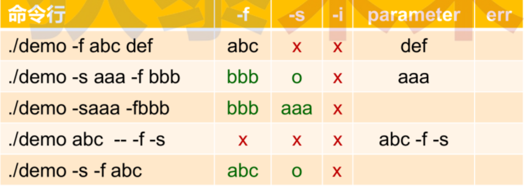
>
>[短参数short.cpp参考代码](https://github.com/WONGZEONJYU/Linux_System_Program/blob/main/x-1_Process_Parameter/short.cpp)
>
>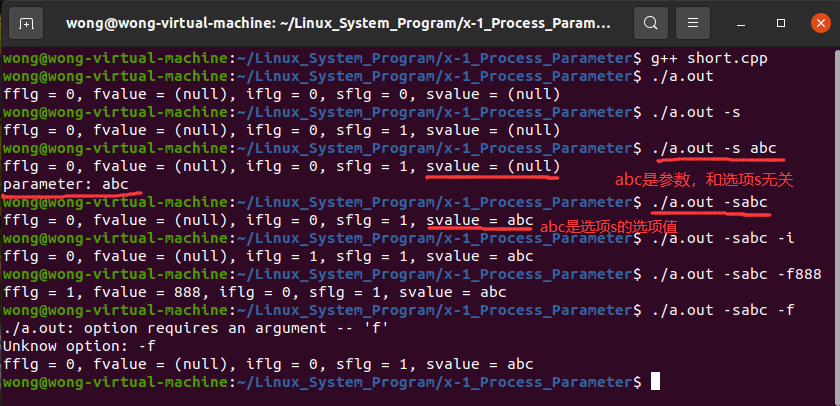

## (二) 进程长参数编程

### 1. 进程长参数示例

>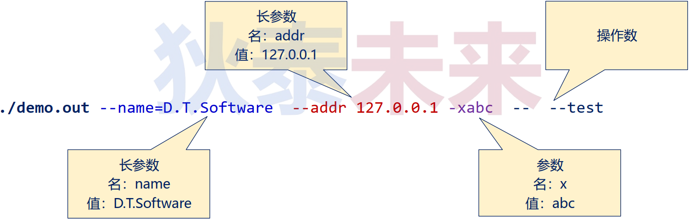
>
>```tex
>‼️ ‼️ ‼️ 选项名和选项值之间可以用 ("=") 或者空格 (" ")
>```

### 2. 进程长参数规范

>- 由选项 , 选项值 , 操作数组成
>- 选项由双横线 (`--`) 开始 , **$\color{SkyBlue}{选项名可以是有意义的字符序列}$**
>- 选项可以有选项值 , 选项与选项值可用 **$\color{red}{空格 / 等号}$** 分隔 ( `--demo test` <==> `--demo=test` )
>- 既不是选项 , 也不能作为选项值的参数是操作数
>- 第一次出现的双横线( `--` ) 用于结束所有选项 , 后续参数为操作数

### 3. Linux启动长参数 (命令行长参数) 编程

>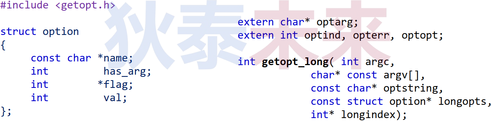
>
>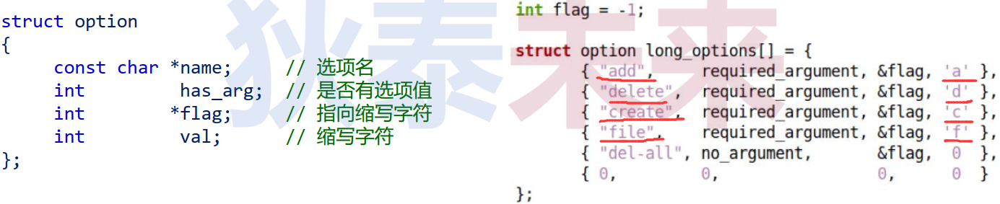
>
>- `getopt_long(…)` 从argc和argv中获取下一个选项
>- `getopt_long(…)` $\color{red}{同时支持}$ **$\color{red}{短选项}$** $\color{red}{和}$ **$\color{red}{长选项}$**
>   - 短选项 : 通过 $\color{red}{规则字符串}$ 指定支持的选项
>   - 长选项 : 通过 `struct option` $\color{red}{结构体}$ 指定支持的选项
>- 默认情况下 : `getopt_long(…)` 对 argc 进行重排 , 所有操作数位于最后位置
>

#### (1) 长参数编程示例

>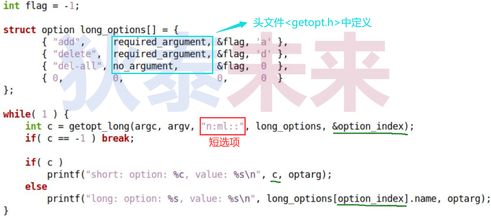
>
>[长参数long.cpp](https://github.com/WONGZEONJYU/Linux_System_Program/blob/main/x-1_Process_Parameter/long.cpp)
>
>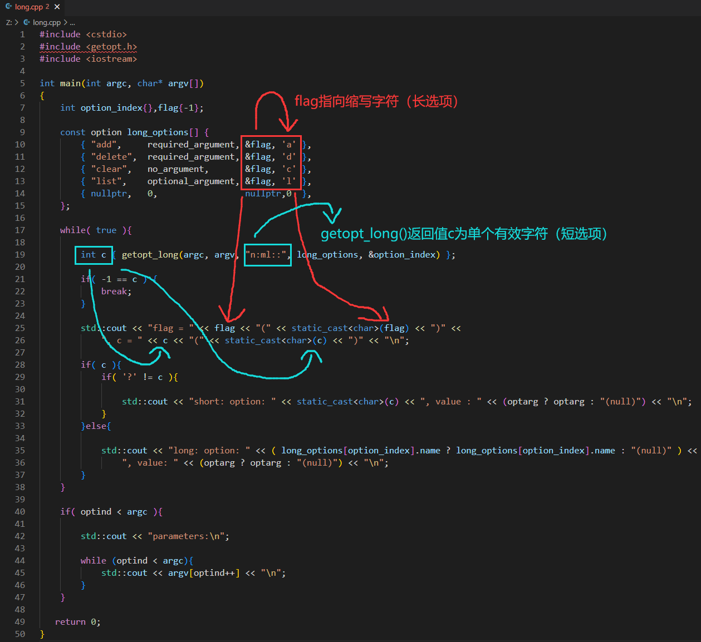
>
>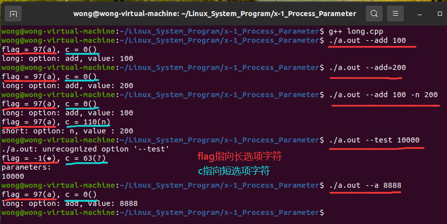
>
>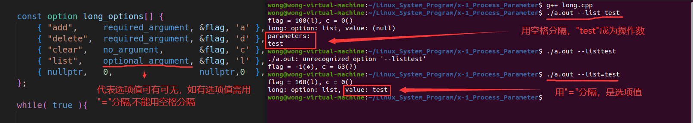

#### (2) 另一种长参数编程模式

>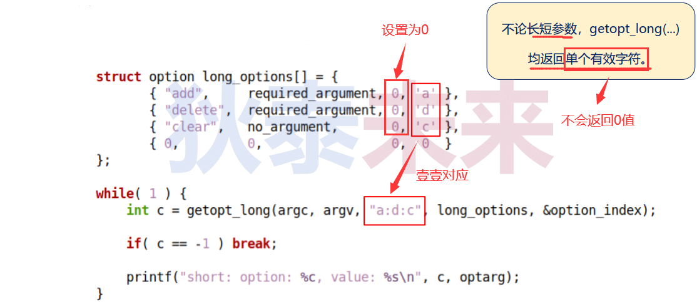
>
>[另外一种长参数编程](https://github.com/WONGZEONJYU/Linux_System_Program/blob/main/x-1_Process_Parameter/long-new.cpp)
>
>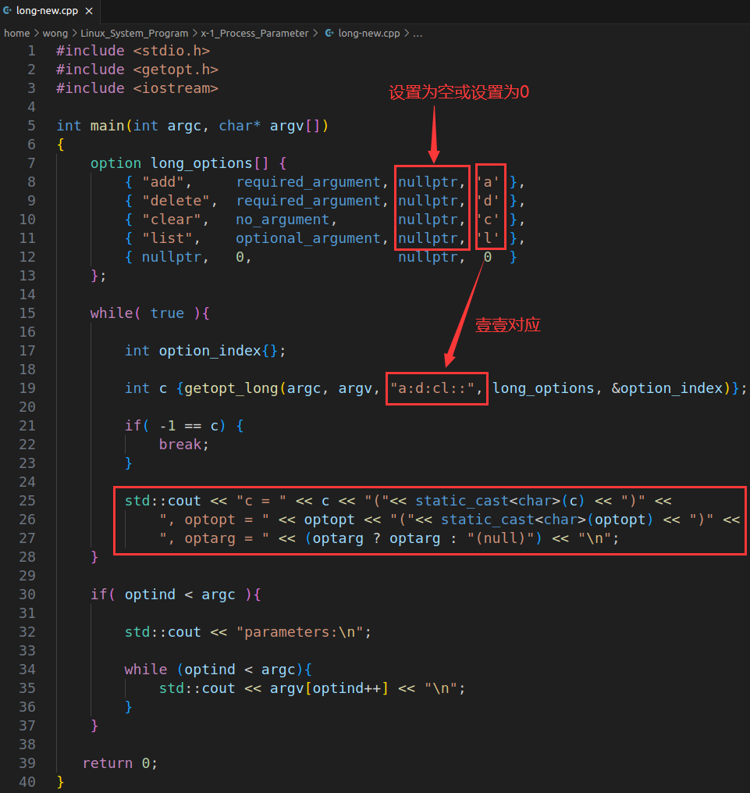
>
>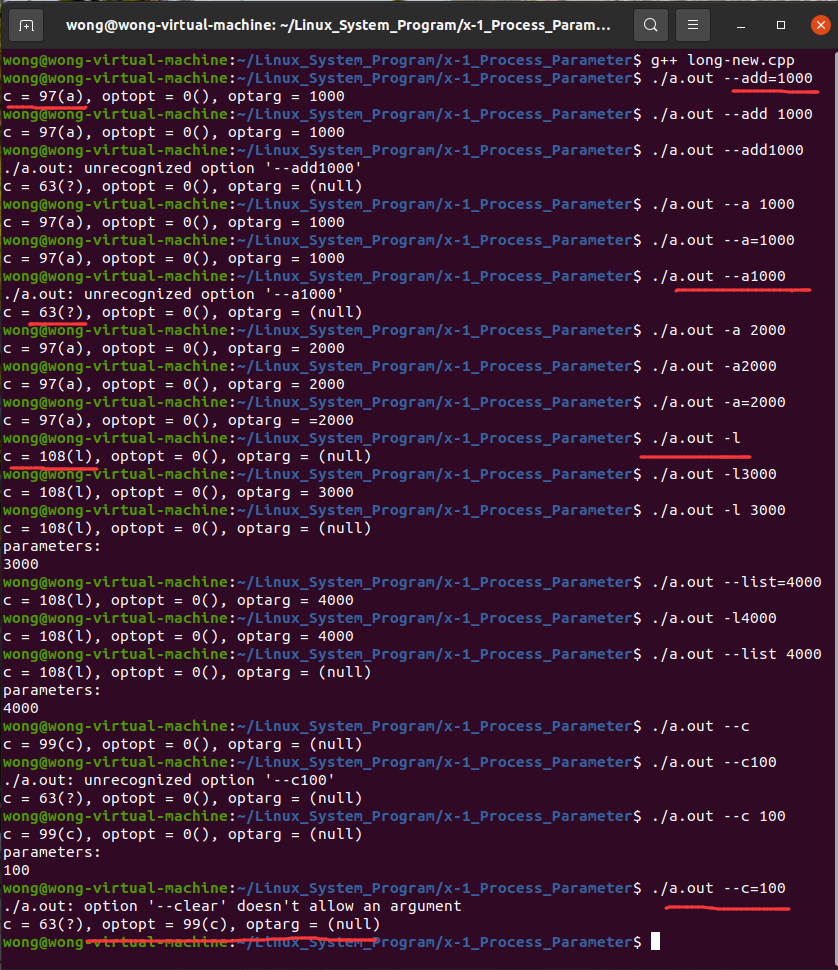

## (三) 进程参数变种玩法 ==> 统一长短参数

>`int getopt_long_only(argc, argv[], optstring, longopts, longindex);`
>
>- 对于以单横线 ( `-` ) 起始的参数
>   - 直接查找长参数选项 , 若查找失败 , 则查找短参数选项
>- 对于以双横线 ( `--` ) 起始的参数
>   - 直接查找长参数选项 , 若查找失败 , 则查找失败
>

#### 1. 统一长短参数示例

>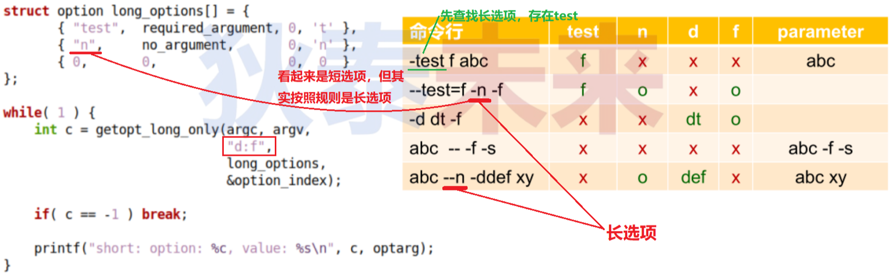
>
>[统一长短参数long-only.cpp](https://github.com/WONGZEONJYU/Linux_System_Program/blob/main/x-1_Process_Parameter/long-only.cpp)
>
>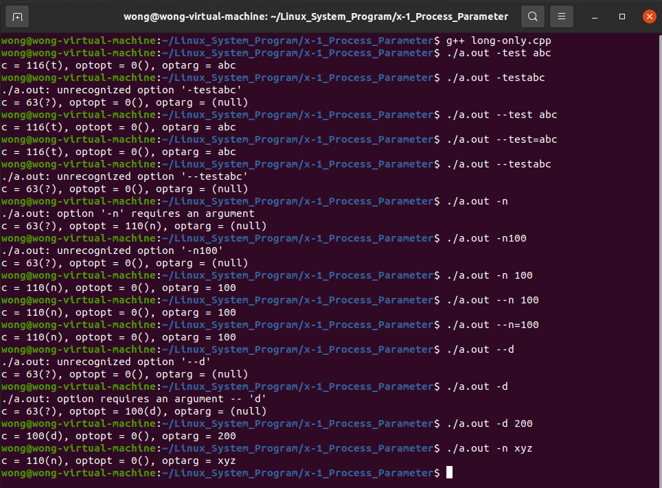

#### 2. 进程参数编程总结

>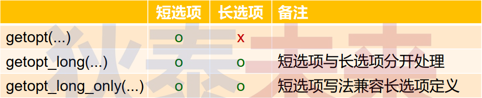

