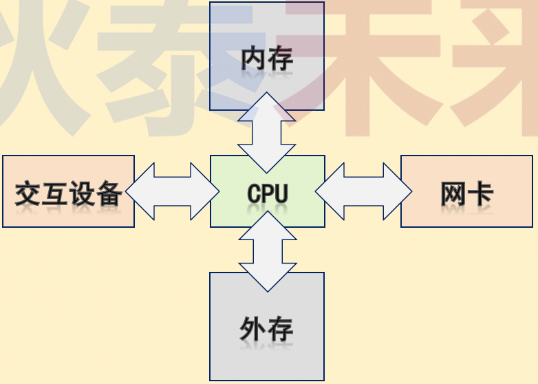
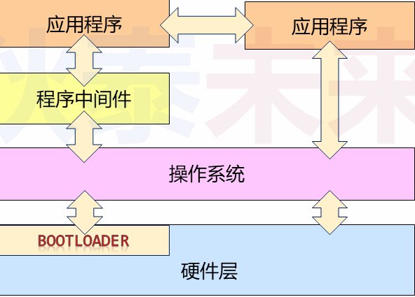
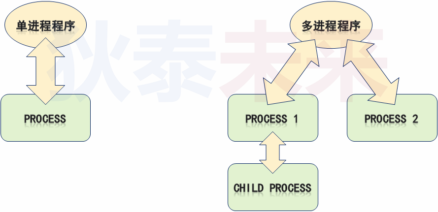
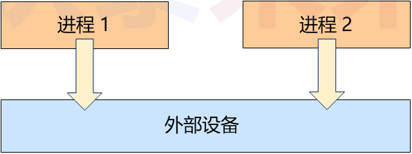
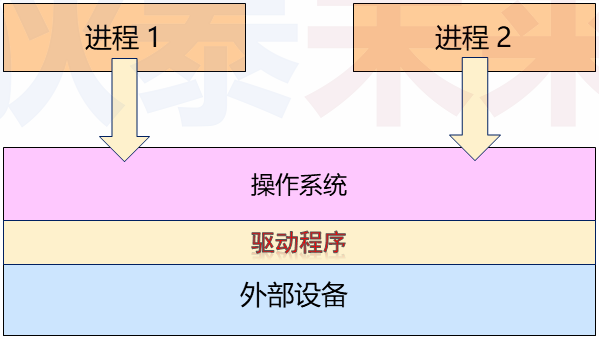

# 一、再论计算机系统

>* 计算机系统由躯体和灵魂两部分组成
>* 躯体：构成计算机系统的电子设备（硬件）
>* 灵魂：指挥躯体完成动作的指令序列（软件）
>* 躯体核心：中央处理器CPU
>* 灵魂核心：操作系统OS

## 	（一）问题

>$\textcolor{red}{思考}$：计算机系统的诞生是为了执行数据处理（计算）任务。那么，如何获取计算任务，并反馈任务执行结果？
>
>数据  **$\textcolor{red}{输入}$** 与  **$\textcolor{red}{输出}$** 是计算机系统不可或缺的部分
>

## （二）计算任务执行流程

> * 通过交互设备或网络向计算机系统发起请求
>
> * 根据请求将任务指令（程序/软件）加载进入内存
>
> * CPU 从内存中取指令，并逐条执行
>
> * 计算任务的最终结果暂存入内存
>
> * 内存数据通过交互设备或网络进行反馈（也可以写入外存）
>
>   

## （三）什么是程序

>* 程序的本质是 **$\textcolor{red}{指令}$** 和 **$\textcolor{red}{数据}$** 的集合
>   * 指令：指示CPU 执行动作的命令
>   * 数据：CPU 执行动作的操作目标

## （四）什么是程序

> * 应用程序：用户可直接使用，为用户提供直接帮助的程序
> * 程序中间件：多数应用程序的 **$\textcolor{red}{通用功能}$** ，用于辅助应用程序的运行
> * 操作系统：直接操作硬件设备，并为应用程序与程序中间件提供运行环境

## （五）当代计算机系统架构

> 

## （六）进程-程序的执行

> * 通常情况下，程序在操作系统上以进程为单位运行
> * 每个程序运行后由一个或者多个进程构成
> * 进程是操作系统任务的基本单元，也是系统资源的基本分配单元
> * 程序是“死”的，进程是“活”的
>   * 程序的本质只是二进制数据，不加载执行就没有任何价值
>   * 进程是计算机系统对程序的 **$\textcolor{red}{一次}$** 加载执行，即：执行计算任务的过程

## （七）程序VS进程

## （八）应用程序与外部设备

> * 多数情况下，应用程序需要借助外部设备才能完成计算任务
>
> * 外部设备：除CPU 与内存之外的其它计算机硬件（如：硬盘，网卡，显卡）
>
> * 
>
> * 应用程序设备访问：
>
>   * 直接访问
>     * 开发成本高：应用开发者必须熟悉各类外设的硬件特性
>     * 开发周期长：业务逻辑 + 设备逻辑
>     * 应用场景难：其它应用程序可能同时访问外设
>
>   * 间接访问
>     * 应用程序通过 **$\textcolor{red}{某软件层（驱动程序）接口}$** 以统一方式访问外设

## （九）设备驱动程序

> **$\textcolor{red}{设备驱动程序}$** 是外设访问接口，**$\textcolor{red}{对应用程序提供统一的外设访问方式}$** 
>
> 
>
> 

