# 九、Linux进程层次分析

## (一) 详解Linux进程组

### 1. Linux进程组

>- $\color{red}{每个进程都有一个 进程组号 ( PGID )}$
>   - 进程组 : $\color{red}{一个或多个进程的集合}$ **( 集合中的进程并不孤立 )**
>   - 进程组中的进程通常存在 $\color{red}{父子关系 , 兄弟关系 , 或功能相近}$
>
>- 进程组可方便进程管理 ( 如 : 同时杀死多个进程，发送一个信号给多个进程)
>   - 每个进程必定属于一个进程组，也只能属于一个进程组
>   - 进程除了有 PID 外 , 还有 PGID ( 唯一 , 但可变 )
>   - 每个进程组有一个 $\color{red}{进程组长}$，$\color{SkyBlue}{进程组长的PID和PGID相同(PID == PGID)}$
>
>- `pid_t getpgrp(void);`  获取当前进程的组标识
>- `pid_t getpgid(pid_t pid);`  获取指定进程的组标识
>- 对于 `int setpgid(pid_t pid, pid_t pgid);` 设置pid进程的进程组标识为pgid : 
>   - 如果 pid == pgid , 将pid指定的进程设为组长
>   - 如果 pid == 0 , 设置当前进程的组标识为pgid
>   - 如果 pgid == 0 , 则将pid作为组标识
>
>
>```tex
>注释：
>   函数作用：setpgid(pid, pgid) 将pid进程的进程组ID设置成pgid，创建一个新进程组或加入一个已存在的进程组
>   函数性质:
>       性质1:一个进程只能为 自己或子进程 设置进程组ID，不能设置其父进程的进程组ID。
>       性质2:if(pid == pgid)，由pid指定的进程变成进程组长；即进程pid的进程组标识pgid为pid。
>       性质3:if(pid==0)，将当前进程的pid作为进程组ID。
>       性质4:if(pgid==0)，将pid作为进程组ID。
>```
>
>- **$\color{red}{默认情况下 , 子进程与父进程 属于 同一个进程组}$**

### 2. 进程组示例程序

>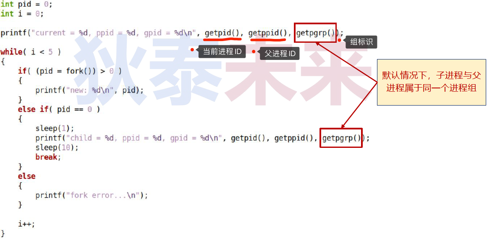

### 3. 编程实验 : Linux进程组

>[pgid_j.cpp参考代码](https://github.com/WONGZEONJYU/Linux_System_Program/blob/main/8.Process_Hierarchy/pgid_j.cpp)
>
>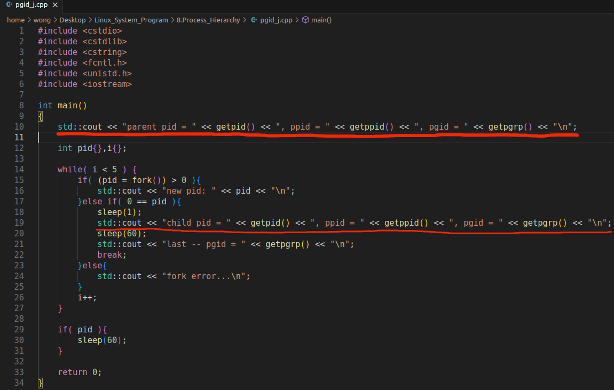
>
>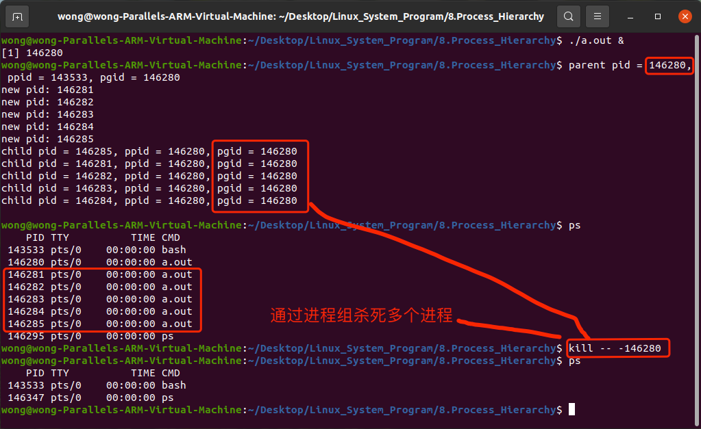

### 4. 深入理解进程组

>- 进程组长终止 , 进程组依然存在 $\color{SkyBlue}{(进程组长仅用于创建新进程组)}$ , $\color{red}{进程组中的 所有进程 结束之后 , 进程组消亡}$
>- 父进程创建子进程后立即通过 `setpgid()` 改变子进程的组标识 ( PGID ) , 子进程从父进程的进程组移动到组标识的进程组；同时 , 子进程也需要通过 `setpgid()` 改变自身组标识 (PGID)
>- 子进程 $\color{red}{如果调用}$ `exec()` , 那么 : 
>   - **父进程无法通过 `setpgid()` 改变子进程的组标识 (PGID)**
>   - **子进程只能自身通过 `setpgid()` 改变组标识 (PGID)**
>

#### (1) 进程组标识设置技巧

>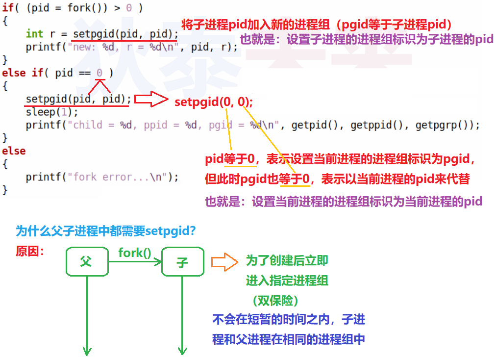
>
>```C+
>setpgrp() <===> setpgid(0,0)
>```

#### (2) 编程实验一

>[pgid_a.cpp代码参考](https://github.com/WONGZEONJYU/Linux_System_Program/blob/main/8.Process_Hierarchy/pgid_a.cpp)
>
>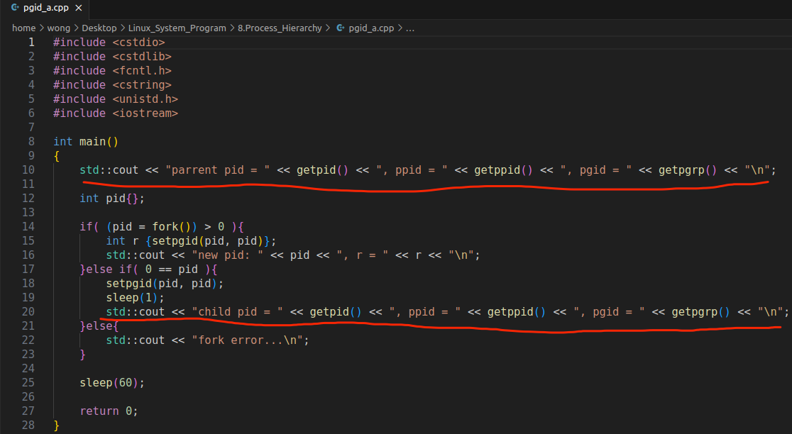
>
>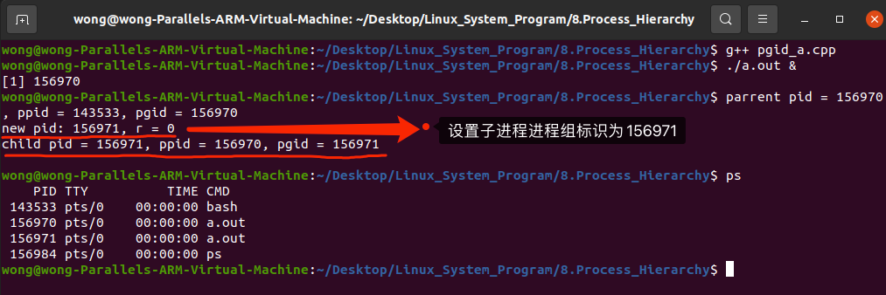

#### (3) 编程实验二

>[与实验一同一个文件,注意屏蔽的代码,我是参考链接,我可以点开](https://github.com/WONGZEONJYU/Linux_System_Program/blob/main/8.Process_Hierarchy/pgid_a.cpp)
>
>1. 未加休眠
>
>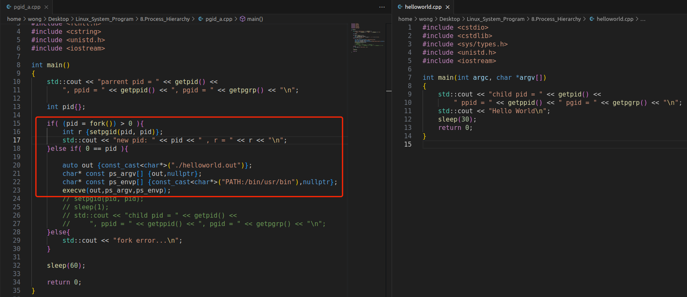
>
>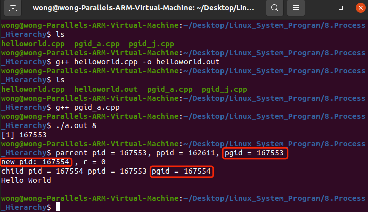
>
>2. 加休眠
>
>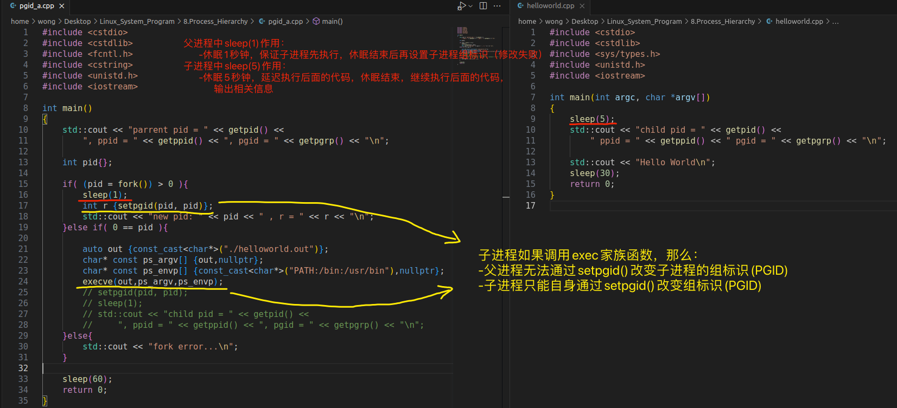
>
>```tex
>注释:代码中的sleep(1),使得子进程先调用了evec(),父进程无法再通过setpgid()改变子进程的组标识(PGID)
>```
>
>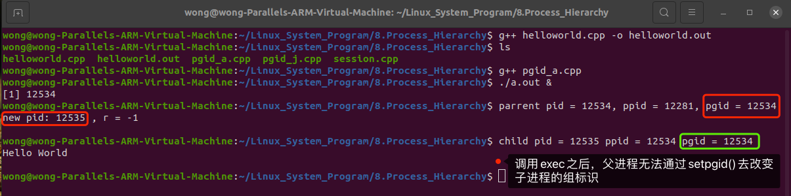

## (二) 会话与终端的关系

### 1. Linux会话 (session)

>- 用户通过终端登陆系统后会产生一个 **$\color{red}{会话}$**
>- 会话是 一个或多个 **$\color{red}{进程组}$** 的集合
>- 每个会话有一个 **$\color{red}{会话标识 (SID)}$**
>   - 终端登录后的第一个进程成为 **$\color{red}{会话首进程}$** , 通常是一个 **$\color{SkyBlue}{shell / bash}$**
>   - 对于会话首进程 (session leader) , 其PID和SID相等 , **$\color{red}{SID == PID}$**
>
>
>| 会话SID |
>| :-----: |
>
>| 进程组PGID | 进程组PGID | ...  |
>| :--------: | :--------: | ---- |
>
>| 进程PID | 进程PID | ...  | 进程PID | 进程PID | ...  | ...  |
>| :-----: | ------- | ---- | ------- | ------- | ---- | ---- |

### 2. 会话与终端

>- 通常情况下 , **$\color{red}{会话}$** $\color{red}{与一个}$ **$\color{red}{终端 (控制终端)}$** $\color{red}{相关联}$ 用于执行输入输出操作
>- **$\color{red}{会话首进程}$** $\color{red}{建立与}$ **$\color{red}{控制终端}$** $\color{red}{的连接}$ $\color{red}{(会话首进程又叫}$ **$\color{red}{控制终端}$**$\color{red}{)}$
>- 会话中的进程组可分为 : 
>   - $\color{red}{前台进程组}$ : 可接收控制终端中的输入 , 也可输出数据到控制终端
>   - $\color{red}{后台进程组}$ : 所有进程后台运行 , 无法接受终端中的输入 , 但可输出数据到终端
>
>- 每个会话 $\color{red}{最多只有一个}$ 前台进程组 , 可以 $\color{red}{有多个}$ 后台进程组
>
>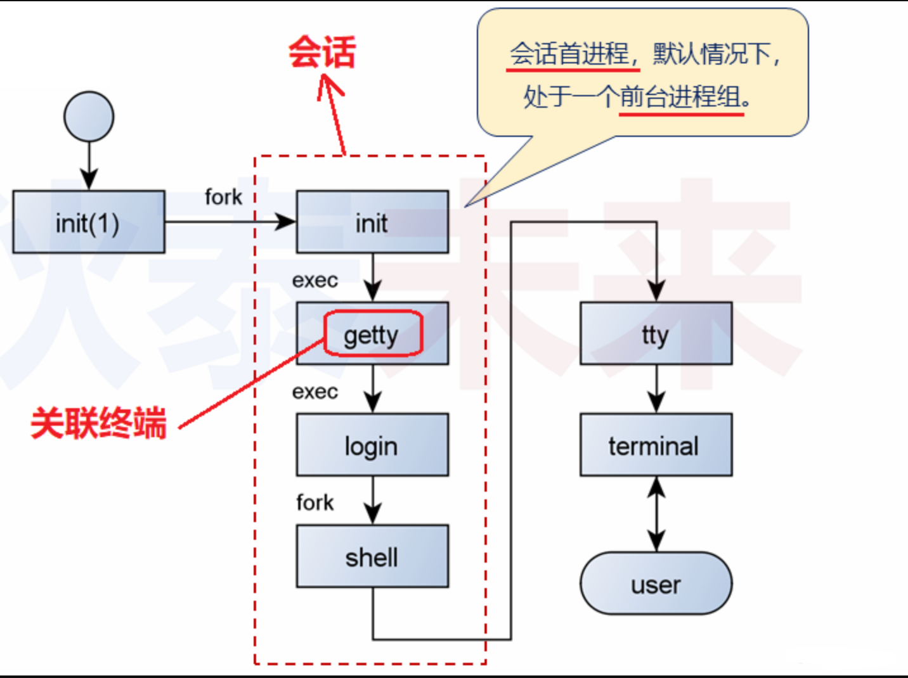

### 3. 登陆实验

#### (1) 准备

>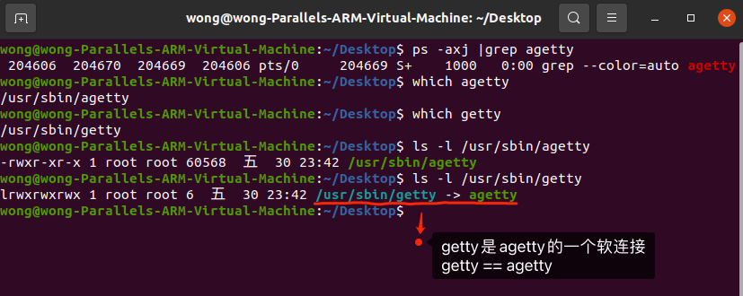
>
>```tex
>agetty 是一个在 Linux 系统上使用的程序，用于提供控制台终端的登录功能。它是 "getty" ("适配器调制解调器"的缩写) 的一个变体,是一种用于处理终端登录的程序。
>  agetty 的中文解释可以是 "虚拟终端登录程序" 或者 "控制台终端登录程序"。它通常用于在 Linux 系统上配置和管理虚拟终端(也称为控制台终端)的登录过程。
>  agetty 在启动时会监视一个或多个虚拟终端设备,并等待用户输入用户名和密码。一旦用户成功登录，agetty 将为其提供一个交互式的命令行界面,以便用户可以执行各种命令和操作。
>  agetty 提供了一些配置选项,可以控制登录界面的外观和行为,例如登录提示符、超时设置和登录失败处理等。这使得系统管理员能够根据特定的需求和安全策略来自定义登录过程。
>  总之,agetty 是一个用于管理控制台终端登录的程序,在 Linux 系统上广泛使用。
>```

#### (2) 此时,在虚拟机Ubuntu下同时按住 ctrl+alt+F6 进入6号终端,这时候先不进行登录 :

>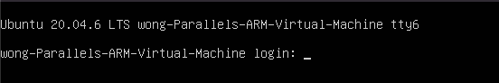

#### (3) 同时按住 ctrl+alt+F2 回到shell图形界面:

>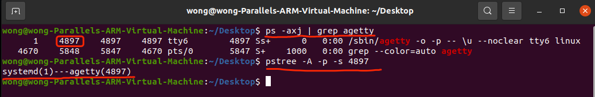

#### (4) 切换到6号终端,只输入用户名,不登录:

>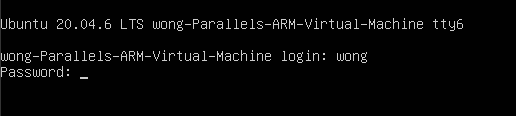

#### (5) 切回图形化界面 :

>

#### (6) 切换到6号终端,输入密码登录:

>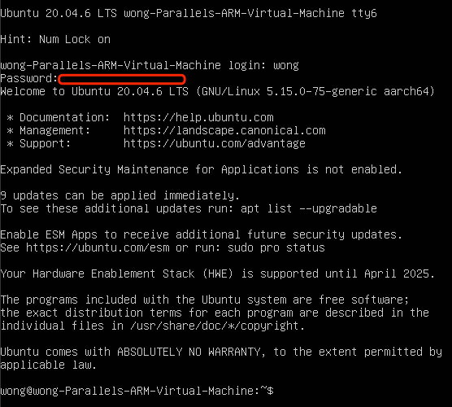

#### (7) 切换回图形化界面:

>```
>😅下图是Linux重启之后重新截图，agetty的pid与之前图片的不一样是正常的！
>```
>
>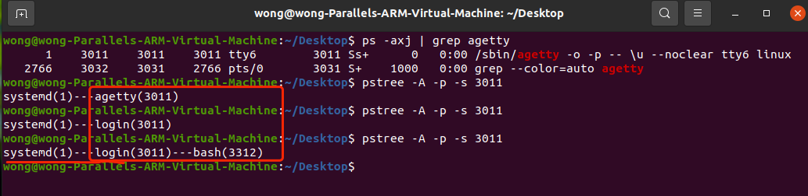

### 4. 会话与前后台进程组

>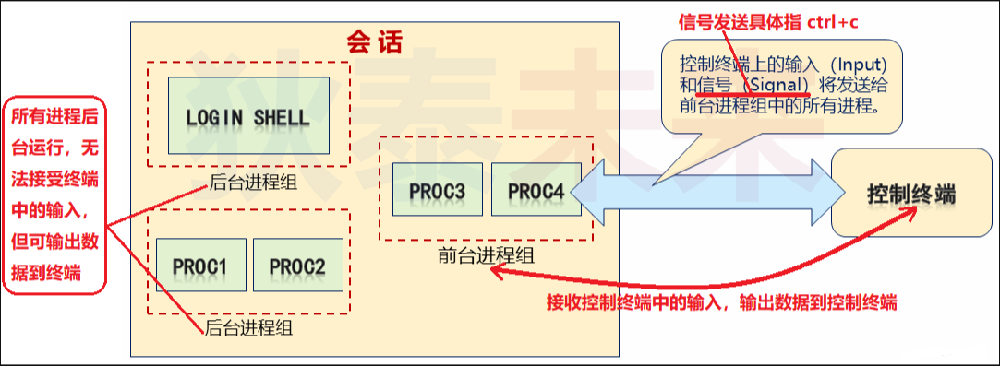

#### (1) 问题

>- 问题1 : ❓在终端中输入命令后 , 会发生什么?
>  - 当命令行shell $\color{red}{运行命令后创建一个新的进程组}$
>  - 如果运行的命令中有 **$\color{red}{多个子命令}$** 则创建 **$\color{red}{多个进程}$** $\color{red}{(处于新建的进程组中)}$
>  - 命令 $\color{red}{不带}$ `&`
>	  - shell将新建的进程组设置为 $\color{red}{前台进程组}$ , 并将自己暂时设置为后台进程组
>  - 命令 $\color{red}{带}$ `&`
>    - shell将新建的进程组设置为 $\color{red}{后台进程组}$ , 自己依旧是前台进程组
>
>
>* 问题2 : ❓什么是 终端进程组标识 (TPGID)?
>
>    - $\color{red}{标识进程}$ **$\color{red}{是否}$** $\color{red}{处于一个}$ **$\color{red}{和终端相关}$** $\color{red}{的进程组中}$
>
>
>     - $\color{SkyBlue}{前台进程组 : TPGID == PGID}$
>
>
>     - $\color{SkyBlue}{后台进程组 : TPGID != PGID}$
>
>
>     - $\color{SkyBlue}{若进程和任何终端无关 : TPGID == -1}$
>
>
>
>
>
>```
>通过比较TPGID与PGID可判断:一个进程是属于前台进程组 , 还是后台进程组
>由于前台进程组可能改变,TPGID用于标识当前的前台进程组
>当一个进程组与终端相关联,当终端断开了连接,进程组中的所有进程都会被结束掉
>```

#### (2) 实验

>[pgid_j.cpp参考代码](https://github.com/WONGZEONJYU/Linux_System_Program/blob/main/8.Process_Hierarchy/pgid_j.cpp)
>
>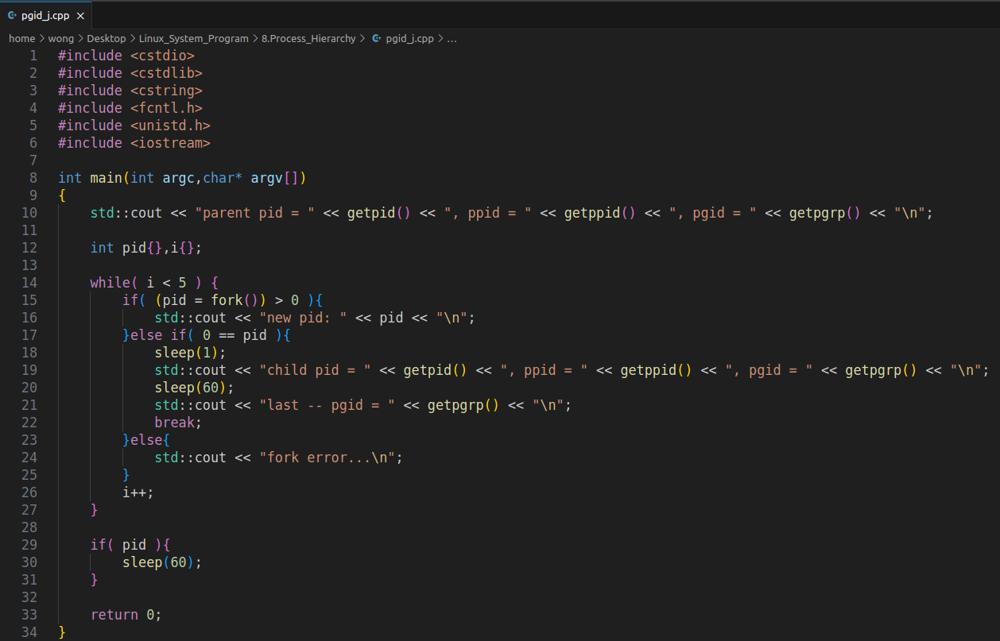
>
>1. 不带 &的情况
>
>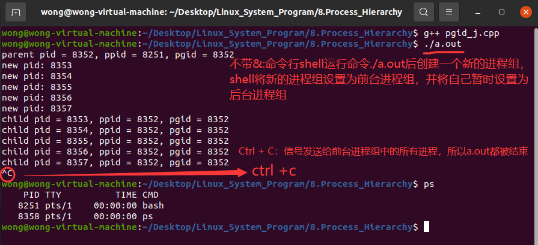
>
>2. 带 &的情况
>
>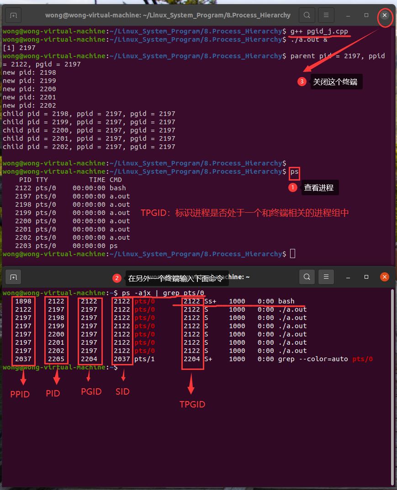
>
>```
>注释:下图和上图的第二个终端图是重新打开的一个终端
>```
>
>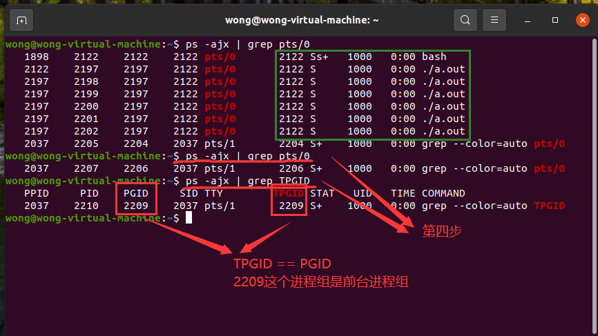

## (三) 会话编程深度剖析

### 1. Linux会话接口

>- `#include <unistd.h>`
>- `pid_t getsid(pid_t pid);`  $\color{SkyBlue}{获取指定进程的SID,(pid == 0)==> 当前进程}$
>- `pid_t setsid(void);` $\color{SkyBlue}{调用进程不能是进程组长}$
>   - 创建新会话 , SID == PID , 调用进程成为会话首进程
>   - 创建新进程组 , PGID == PID , 调用进程成为进程组长
>   - 调用进程没有控制终端 , 若调用前关联了控制终端 , 调用后与控制终端断联
>

### 2. 实例

>❓下面的程序输出什么?为什么?
>
>
>
>[session.cpp参考代码](https://github.com/WONGZEONJYU/Linux_System_Program/blob/main/8.Process_Hierarchy/session.cpp)
>
>(1) 实验一
>
>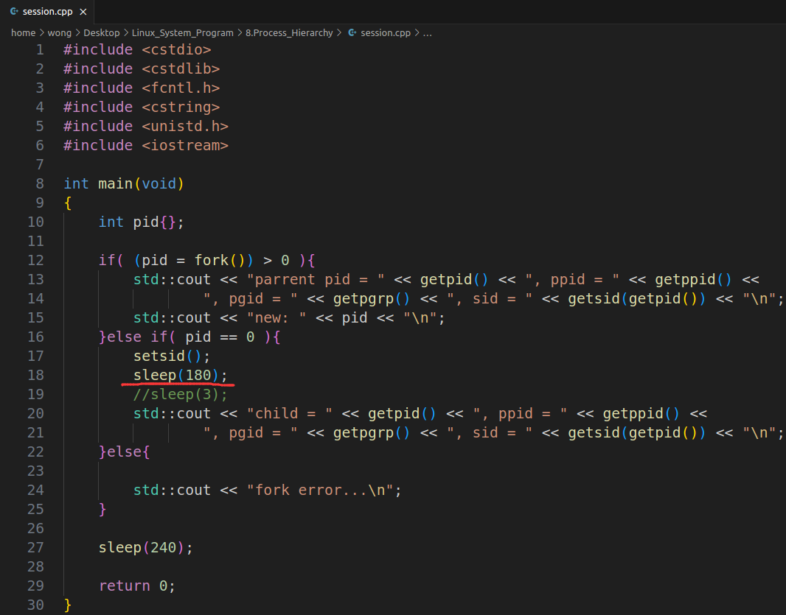
>
>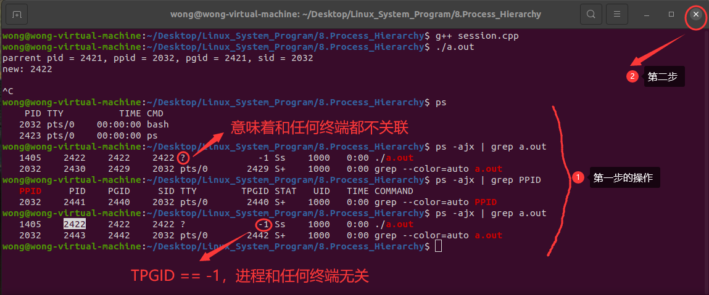
>
>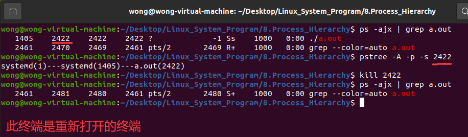
>
>(2) 实验二
>
>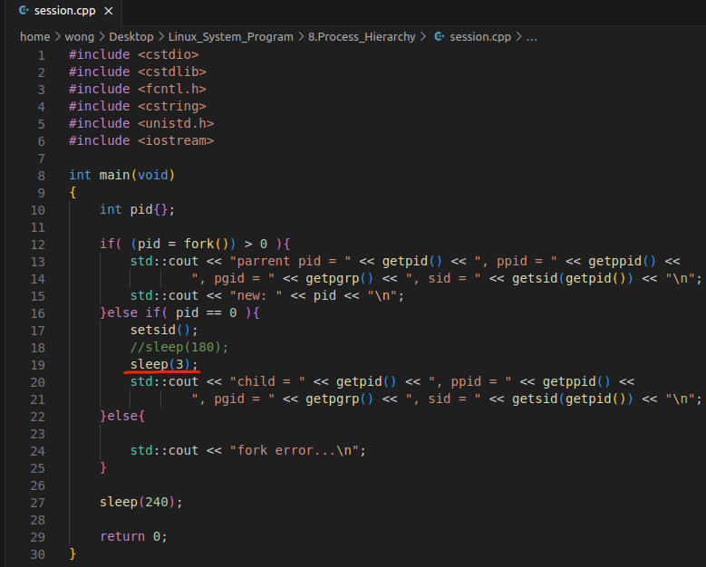
>
>
>
>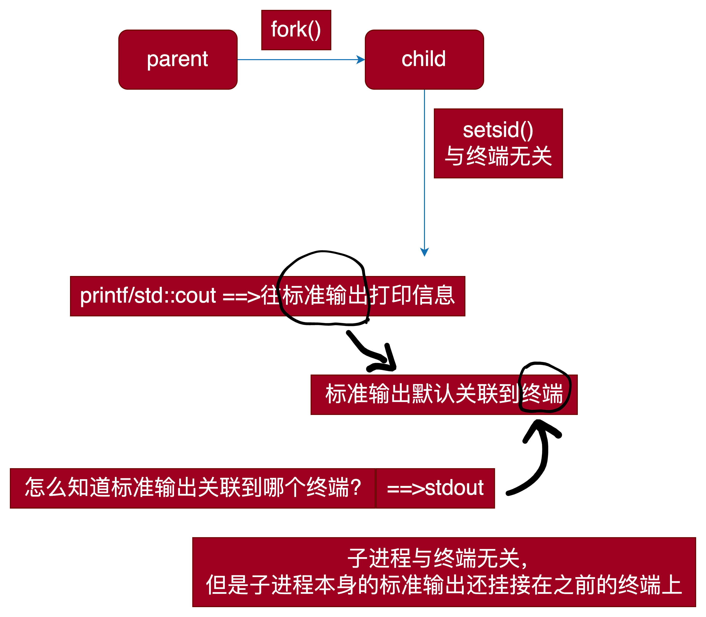
>
>```
>小提示:printf/std::cout往标准输出打印信息,默认情况下,标准输出和默认的终端相关联。
>怎么知道标准输出关联到哪个终端?标识就是stdout
>
>上面的实验：
>	子进程的标准输出是挂接在了我们操作的终端上的，虽然子进程调用了setsid()，但是子进程本身的标准输出还挂接在之前我们操作的终端上。
>
>	由于printf/std::cout是往标准输出进行打印信息的，然而标准输出也是挂接在之前我们操作的终端上，所以打印的信息就会出现在之前我们操作的终端上。
>
>强调：标准输入/输出与终端无关的，只不过默认情况下，标准输出/输出与终端挂接到了一起
>
>如果不让标准输入/输出与终端挂接到一起，可以进行重定向，怎么操作？===>下回分解
>```

