## 二、深入理解系统调用

>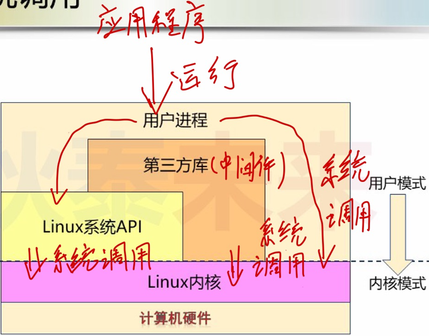

## （一）模式切换的本质（系统调用的本质）

> * 系统模式切换依赖于CPU提供的工作方式
> * 一般来说，大部分CPU至少具有两种工作方式
>   * **$\textcolor{red}{高特权级Ring0(内核模式)}$**  : 可以访问任意的数据，包括外围设备，比如网卡、硬盘等
>   * **$\textcolor{red}{低特权级Ring3(用户模式)}$** : 只能 **$\textcolor{red}{受限的}$**  访问内存 , 并且不允许访问外围设备 , **$\textcolor{red}{可被打断}$** 
> * 系统模式切换通过特殊的CPU指令发起 ($\textcolor{red}{int 0x80，触发中断}$ )
> * 应用程序 (进程) 无法直接切换CPU的工作方式
> * **$\textcolor{red}{系统调用}$** 是应用程序 (进程) 请求模式切换的唯一方式
>
> 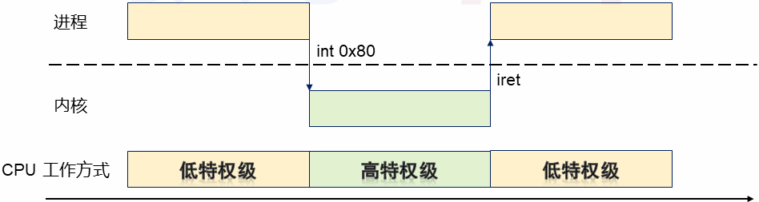

## （二）系统调用的真面目

>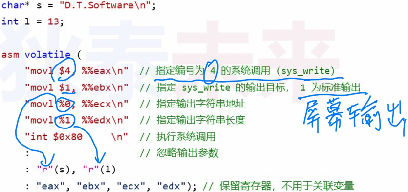

## （三）系统API的真面目

> 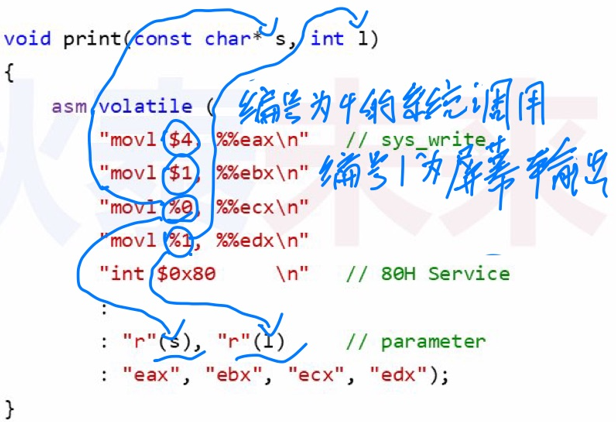

## （四）系统调用和系统API实现示例

> 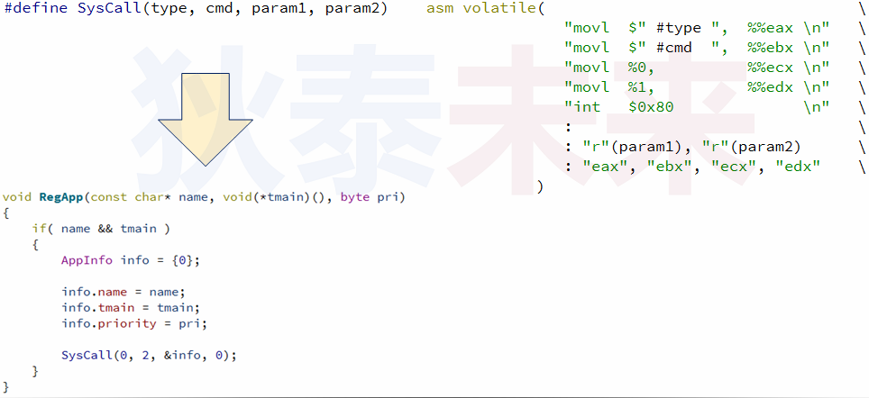

## （五）编程实验：系统调用本质

> [系统调用本质实验参考链接](https://github.com/WONGZEONJYU/Linux_System_Program/blob/main/1.Sys_Call/program.c)
>
> 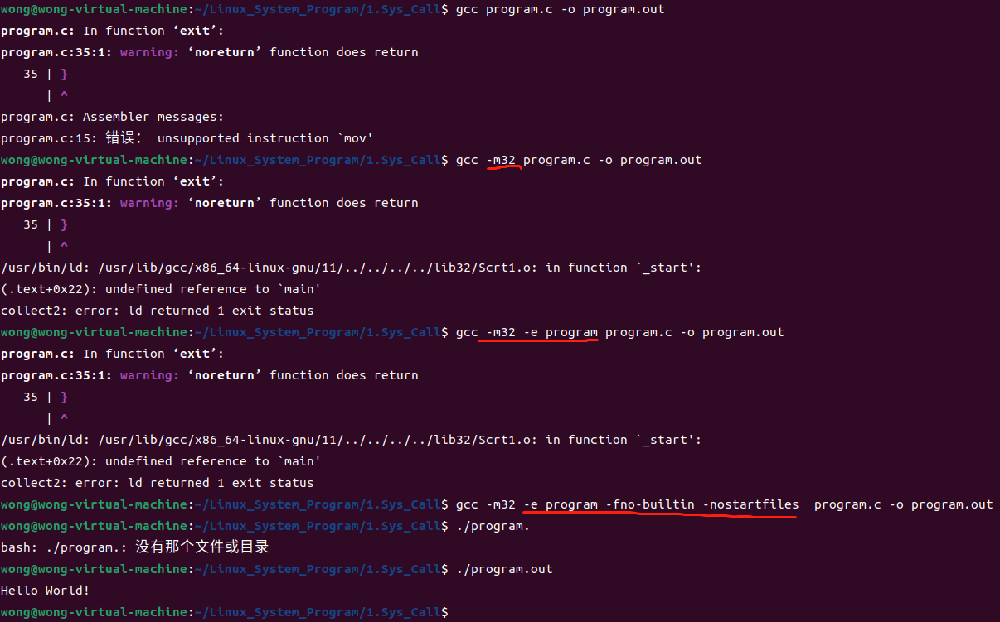
>
> ```
> ‼️
> 注释1：
>   -fno-builtin 用于解决当用户自定义的函数与C语言的内建函数（C库函数）冲突的问题。当用户自定义的函数与内建函数冲突时，若在gcc的编译选项中加上-fno-builtin时，则表示不使用C语言的内建函数。
>   
> 注释2：
>   -nostartfiles 选项的作用是通知编译器不自动加入启动函数以及别的库级别的初始化。
> ```

## （六）值得思考的问题
>❓如何判断一个应用程序 (进程) 触发了系统调用？
>
>✅strace

### 1、相同功能的代码实现

> 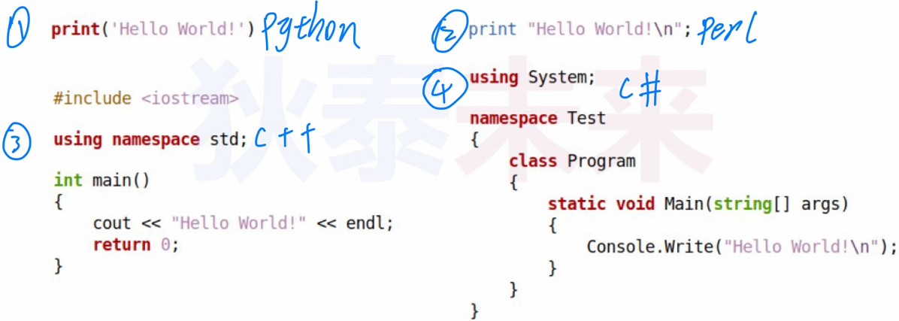

### 2、 $\textcolor{red}{strace}$ – 系统调用探测器

>* strace用于监控进程与内核的交互（监控系统调用）
>* strace用于追踪进程内部状态（定位运行时问题）
>* strace按序输出进程运行过程系统调用名称、参数和返回值
>
>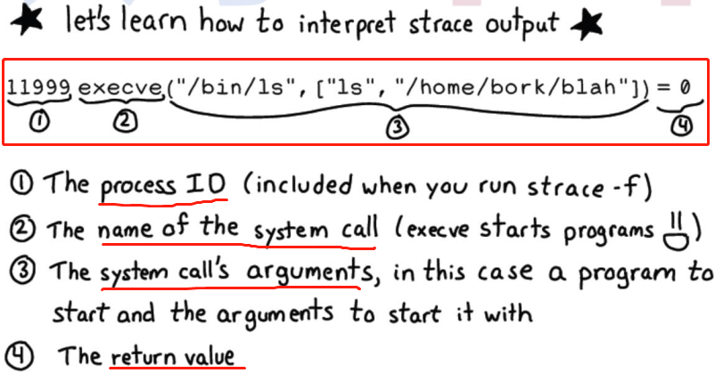
>
>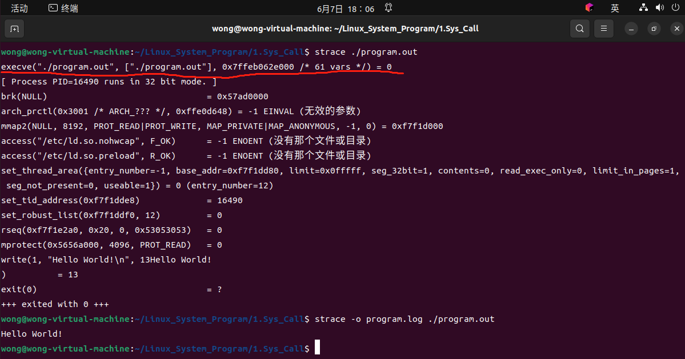
>
>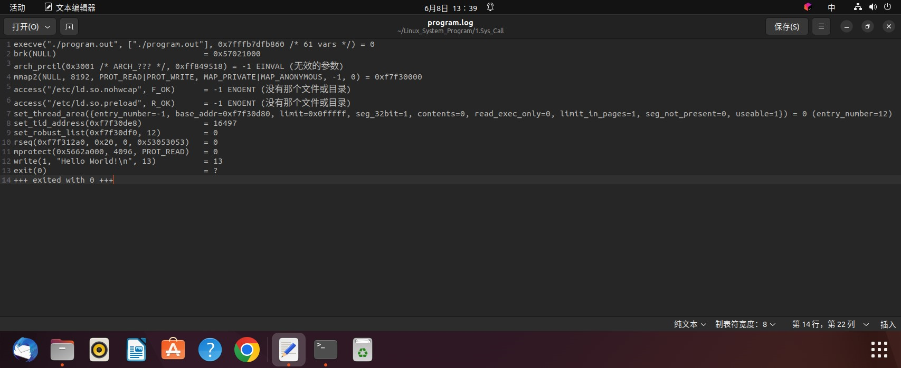
>
>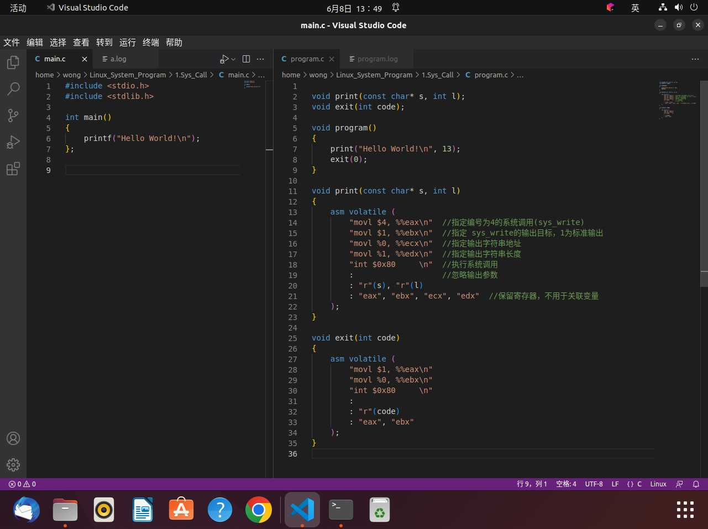
>
>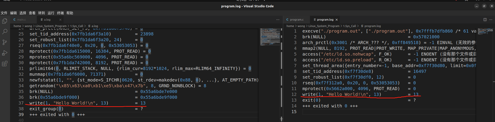
>
>```
>‼️ ldd 用来打印或者查看程序运行所需的共享库（访问共享对象依赖关系），常用来解决程序因缺少某个库文件而不能运行的一些问题。
>```
>
>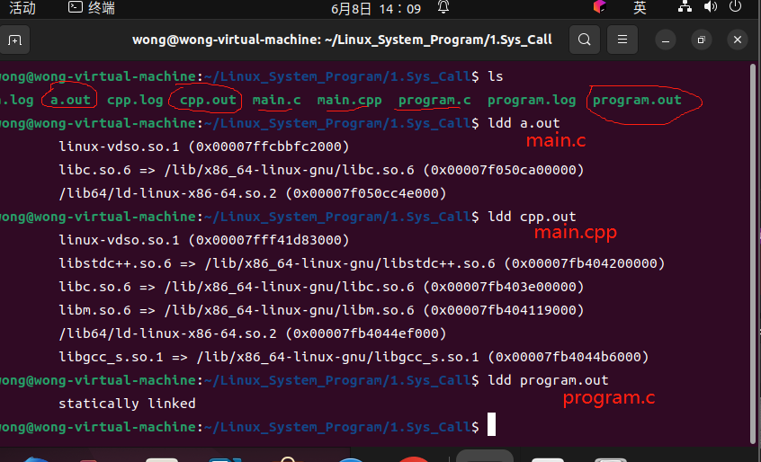

### 3、不同语言的系统调用

> 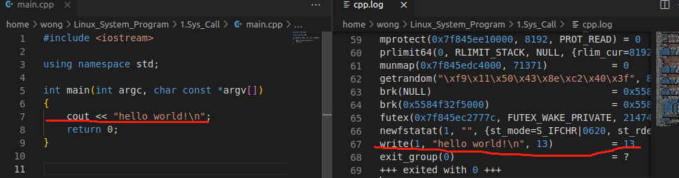
>
> 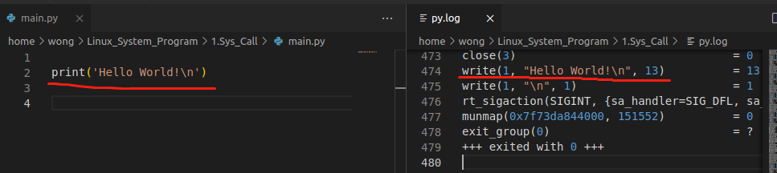
>
> 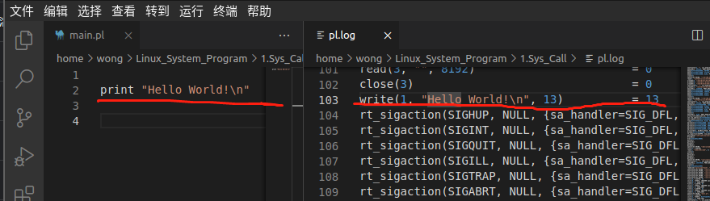
>
> ==> 编译型语言（如C、C++）执行效率较高，解释型语言（如python、perl）效率较低
>
> 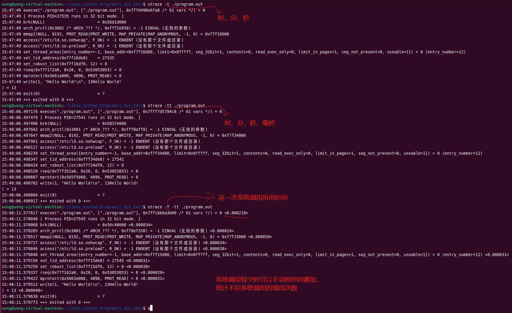
>
> 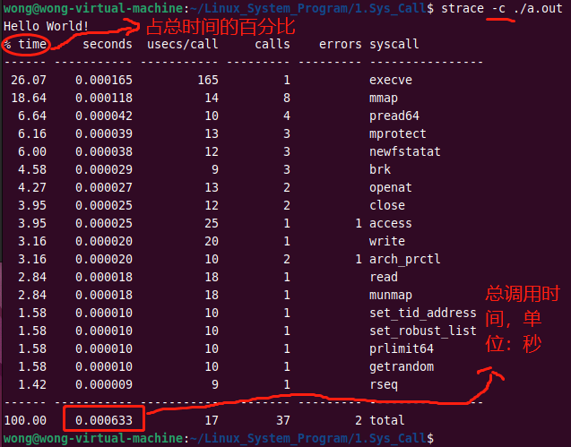

### 4、strace – 程序逆向分析

> [参考代码](https://github.com/WONGZEONJYU/Linux_System_Program/blob/main/1.Sys_Call/fcopy.c)
>
> 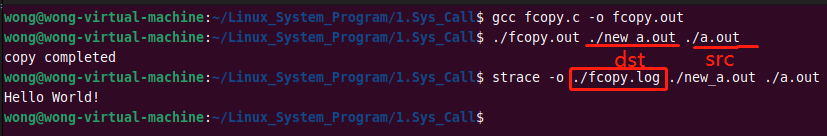
>
> 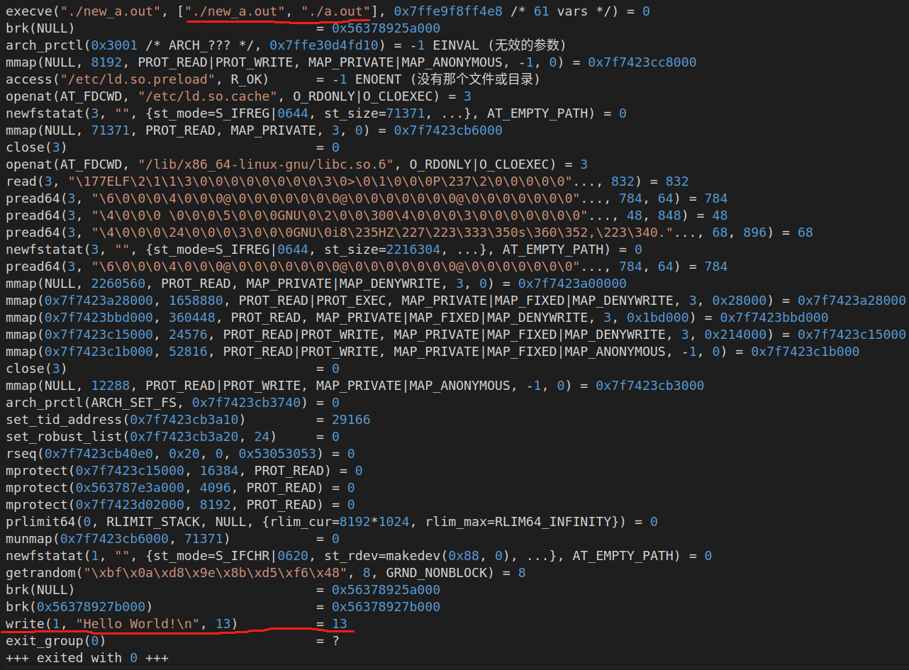

### 5、strace – 程序数据分析

> * -x : print non-ascii strings in hex (以十六进制打印非 ASCII 字符串) (如果没有对应的字符，会以16进制方式展示)
> * -xx : print all strings in hex (以十六进制打印所有字符串) (强制以16进制展示)
> * -s strsize : limit length of print strings to STRSIZE chars (default 32)（将打印字符串的长度限制为 STRSIZE 个字符 (默认 32))
>
> 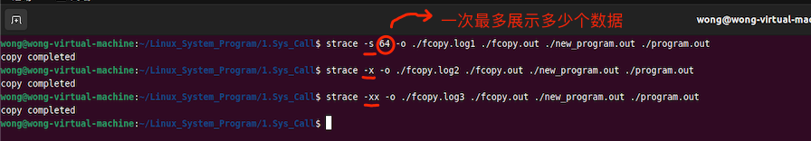
>
> 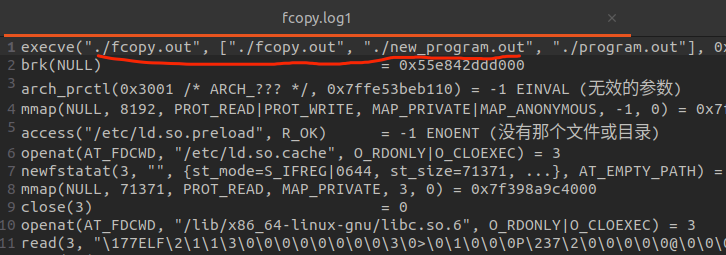
>
> 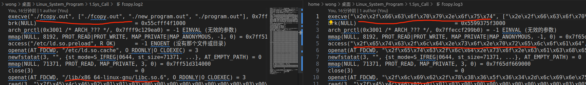
>
> ```
> strace–用法详解
> • -c --count time, calls, and errors for each syscalland report summary
> • -f --follow forks
> • -ff--with output into separate files
> • -F --attempt to follow vforks
> • -i--print instruction pointer at time of syscall
> • -q --suppress messages about attaching, detaching, etc.
> • -r --print relative timestamp
> • -t --absolute timestamp,
> • -tt--with usecs
> • -T --print time spent in each syscall, 
> • -v --verbose mode: print unabbreviated argv, stat, termio[s], etc. args
> • -x --print non-asciistrings in hex, 
> • -xx --print all strings in hex
> • -o file --send trace output to FILE instead of stderr
> • -O overhead --set overhead for tracing syscallsto OVERHEAD usecs
> • -p pid--trace process with process id PID, may be repeated
> • -D --run tracer process as a detached grandchild, not as parent
> • -s strsize--limit length of print strings to STRSIZE chars (default 32)
> • -S sortby--sort syscallcounts by: time, calls, name, nothing (default time)
> 
> ```
>
> ```
> – -e expr : 指定一个表达式，用来控制如何跟踪
> • -e trace=set 跟踪指定的系统调用
> 	如：-e trace=open,close,rean,write 表示只跟踪这四个系统调用
> • -e trace=file 跟踪有关文件操作的系统调用
> • -e trace=process 跟踪有关进程控制的系统调用
> • -e trace=network 跟踪与网络有关的所有系统调用
> • -e strace=signal 跟踪所有与系统信号有关的系统调用
> • -e trace=ipc 跟踪所有与进程通讯有关的系统调用
> • -e raw=set 将指定的系统调用的参数以十六进制显示
> • -e signal=set 指定跟踪的系统信号
> 	如：signal=!SIGIO(或者signal=!IO)，表示不跟踪SIGIO 信号
> • -e read=set 输出从指定文件中读出的数据
> 	如：-e read=3,5 
> • -e write=set 输出写入到指定文件中的数据
> ```
>
> 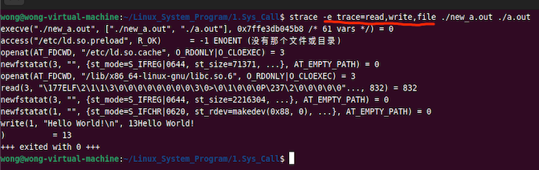

