# 五、环境变量编程

## (一) 初识环境变量

### 1.问题

>❓环境变量是什么？有什么意义？
>
>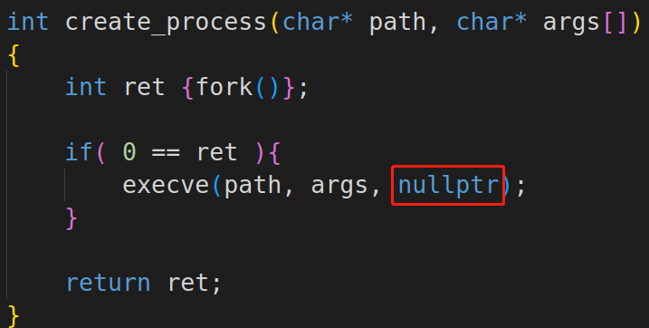
>
>

### 2. main函数(默认进程入口):

>```c++
>int main(int argc, char* argv[], char* env[])
>```
>
>* `argc` : 命令行参数个数
>* `argv[ ]`: 命令行参数数组
>* `env[ ]`: 环境变量数组（最后一个元素为`NULL`）
>* 环境变量的地位与进程参数的地位是一样的，对于一个进程的运行同等重要

### 3.什么是环境变量？

>* 环境变量是进程运行过程中可能用到的 $\color{red}{“键值对”}$ `(NAME=Value)`
>* 进程拥有一个 $\color{red}{环境变量表}$ **(environment list)**，环境表包含了环境变量
>* 进程表用于 $\color{red}{记录系统中相对固定的共享信息}$ **(不特定于具体进程)**
>* 进程之间的环境表 $\color{red}{相互独立}$ **(环境表可在父子进程之间传递)**

### 4.环境表的构成

>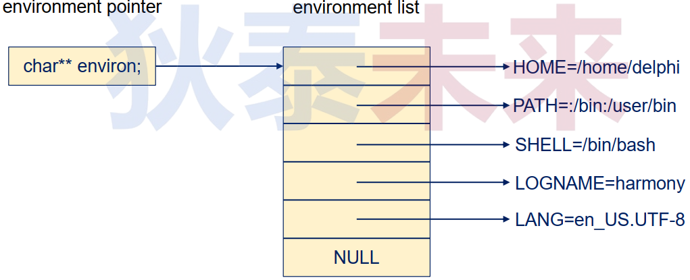
>
>```tex
>如：ls命令，通过环境变量PATH指定的路径去查找ls
>```

### 5.思考

>❓下面的程序输出什么？为什么？
>
>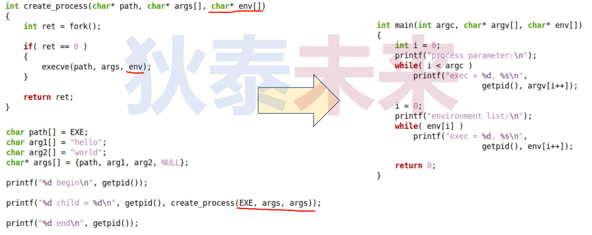

### 6.编程实验

>[parent.cpp](https://github.com/WONGZEONJYU/Linux_System_Program/blob/main/4.env_var/parent.cpp)
>
>[child.cpp](https://github.com/WONGZEONJYU/Linux_System_Program/blob/main/4.env_var/child.cpp)
>
>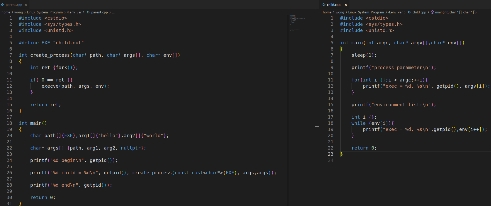
>
>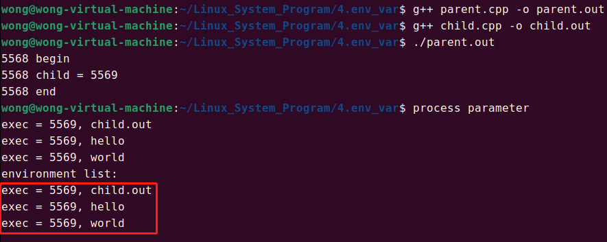
>
>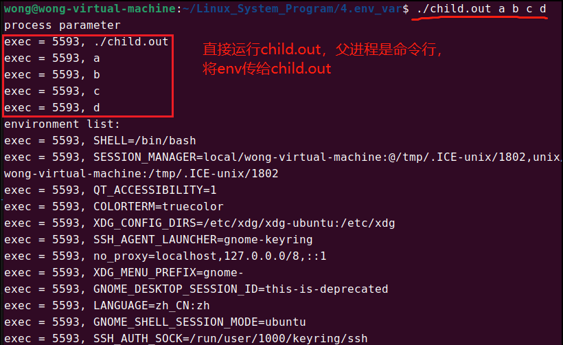

## (二) 深入理解环境变量

>* 对于进程来说 , $\color{red}{环境变量是一种特殊的参数}$
>* 环境变量相对于启动参数较稳定 **(系统定义且各个进程共享)**
>* 环境变量遵守固定规范 **(如 : 键值对，变量名大写)**
>* 环境变量与启动参数存储于进程的同一内存区域 $\color{red}{(属于进程私有的)}$

### 1.环境变量读写接口

>* 头文件：`#include<stdlib.h>`
>* 读：`char* getenv(const char* name);`
>  * 返回`name`环境变量的值，如果不存在，返回`NULL`
>* 写：`int putenv(char* string);`
>* 设置/改变环境变量 `(NAME=Value)` , $\color{red}{string 不能是栈上定义的字符串}$
>* 环境表入口：`extern char** environ;`

### 2.思考

>❓下面程序输出什么？为什么？
>
>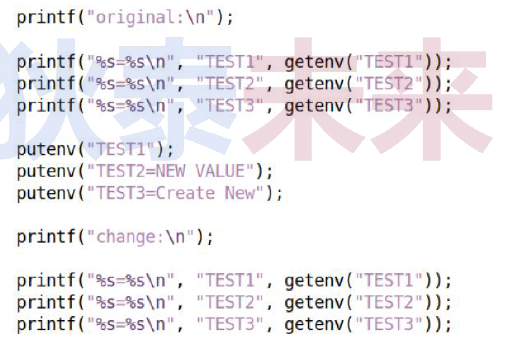
>
>[环境变量参考代码](https://github.com/WONGZEONJYU/Linux_System_Program/blob/main/4.env_var/test.cpp)
>
>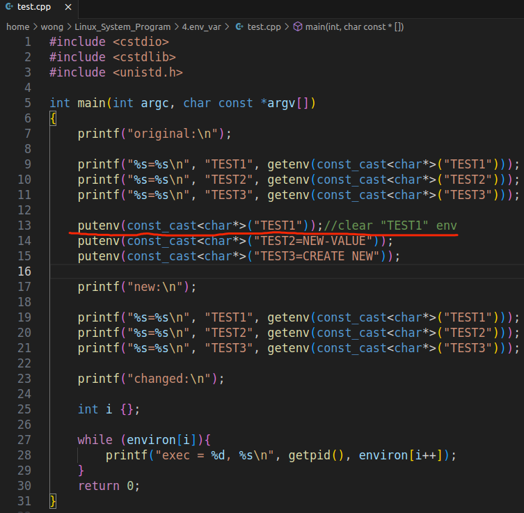
>
>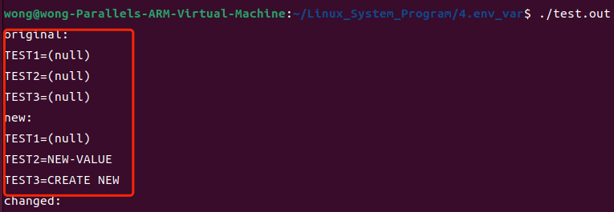
>
>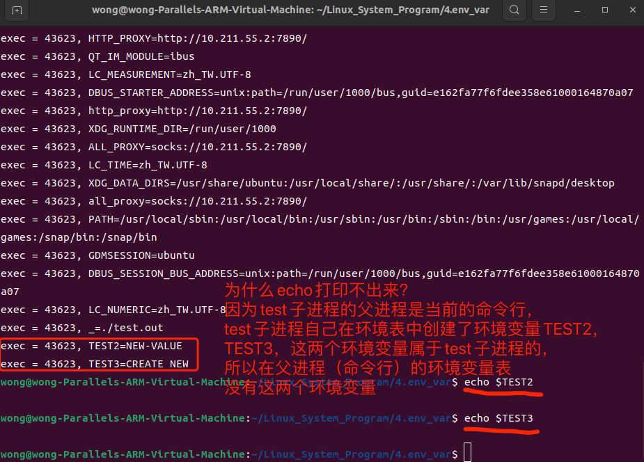

### 3.编程练习

>* 编写应用程序，通过命令行参数读写环境变量
>* 选项定义：
>  * -a：无选项值，输出所有环境变量值
>  * -r：读环境变量值，-n环境变量名
>  * -w：写环境变量，-n环境变量名，-v环境变量值
>  * -t：环境变量读写测试，先写入指定环境变量，之后输出所有环境变量
>
>[参考代码](https://github.com/WONGZEONJYU/Linux_System_Program/blob/main/4.env_var/main.cpp)
>
>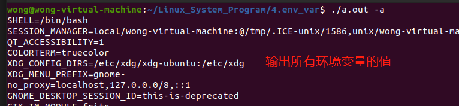
>
>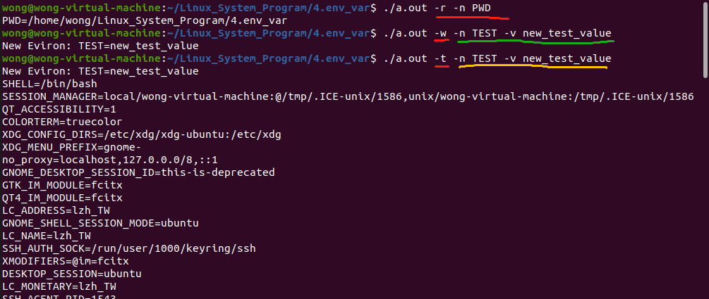
>
>1. free()没被屏蔽的时候
>
>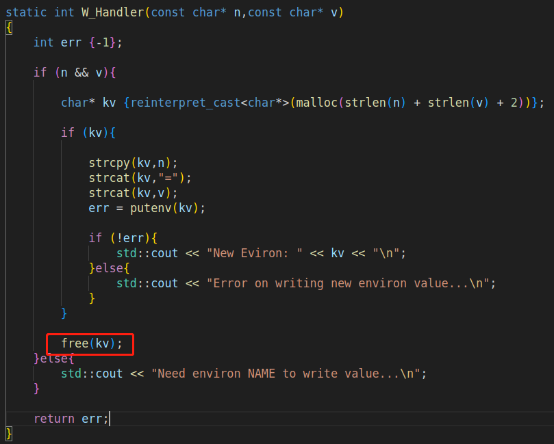
>
>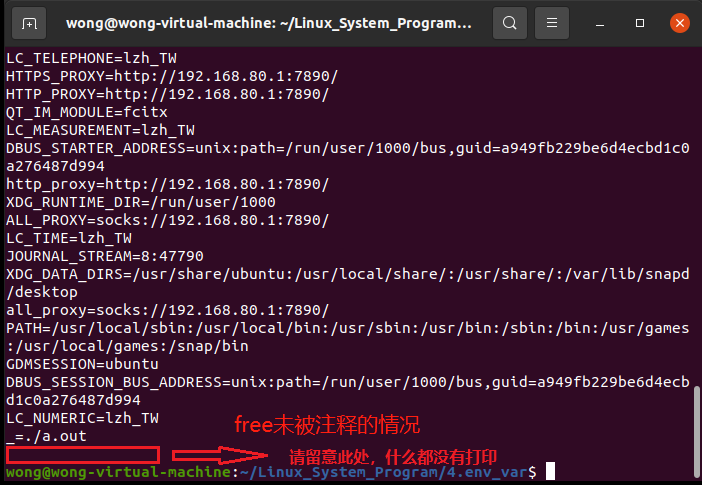
>
>2. free()被屏蔽的时候
>
>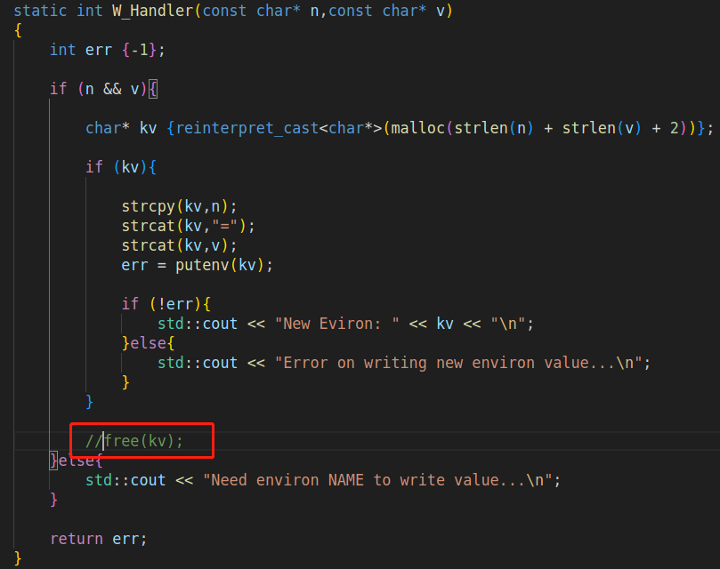
>
>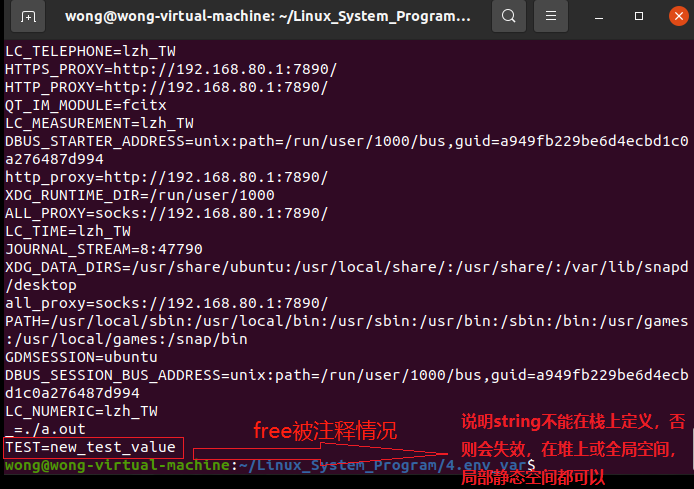

## (三) 思考

>❓进程参数和环境变量对于进程意味着什么？


