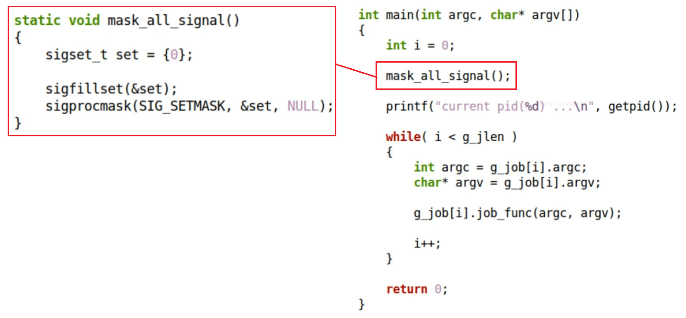
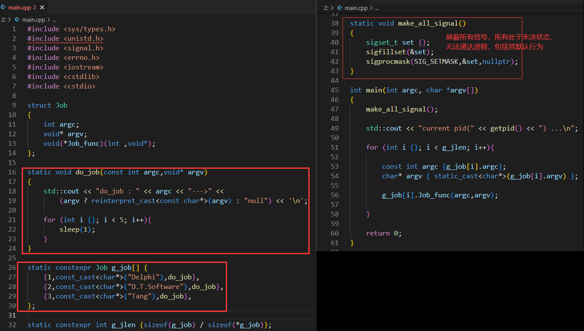
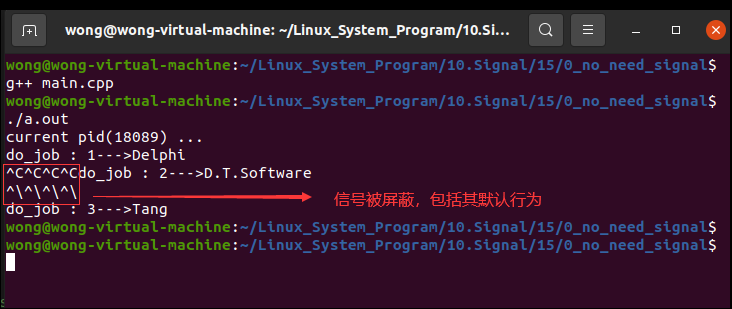
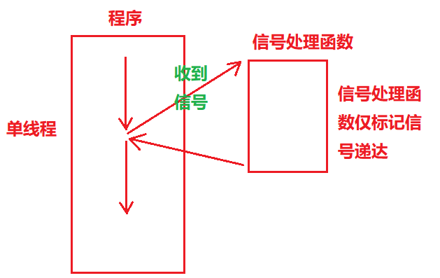
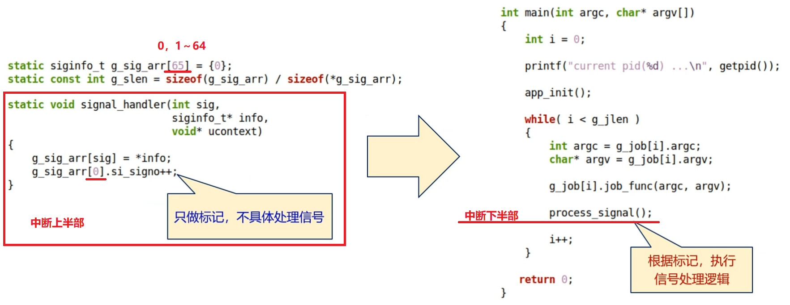

# 十五、信号处理设计模式

## (一) Linux应用程序安全性讨论

### 1.问题

>❓如何编写信号安全的应用程序? ? ?

### 2. 不同场景

#### (1) 场景一 : 不需要处理信号

>- 应用程序实现单一功能 , 不需要关注信号
>- 如 : 数据处理程序 , 文件加密程序、科学计算程序

#### (2) 场景二 : 需要处理信号

>- 应用程序长时间运行，需要关注信号，并及时处理
>- 如 : 服务端程序，上位机程序
>
>```
>在代码层面,直接阻塞所有可能的信号(本质上就是信号始终处于未决状态，无法递达进程)
>```
>
>
>
>- 编程实验 : 不需要处理信号
>
>[编程实验：不需要处理信号](https://github.com/WONGZEONJYU/Linux_System_Program/blob/main/10.Signal/15/0_no_need_signal/main.cpp)
>
>
>
>

## (三) 场景二 : 需要处理信号 (长时间运行的应用)

>- 同步方案
>  - 通过 标记 同步处理信号 , 整个应用中 只有一个执行流(交替执行)
>- 同步方案
>  - 专用任务处理，应用中存在 多个执行流 (多线程应用)
>- 设置 专用于信号处理的任务 , 其它任务忽略信号 , 专注功能实现

### 1.同步解决方案 (单任务)

> - 信号处理逻辑与程序逻辑位于同一个上下文
>   即：信号处理函数与主函数不存在资源竞争关系

#### (1) 方案设计一

>1. 将任务分解为 子任务 (每个任务可对应一个函数)
>2. 信号递达时 , 信号处理函数中 仅 标记 递达状态
>3. 子任务处理结束后 , 真正执行信号处理
>
>

##### ① 同步方案示例一

>

##### ② 编程实验

###### a. 对于不可靠信号

>
>
>


