# 十四、信号优先级与安全性

## (一) 信号优先级的概念

### 1. 问题

>❓对于 $\color{red}{同一个进程}$ , 如果 $\color{red}{存在两个不同的未决}$ **$\color{red}{实时信号}$** **$\color{red}{(可靠信号)}$** , 那么先处理谁 ?

### 2. 信号优先级概念

>- 信号的本质是一种软中断 ( **$\color{SkyBlue}{中断有优先级}$** , **$\color{red}{信号也有优先级}$** ) 
>- 对于未决实时信号 : 
>   - 对于同一个未决实时信号 , 按照 **$\color{red}{发送先后顺序}$** 递送给进程
>   - 对于不同的未决实时信号 , **$\color{red}{信号值越小优先级越高 (优先递达目标进程)}$** 
>- **$\color{red}{不可靠信号}$** 与 **$\color{red}{可靠信号}$** 同时未决 : 
>   - 严格意义上 , 没有明确规定优先级
>   - 实际上，Linux优先递达不可靠信号 **(不可靠信号的信号值小 , 所以先递达)**
>- 多个不可靠信号同时未决 , 优先递达谁 ?
>   - 优先递达硬件相关信号 : 
>     - `SIGSEGV` , `SIGBUS` , `SIGILL` , `SIGTRAP` , `SIGFPE` , `SIGSYS`
>- 优先递达信号值小的不可靠信号
>- 不可靠信号 **$\color{red}{优先于}$** 可靠信号 递达

## (二) 信号优先级实验设计

### 1. 实验设计

>- 目标 : 验证信号的优先级
>   - 场景 : $\color{red}{不可靠 VS 不可靠 ; 不可靠 VS 可靠 ; 可靠vs可靠}$
>- 方案 : 对目标进程发送N次“无”序信号 , $\color{red}{验证信号递达进程的先后次序}$
>- 预备函数 : 
>
>```c++
>int sigaddset(sigset_t* set, int signum);
>int sigfillset(sigset_t* set);
>int sigemptyset(sigset_t* set);
>int sigprocmask(int how, const sigset_t* set, sigset_t* oldset);
>```

### 2. 需要思考的问题

>- 如何使得多个信号同时未决 , 且以优先级方式递达进程 ?
>- 如何记录和对比信号的递达次序及发送次序?
>- 对于实验中涉及的不可靠信号 , 是否特殊考虑?
>- 需要考虑特殊的可靠信号吗?  **$\color{red}{( 有两个可靠信号被线程征用了 )}$**
>- ......
>
>```
>😅以上提出的问题是实验设计的重点和难点
>```

### 3. 发送端的设计

>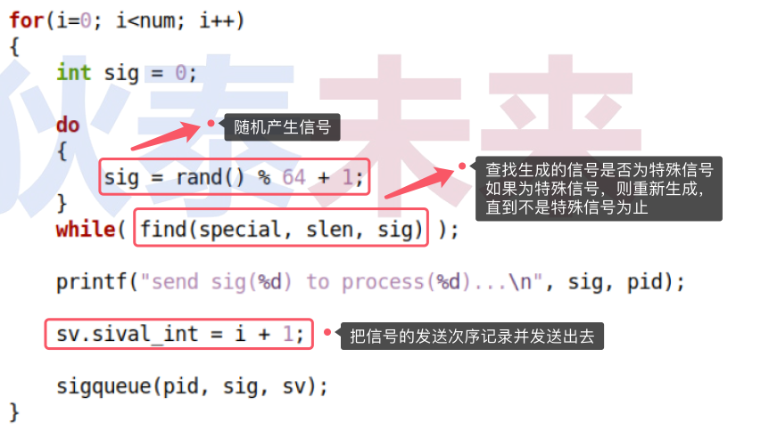

### 4. 接收端的设计

>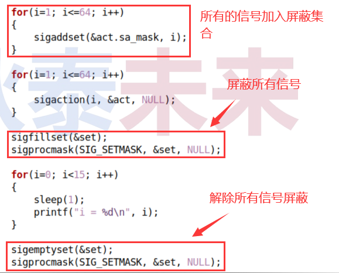
>
>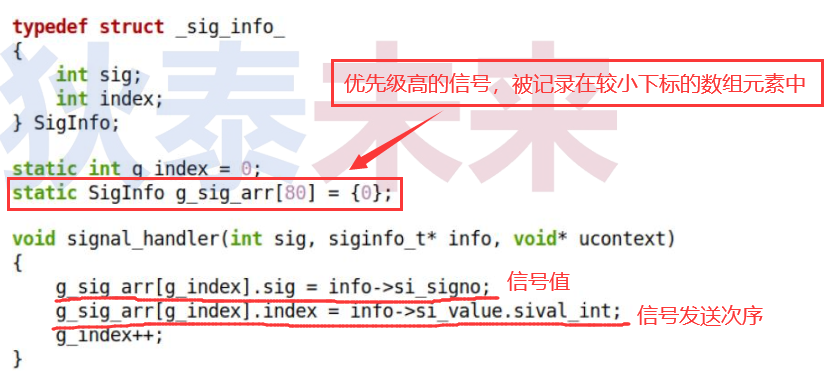

### 5.编程实验 : 信号优先级

>[信号优先级(可靠信号)参考链接](https://github.com/WONGZEONJYU/Linux_System_Program/tree/main/10.Signal/14/priority/reliable_signal)

#### (1) 实验一 : 34~64范围内的信号 (可靠信号==实时信号)

>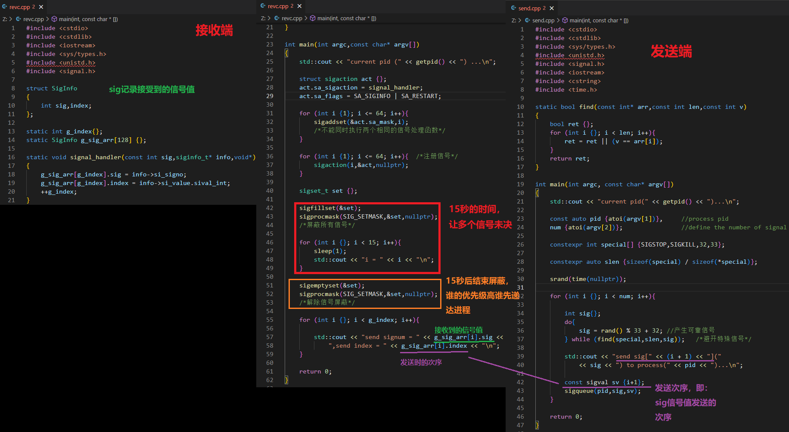
>
>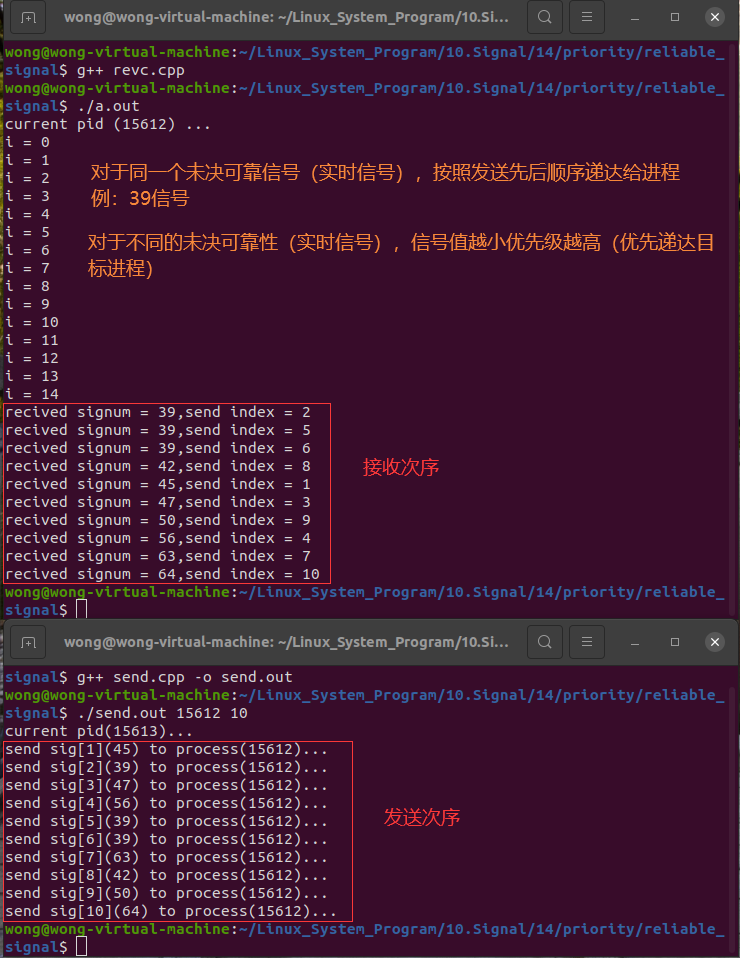
>
>```
>😅对于上图,像信号值为36,50的,对于同一个未决实时信号,按照发送先后顺序递达进程,对于不同的未决实时信号，信号值越小,优先级越高(优先递达目标进程)
>```

#### (2) 实验二 : 所有信号

>[信号优先级(所有信号)参考链接](https://github.com/WONGZEONJYU/Linux_System_Program/tree/main/10.Signal/14/priority/all_signal)
>
>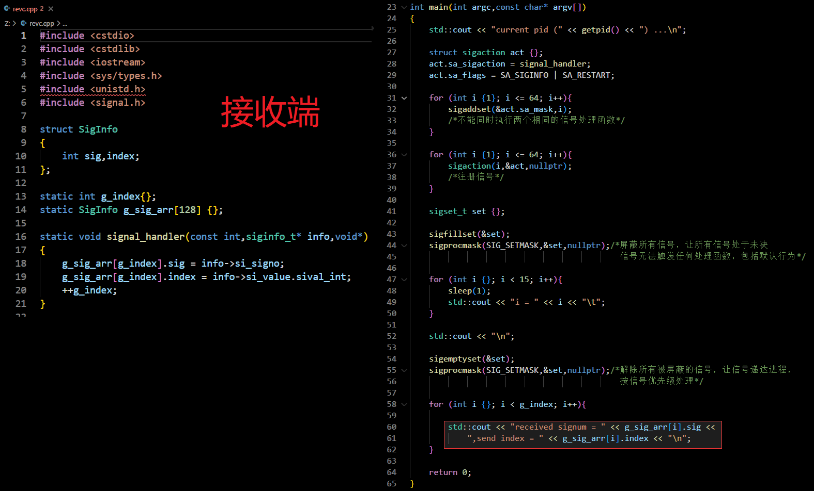
>
>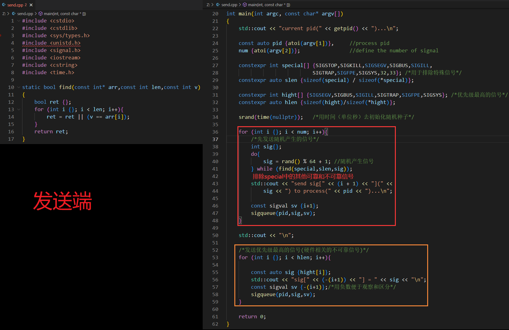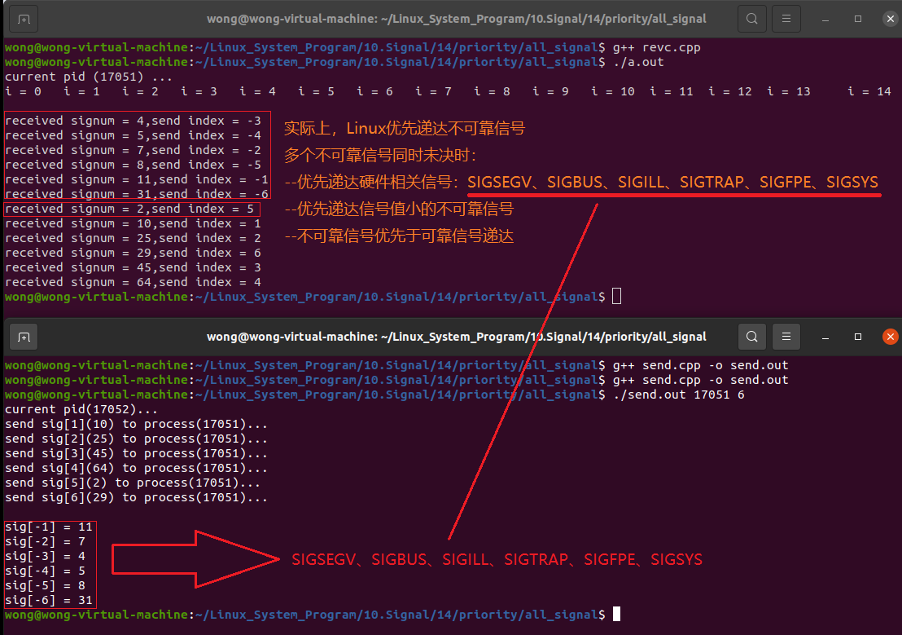
>
>```
>📖优先级最高的信号是硬件相关的信号,硬件相关的信号的信号值不一定是最小的。
>```

## (三) 信号安全性

#### 1. 再论信号处理...

>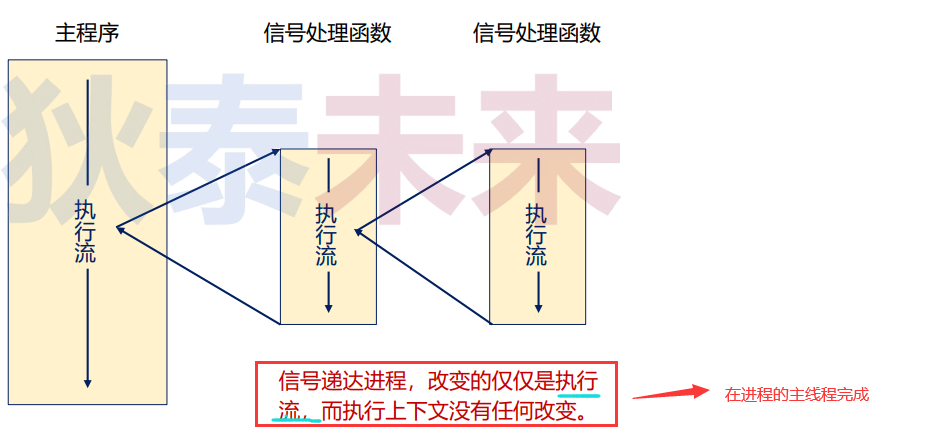

#### 2. 信号安全性概念

>- 什么是安全性?
>  - 程序能正确且无意外的按照预期方式执行
>- 信号的不确定性
>  - 什么时候信号递达是不确定的 -> 主程序被中断的位置是不确定的
>- 当信号递达，转而执行信号处理函数时 , 不可重入的函数不能调用
>  - 不可重入函数：函数不能由超过一个 **$\color{red}{任务 (线程) }$** 所共享，除非能确保函数的互斥 ( 或者使用信号量 , 或者在代码的关键部分禁用中断 )
>
>```
>❓下面程序输出什么?为什么?
>```
>
>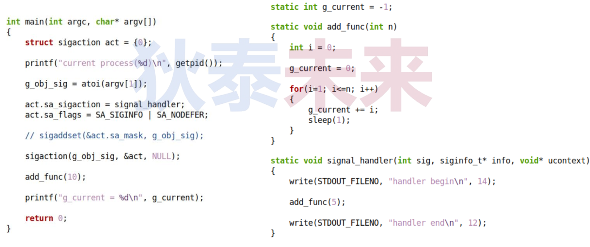

#### 3. 编程实验 : 信号安全性

>[信号安全性实验](https://github.com/WONGZEONJYU/Linux_System_Program/blob/main/10.Signal/14/security/sigex.cpp)
>
>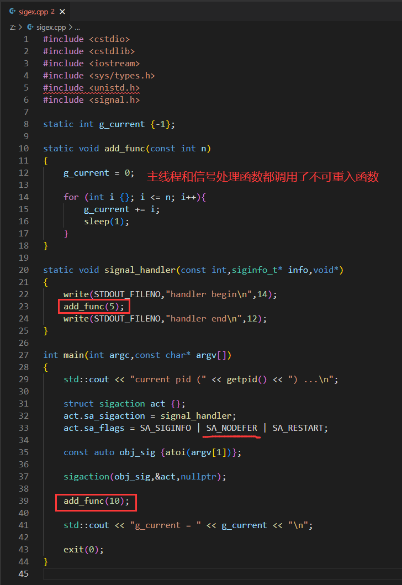
>
>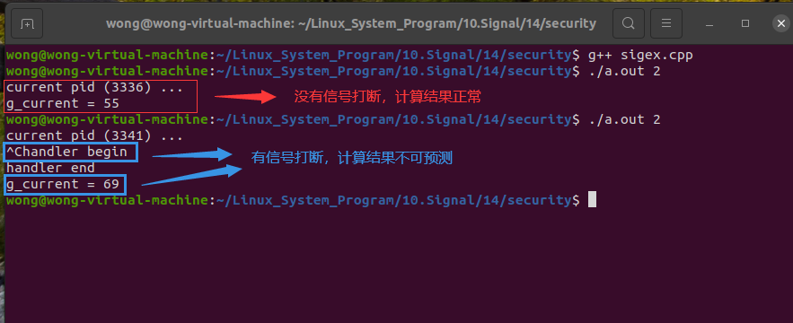
>
>```tex
>😅此处被信号打断后,由于信号处理函数调用了不可重入函数,导致计算结果出问题
>```

#### 4. 深入信号安全性

>- 避坑规则 : 
>  - 不要在信号处理函数中调用 不可重入函数 ( 即 : 使用了全局变量的函数 )
>  - 不要调用函数中存在临界区的函数 (可能产生竞争导致死锁)
>  - 不要调用 `malloc()` 和 `free()` 函数
>  - 不要调用 **$\color{red}{标准 I/O 函数}$** , 如 : `printf()` 函数
>  - ......
>
>
>
>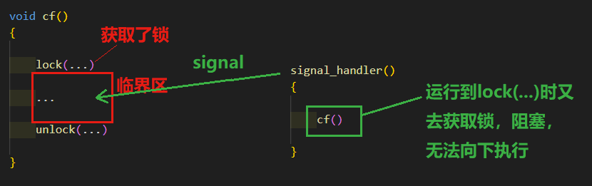
>
>
>
>- 小问题 : 如何知道那些函数是安全的?
>
>  - `man 7 signal-safety`
>
>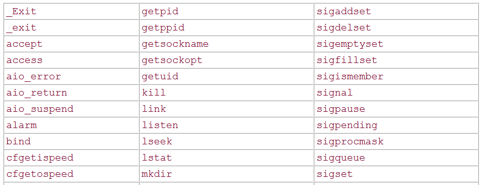

#### 5. 思考

>❓如何编写信号安全的应用程序? ? ?

