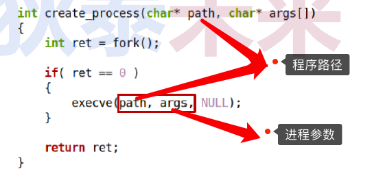

# 四、进程参数编程

## （一）问题

> ❓`execve(…)` 的参数是什么？有什么意义？
>
> 

### 1.再论`execve(…)`

>

### 2. main函数 (默认进程入口)

>```c++
>int main(int argc, char* argv[])
>```
>
>

### 3.进程空间概要图

>
>
>```
>initialized data是已初始化的全局变量和静态局部变量，它们的初始值是存放在代码段的，所以它与text（代码段）挨在一起。
>such as：int a = 888;    888这个初始值存在代码段中
>```

### 4.编程实验：进程参数剖析

#### （1）进程空间实验

>[代码参考链接](https://github.com/WONGZEONJYU/Linux_System_Program/blob/main/3.Process_Parameter/mem.cpp)
>
>
>
>

#### （2）父子进程参数实验

>❓下面的程序输出什么？why？
>
>
>
>[parent.cpp 参考代码](https://github.com/WONGZEONJYU/Linux_System_Program/blob/main/3.Process_Parameter/parent.cpp)
>
>[child.cpp](https://github.com/WONGZEONJYU/Linux_System_Program/blob/main/3.Process_Parameter/child.cpp) 
>
>
>
>

### 5. Linux启动参数 (命令行参数) 规范

>💨进程参数、命令行参数、启动参数都是一个东西
>
>* 由 $\textcolor{red}{选项}$ 、 $\textcolor{Red}{选项值}$、 $\textcolor{red}{操作数}$组成
>* 选项由短横线（ - ）开始，选项名必须是单个字母或数字字符(-c 或者 -3)
>* 选项可以有选项值，选项与选项值之间可用空格分隔( -o test 或者 -otest )
>* 如果多个选项均无选项值，可合而为一（ -a -b -c 或者 -abc ）
>* 既不是选项，也不能作为选项值的参数是操作数 ( 例：gcc $\textcolor{red}{test.c}$ -o test.out，其中 $\textcolor{red}{test.c}$ 就是操作数 )
>* 第一次出现的 $\textcolor{Red}{双横线}$ ( –– ) 用于结束所有选项，后续参数为操作数

#### (1) Linux启动参数（命令行参数）解析

>* 规则：`if:s` ==> -i -s $\textcolor{red}{-f+选项值}$
>
>```
>-f后面必须有选项值。
>选项只存在 出现 或 不出现 的情况，没有规定出现顺序。
>顺序可以是这三种情况：if:s ==> isf: ==>f:is
>```
>
>* 实例：
>
>

#### (2) Linux启动参数 (命令行参数) 编程

> 
>
> * `getopt(…)` 从 argc 和 argv 中获取下一个选项
>  * 选项 $\textcolor{red}{合法}$ : $\textcolor{GreenYellow}{返回值 为 选项字符，optarg 指向 选项值字符串}$ 
>   * 选项 $\textcolor{red}{不合法}$ : $\textcolor{GreenYellow}{返回字符}$ `"?"` $\textcolor{GreenYellow}{, optopt 保存 当前选项字符(错误)}$ 
>  * 选项 $\textcolor{red}{合法但缺少选项值}$ : $\textcolor{GreenYellow}{返回}$ `":"`$\textcolor{GreenYellow}{，optopt 保存 当前选项字符(错误)(这里需参考扩展规则)}$ 
>   * 默认情况下：`getopt(…)`对argv进行重排 , $\textcolor{GreenYellow}{所有操作数位于最后位置}$ 
>
> 
>
> 
>
> * $\textcolor{red}{optstring}$ 规则 的扩展定义
>  * 起始字符可以是 “ ：，+，- 或省略 ”
>     * $\textcolor{red}{省略}$：出现选项错误时，程序中通过`":"`或`"?"`进行处理并给出默认错误提示
>    * `":"`：错误提示开关，程序中通过返回值`":"`或`"?"`进行处理（**无默认错误提示**）
>     * `"+"`：提前停止开关，遇见操作数时，返回 -1，认为选项处理完毕（**后续都是操作数**）
>     * `"-"` ：不重排开关，遇见操作数时，返回 1，optarg指向操作数字符串
>     * $\textcolor{red}{组合}$: `"+:" or "-:"`
> 
> ```
> ‼️ getopt(…)什么时候返回 " : " ? 当optstring参数第一个字符是" : "，则遇到缺少选项值返回 " : " , 否则就返回 " ? "。getopt_long(...)同理适用
> ```

#### (3) 编程实验：进程参数编程    

>[代码参考链接](https://github.com/WONGZEONJYU/Linux_System_Program/blob/main/3.Process_Parameter/main.cpp)

##### 1）规则：`"f:is"`

>
>
>

##### 2）规则扩展：`":f:is "`

>
>
>

##### 3）规则扩展：`"+:f:is"`

>
>
>

##### 4）规则扩展：`"-:f:is"`

>
>
>

### 6.问题

>❓环境变量是什么？有什么意义？


